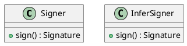
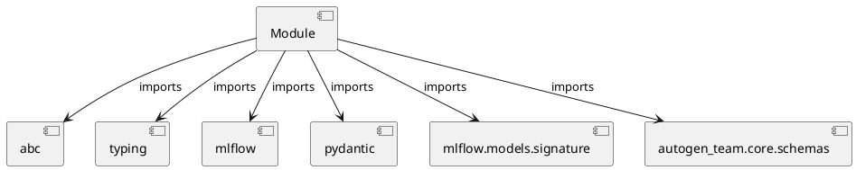

# Module Specification: signers

* **Source Reference:** `src/autogen_team/infrastructure/utils/signers.py`

## 1. Architectural Role & Responsibilities
**Purpose:**
Provides functionality related to signers.

**Architecture Layer:**
- Infrastructure/Other

**Responsibilities:**
- Not explicitly defined.

**Main Workflow:**
- Not explicitly defined.

## 2. Dependencies
**Imports:**
- `abc`
- `typing`
- `mlflow`
- `pydantic`
- `mlflow.models.signature`
- `autogen_team.core.schemas`

**Exported Classes:**
- `Signer`
- `InferSigner`

**Exported Functions:**
- None

## 3. Architecture & Execution
### Internal Architecture
Not explicitly defined.

### Execution Flow
Not explicitly defined.

### Sequence Explanation
Not explicitly defined.

## 4. UML 2.0 Diagrams
### Class Diagram


### Dependency Graph


## 5. Class & Method Specifications
### `Signer` ([`src/autogen_team/infrastructure/utils/signers.py`](/src/autogen_team/infrastructure/utils/signers.py))
#### Overview
Base class for generating model signatures.

Allow to switch between model signing strategies.
e.g., automatic inference, manual model signature, ...

https://mlflow.org/docs/latest/models.html#model-signature-and-input-example

#### Attributes
- None found.

#### Methods
##### `sign(self, inputs: schemas.Inputs, outputs: schemas.Outputs) -> Signature` (Public)
**Description:** Generate a model signature from its inputs/outputs.

Args:
    inputs (schemas.Inputs): inputs data.
    outputs (schemas.Outputs): outputs data.

Returns:
    Signature: signature of the model.

**Inputs:**
- `inputs`: schemas.Inputs
- `outputs`: schemas.Outputs

**Output:**
- Return Type: `Signature`
- Semantic Meaning: Not explicitly defined.

**Side Effects:**
- Not explicitly defined.

**Complexity:**
- Time Complexity: Not explicitly defined.
- Space Complexity: Not explicitly defined.

**Example:**
```python
result = Signer.sign(..., ...)
```

### `InferSigner` ([`src/autogen_team/infrastructure/utils/signers.py`](/src/autogen_team/infrastructure/utils/signers.py))
#### Overview
Generate model signatures from inputs/outputs data.

#### Attributes
- None found.

#### Methods
##### `sign(self, inputs: schemas.Inputs, outputs: schemas.Outputs) -> Signature` (Public)
**Description:** No description provided.

**Inputs:**
- `inputs`: schemas.Inputs
- `outputs`: schemas.Outputs

**Output:**
- Return Type: `Signature`
- Semantic Meaning: Not explicitly defined.

**Side Effects:**
- Not explicitly defined.

**Complexity:**
- Time Complexity: Not explicitly defined.
- Space Complexity: Not explicitly defined.

**Example:**
```python
result = InferSigner.sign(..., ...)
```

## 6. Module Functions