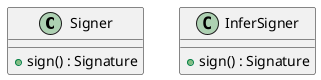
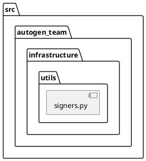
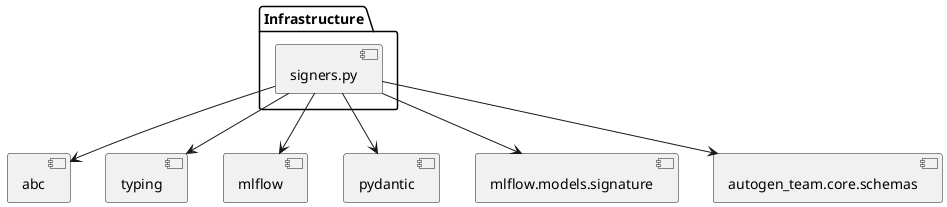
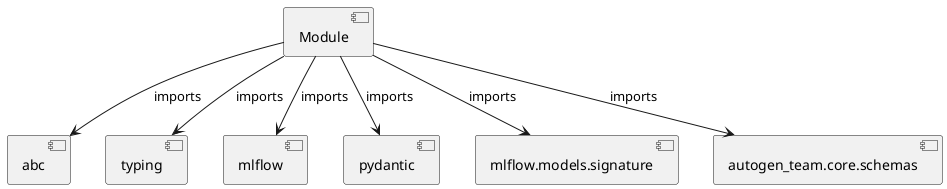
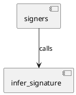

# Module Specification: signers

* **Source Reference:** `src/autogen_team/infrastructure/utils/signers.py`

## 1. Architectural Role & Responsibilities
**Purpose:**
Provides functionality related to signers.

**Architecture Layer:**
- Infrastructure

**Responsibilities:**
- Not explicitly defined.

**Main Workflow:**
- Not explicitly defined.

## 2. Dependencies
**Imports:**
- `abc`
- `typing`
- `mlflow`
- `pydantic`
- `mlflow.models.signature`
- `autogen_team.core.schemas`

**Exported Classes:**
- `Signer`
- `InferSigner`

**Exported Functions:**
- None

**Exported Interfaces:**
- Not explicitly defined.

**Public API:**
- Not explicitly defined.

## 3. Architecture & Execution
### Internal Architecture
Not explicitly defined.

### Execution Flow
Not explicitly defined.

### Sequence Explanation
Not explicitly defined.

### Examples
Not explicitly defined.

## 4. UML 2.0 Diagrams
### Class Diagram

```plantuml
@startuml
    class Signer {
        +sign() : Signature
    }
    class InferSigner {
        +sign() : Signature
    }
@enduml
```

### Package Diagram

```plantuml
@startuml
    package "src" {
        package "autogen_team" {
            package "infrastructure" {
                package "utils" {
                    [signers.py]
                }
            }
        }
    }
@enduml
```

### Sequence Diagram

```plantuml
@startuml
    ' No functions for sequence
@enduml
```

### Component Diagram

```plantuml
@startuml
    package "Infrastructure" {
        [signers.py]
    }
    [signers.py] --> [abc]
    [signers.py] --> [typing]
    [signers.py] --> [mlflow]
    [signers.py] --> [pydantic]
    [signers.py] --> [mlflow.models.signature]
    [signers.py] --> [autogen_team.core.schemas]
@enduml
```

### Dependency Graph

```plantuml
@startuml
    [Module] --> [abc] : imports
    [Module] --> [typing] : imports
    [Module] --> [mlflow] : imports
    [Module] --> [pydantic] : imports
    [Module] --> [mlflow.models.signature] : imports
    [Module] --> [autogen_team.core.schemas] : imports
@enduml
```

## 5. Class & Method Specifications
### `Signer` ([`src/autogen_team/infrastructure/utils/signers.py`](/src/autogen_team/infrastructure/utils/signers.py))
#### Overview
Base class for generating model signatures.

Allow to switch between model signing strategies.
e.g., automatic inference, manual model signature, ...

https://mlflow.org/docs/latest/models.html#model-signature-and-input-example

#### Attributes
- None found.

#### Methods
##### `sign(self, inputs: schemas.Inputs, outputs: schemas.Outputs) -> Signature` (Public)
**Description:** Generate a model signature from its inputs/outputs.

Args:
    inputs (schemas.Inputs): inputs data.
    outputs (schemas.Outputs): outputs data.

Returns:
    Signature: signature of the model.

**Inputs:**
- `inputs`
  - type: schemas.Inputs
  - meaning: Not explicitly defined.
  - valid values: Not explicitly defined.
  - optional?: False
  - default value: None
- `outputs`
  - type: schemas.Outputs
  - meaning: Not explicitly defined.
  - valid values: Not explicitly defined.
  - optional?: False
  - default value: None

**Output:**
- return type: `Signature`
- semantic meaning: Not explicitly defined.
- possible null values: Not explicitly defined.
- exceptions: Not explicitly defined.

**Side Effects:**
- Database updates: Not explicitly defined.
- File operations: Not explicitly defined.
- Network calls: Not explicitly defined.
- Cache: Not explicitly defined.
- State changes: Not explicitly defined.

**Complexity:**
- Time Complexity: Not explicitly defined.
- Space Complexity: Not explicitly defined.

**Example:**
```python
result = Signer.sign(..., ...)
```

### `InferSigner` ([`src/autogen_team/infrastructure/utils/signers.py`](/src/autogen_team/infrastructure/utils/signers.py))
#### Overview
Generate model signatures from inputs/outputs data.

#### Attributes
- None found.

#### Methods
##### `sign(self, inputs: schemas.Inputs, outputs: schemas.Outputs) -> Signature` (Public)
**Description:** Executes the sign operation.

**Inputs:**
- `inputs`
  - type: schemas.Inputs
  - meaning: Not explicitly defined.
  - valid values: Not explicitly defined.
  - optional?: False
  - default value: None
- `outputs`
  - type: schemas.Outputs
  - meaning: Not explicitly defined.
  - valid values: Not explicitly defined.
  - optional?: False
  - default value: None

**Output:**
- return type: `Signature`
- semantic meaning: Not explicitly defined.
- possible null values: Not explicitly defined.
- exceptions: Not explicitly defined.

**Side Effects:**
- Database updates: Not explicitly defined.
- File operations: Not explicitly defined.
- Network calls: Not explicitly defined.
- Cache: Not explicitly defined.
- State changes: Not explicitly defined.

**Complexity:**
- Time Complexity: Not explicitly defined.
- Space Complexity: Not explicitly defined.

**Example:**
```python
result = InferSigner.sign(..., ...)
```

## 6. Module Functions
## 7. Call Graph

```plantuml
@startuml
[signers] --> [infer_signature] : calls
@enduml
```

## 8. Cross References
- **Dependencies:** [Dependencies](../../../../../dependencies/index.md)
- **Used by:** ../../../../tests/conftest.md, ../../application/jobs/training.md, ../../../../tests/infrastructure/utils/test_signers.md
- **Calls:** infer_signature
- **Called from:** None
- **Related classes:** [Classes](../../../../../classes/index.md)
- **Related diagrams:** [Diagrams](../../../../../diagrams/index.md)
