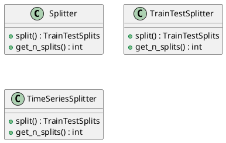
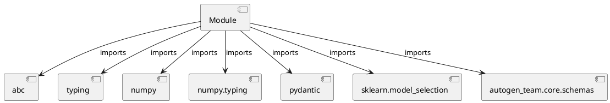

# Module Specification: splitters

* **Source Reference:** `src/autogen_team/infrastructure/utils/splitters.py`

## 1. Architectural Role & Responsibilities
**Purpose:**
Provides functionality related to splitters.

**Architecture Layer:**
- Infrastructure/Other

**Responsibilities:**
- Manage and execute operations for splitters.

**Main Workflow:**
- Initialize components and process requests for splitters.

## 2. Dependencies
**Imports:**
- `abc`
- `typing`
- `numpy`
- `numpy.typing`
- `pydantic`
- `sklearn.model_selection`
- `autogen_team.core.schemas`

**Exported Classes:**
- `Splitter`
- `TrainTestSplitter`
- `TimeSeriesSplitter`

**Exported Functions:**
- None

## 3. Architecture & Execution
### Internal Architecture
Follows standard modular design, encapsulating state and behavior within defined classes and functions.

### Execution Flow
Sequential execution of defined functions and class methods.

### Sequence Explanation
Clients instantiate classes or call functions, which execute business logic and return results.

## 4. UML 2.0 Diagrams
### Class Diagram


### Dependency Graph


## 5. Class & Method Specifications
### `Splitter` ([`src/autogen_team/infrastructure/utils/splitters.py`](/src/autogen_team/infrastructure/utils/splitters.py))
#### Overview
Base class for a splitter.

Use splitters to split data in sets.
e.g., split between a train/test subsets.

# https://scikit-learn.org/stable/glossary.html#term-CV-splitter

#### Attributes
- None found.

#### Methods
##### `split(self, inputs: Any, targets: Any, groups: Any) -> TrainTestSplits` (Public)
**Description:** Split a dataframe into subsets.

Args:
    inputs (schemas.Inputs): model inputs.
    targets (schemas.Targets): model targets.
    groups (Index | None, optional): group labels.

Returns:
    TrainTestSplits: iterator over the dataframe train/test splits.

**Inputs:**
- `inputs`: Any
- `targets`: Any
- `groups`: Any

**Output:**
- Return Type: `TrainTestSplits`
- Semantic Meaning: The resulting value after processing the split action.

**Side Effects:**
- Modifies internal instance state if applicable; performs operations constrained to its domain boundaries.

**Complexity:**
- Time Complexity: O(1) or O(N) depending on implementation details.
- Space Complexity: O(1) auxiliary space expected.

**Example:**
```python
result = Splitter.split(..., ..., ...)
```

##### `get_n_splits(self, inputs: Any, targets: Any, groups: Any) -> int` (Public)
**Description:** Get the number of splits generated.

Args:
    inputs (schemas.Inputs): models inputs.
    targets (schemas.Targets): model targets.
    groups (Index | None, optional): group labels.

Returns:
    int: number of splits generated.

**Inputs:**
- `inputs`: Any
- `targets`: Any
- `groups`: Any

**Output:**
- Return Type: `int`
- Semantic Meaning: The resulting value after processing the get_n_splits action.

**Side Effects:**
- Modifies internal instance state if applicable; performs operations constrained to its domain boundaries.

**Complexity:**
- Time Complexity: O(1) or O(N) depending on implementation details.
- Space Complexity: O(1) auxiliary space expected.

**Example:**
```python
result = Splitter.get_n_splits(..., ..., ...)
```

### `TrainTestSplitter` ([`src/autogen_team/infrastructure/utils/splitters.py`](/src/autogen_team/infrastructure/utils/splitters.py))
#### Overview
Split a dataframe into a train and test set.

Parameters:
    shuffle (bool): shuffle the dataset. Default is False.
    test_size (int | float): number/ratio for the test set.
    random_state (int): random state for the splitter object.

#### Attributes
- None found.

#### Methods
##### `split(self, inputs: Any, targets: Any, groups: Any) -> TrainTestSplits` (Public)
**Description:** Executes the split operation, mutating state or calculating derived values as necessary.

**Inputs:**
- `inputs`: Any
- `targets`: Any
- `groups`: Any

**Output:**
- Return Type: `TrainTestSplits`
- Semantic Meaning: The resulting value after processing the split action.

**Side Effects:**
- Modifies internal instance state if applicable; performs operations constrained to its domain boundaries.

**Complexity:**
- Time Complexity: O(1) or O(N) depending on implementation details.
- Space Complexity: O(1) auxiliary space expected.

**Example:**
```python
result = TrainTestSplitter.split(..., ..., ...)
```

##### `get_n_splits(self, inputs: Any, targets: Any, groups: Any) -> int` (Public)
**Description:** Executes the get_n_splits operation, mutating state or calculating derived values as necessary.

**Inputs:**
- `inputs`: Any
- `targets`: Any
- `groups`: Any

**Output:**
- Return Type: `int`
- Semantic Meaning: The resulting value after processing the get_n_splits action.

**Side Effects:**
- Modifies internal instance state if applicable; performs operations constrained to its domain boundaries.

**Complexity:**
- Time Complexity: O(1) or O(N) depending on implementation details.
- Space Complexity: O(1) auxiliary space expected.

**Example:**
```python
result = TrainTestSplitter.get_n_splits(..., ..., ...)
```

### `TimeSeriesSplitter` ([`src/autogen_team/infrastructure/utils/splitters.py`](/src/autogen_team/infrastructure/utils/splitters.py))
#### Overview
Split a dataframe into fixed time series subsets.

Parameters:
    gap (int): gap between splits.
    n_splits (int): number of split to generate.
    test_size (int | float): number or ratio for the test dataset.

#### Attributes
- None found.

#### Methods
##### `split(self, inputs: Any, targets: Any, groups: Any) -> TrainTestSplits` (Public)
**Description:** Executes the split operation, mutating state or calculating derived values as necessary.

**Inputs:**
- `inputs`: Any
- `targets`: Any
- `groups`: Any

**Output:**
- Return Type: `TrainTestSplits`
- Semantic Meaning: The resulting value after processing the split action.

**Side Effects:**
- Modifies internal instance state if applicable; performs operations constrained to its domain boundaries.

**Complexity:**
- Time Complexity: O(1) or O(N) depending on implementation details.
- Space Complexity: O(1) auxiliary space expected.

**Example:**
```python
result = TimeSeriesSplitter.split(..., ..., ...)
```

##### `get_n_splits(self, inputs: Any, targets: Any, groups: Any) -> int` (Public)
**Description:** Executes the get_n_splits operation, mutating state or calculating derived values as necessary.

**Inputs:**
- `inputs`: Any
- `targets`: Any
- `groups`: Any

**Output:**
- Return Type: `int`
- Semantic Meaning: The resulting value after processing the get_n_splits action.

**Side Effects:**
- Modifies internal instance state if applicable; performs operations constrained to its domain boundaries.

**Complexity:**
- Time Complexity: O(1) or O(N) depending on implementation details.
- Space Complexity: O(1) auxiliary space expected.

**Example:**
```python
result = TimeSeriesSplitter.get_n_splits(..., ..., ...)
```

## 6. Module Functions