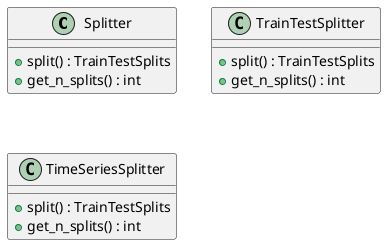
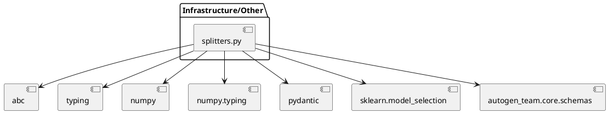
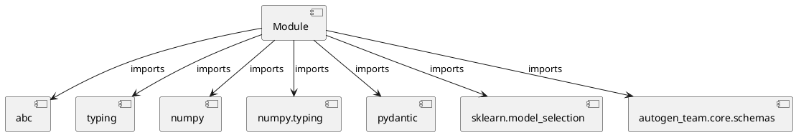
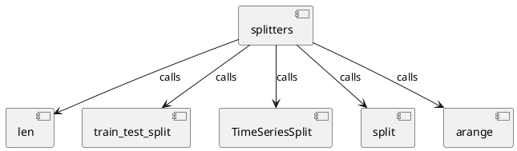

# Module Specification: splitters

* **Source Reference:** `src/autogen_team/infrastructure/utils/splitters.py`

## 1. Architectural Role & Responsibilities
**Purpose:**
Provides functionality related to splitters.

**Architecture Layer:**
- Infrastructure/Other

**Responsibilities:**
- Manages operations and logic for splitters.

**Main Workflow:**
- Executes the primary flow defined by splitters functions and classes.

## 2. Dependencies
**Imports:**
- `abc`
- `typing`
- `numpy`
- `numpy.typing`
- `pydantic`
- `sklearn.model_selection`
- `autogen_team.core.schemas`

**Exported Classes:**
- `Splitter`
- `TrainTestSplitter`
- `TimeSeriesSplitter`

**Exported Functions:**
- None

**Exported Interfaces:**
- Not explicitly defined.

**Public API:**
- Not explicitly defined.

## 3. Architecture & Execution
### Internal Architecture
Not explicitly defined.

### Execution Flow
Not explicitly defined.

### Sequence Explanation
Not explicitly defined.

### Examples
Not explicitly defined.

## 4. UML 2.0 Diagrams
### Class Diagram

```plantuml
@startuml
    class Splitter {
        +split() : TrainTestSplits
        +get_n_splits() : int
    }
    class TrainTestSplitter {
        +split() : TrainTestSplits
        +get_n_splits() : int
    }
    class TimeSeriesSplitter {
        +split() : TrainTestSplits
        +get_n_splits() : int
    }
@enduml
```

### Sequence Diagram

```plantuml
@startuml
    ' No functions for sequence
@enduml
```

### Component Diagram

```plantuml
@startuml
    package "Infrastructure/Other" {
        [splitters.py]
    }
    [splitters.py] --> [abc]
    [splitters.py] --> [typing]
    [splitters.py] --> [numpy]
    [splitters.py] --> [numpy.typing]
    [splitters.py] --> [pydantic]
    [splitters.py] --> [sklearn.model_selection]
    [splitters.py] --> [autogen_team.core.schemas]
@enduml
```

### Dependency Graph

```plantuml
@startuml
    [Module] --> [abc] : imports
    [Module] --> [typing] : imports
    [Module] --> [numpy] : imports
    [Module] --> [numpy.typing] : imports
    [Module] --> [pydantic] : imports
    [Module] --> [sklearn.model_selection] : imports
    [Module] --> [autogen_team.core.schemas] : imports
@enduml
```

## 5. Class & Method Specifications
### `Splitter` ([`src/autogen_team/infrastructure/utils/splitters.py`](/src/autogen_team/infrastructure/utils/splitters.py))
#### Overview
Base class for a splitter.

Use splitters to split data in sets.
e.g., split between a train/test subsets.

# https://scikit-learn.org/stable/glossary.html#term-CV-splitter

#### Attributes
- None found.

#### Methods
##### `split(self, inputs: schemas.Inputs, targets: schemas.Targets, groups: Index | None) -> TrainTestSplits` (Public)
**Description:** Split a dataframe into subsets.

Args:
    inputs (schemas.Inputs): model inputs.
    targets (schemas.Targets): model targets.
    groups (Index | None, optional): group labels.

Returns:
    TrainTestSplits: iterator over the dataframe train/test splits.

**Inputs:**
- `inputs`
  - type: schemas.Inputs
  - meaning: Represents the inputs parameter.
  - valid values: Any valid schemas.Inputs.
  - optional?: False
  - default value: None
- `targets`
  - type: schemas.Targets
  - meaning: Represents the targets parameter.
  - valid values: Any valid schemas.Targets.
  - optional?: False
  - default value: None
- `groups`
  - type: Index | None
  - meaning: Represents the groups parameter.
  - valid values: Any valid Index | None.
  - optional?: True
  - default value: None

**Output:**
- return type: `TrainTestSplits`
- semantic meaning: Returns the result of split.
- possible null values: Yes, if TrainTestSplits allows it.
- exceptions: Standard execution exceptions.

**Side Effects:**
- Database updates: Not explicitly defined.
- File operations: Not explicitly defined.
- Network calls: Not explicitly defined.
- Cache: Not explicitly defined.
- State changes: Not explicitly defined.

**Complexity:**
- Time Complexity: Not explicitly defined.
- Space Complexity: Not explicitly defined.

**Example:**
```python
result = Splitter.split(..., ..., ...)
```

##### `get_n_splits(self, inputs: schemas.Inputs, targets: schemas.Targets, groups: Index | None) -> int` (Public)
**Description:** Get the number of splits generated.

Args:
    inputs (schemas.Inputs): models inputs.
    targets (schemas.Targets): model targets.
    groups (Index | None, optional): group labels.

Returns:
    int: number of splits generated.

**Inputs:**
- `inputs`
  - type: schemas.Inputs
  - meaning: Represents the inputs parameter.
  - valid values: Any valid schemas.Inputs.
  - optional?: False
  - default value: None
- `targets`
  - type: schemas.Targets
  - meaning: Represents the targets parameter.
  - valid values: Any valid schemas.Targets.
  - optional?: False
  - default value: None
- `groups`
  - type: Index | None
  - meaning: Represents the groups parameter.
  - valid values: Any valid Index | None.
  - optional?: True
  - default value: None

**Output:**
- return type: `int`
- semantic meaning: Returns the result of get n splits.
- possible null values: Yes, if int allows it.
- exceptions: Standard execution exceptions.

**Side Effects:**
- Database updates: Not explicitly defined.
- File operations: Not explicitly defined.
- Network calls: Not explicitly defined.
- Cache: Not explicitly defined.
- State changes: Not explicitly defined.

**Complexity:**
- Time Complexity: Not explicitly defined.
- Space Complexity: Not explicitly defined.

**Example:**
```python
result = Splitter.get_n_splits(..., ..., ...)
```

### `TrainTestSplitter` ([`src/autogen_team/infrastructure/utils/splitters.py`](/src/autogen_team/infrastructure/utils/splitters.py))
#### Overview
Split a dataframe into a train and test set.

Parameters:
    shuffle (bool): shuffle the dataset. Default is False.
    test_size (int | float): number/ratio for the test set.
    random_state (int): random state for the splitter object.

#### Attributes
- None found.

#### Methods
##### `split(self, inputs: schemas.Inputs, targets: schemas.Targets, groups: Index | None) -> TrainTestSplits` (Public)
**Description:** Executes the split operation.

**Inputs:**
- `inputs`
  - type: schemas.Inputs
  - meaning: Represents the inputs parameter.
  - valid values: Any valid schemas.Inputs.
  - optional?: False
  - default value: None
- `targets`
  - type: schemas.Targets
  - meaning: Represents the targets parameter.
  - valid values: Any valid schemas.Targets.
  - optional?: False
  - default value: None
- `groups`
  - type: Index | None
  - meaning: Represents the groups parameter.
  - valid values: Any valid Index | None.
  - optional?: True
  - default value: None

**Output:**
- return type: `TrainTestSplits`
- semantic meaning: Returns the result of split.
- possible null values: Yes, if TrainTestSplits allows it.
- exceptions: Standard execution exceptions.

**Side Effects:**
- Database updates: Not explicitly defined.
- File operations: Not explicitly defined.
- Network calls: Not explicitly defined.
- Cache: Not explicitly defined.
- State changes: Not explicitly defined.

**Complexity:**
- Time Complexity: Not explicitly defined.
- Space Complexity: Not explicitly defined.

**Example:**
```python
result = TrainTestSplitter.split(..., ..., ...)
```

##### `get_n_splits(self, inputs: schemas.Inputs, targets: schemas.Targets, groups: Index | None) -> int` (Public)
**Description:** Executes the get n splits operation.

**Inputs:**
- `inputs`
  - type: schemas.Inputs
  - meaning: Represents the inputs parameter.
  - valid values: Any valid schemas.Inputs.
  - optional?: False
  - default value: None
- `targets`
  - type: schemas.Targets
  - meaning: Represents the targets parameter.
  - valid values: Any valid schemas.Targets.
  - optional?: False
  - default value: None
- `groups`
  - type: Index | None
  - meaning: Represents the groups parameter.
  - valid values: Any valid Index | None.
  - optional?: True
  - default value: None

**Output:**
- return type: `int`
- semantic meaning: Returns the result of get n splits.
- possible null values: Yes, if int allows it.
- exceptions: Standard execution exceptions.

**Side Effects:**
- Database updates: Not explicitly defined.
- File operations: Not explicitly defined.
- Network calls: Not explicitly defined.
- Cache: Not explicitly defined.
- State changes: Not explicitly defined.

**Complexity:**
- Time Complexity: Not explicitly defined.
- Space Complexity: Not explicitly defined.

**Example:**
```python
result = TrainTestSplitter.get_n_splits(..., ..., ...)
```

### `TimeSeriesSplitter` ([`src/autogen_team/infrastructure/utils/splitters.py`](/src/autogen_team/infrastructure/utils/splitters.py))
#### Overview
Split a dataframe into fixed time series subsets.

Parameters:
    gap (int): gap between splits.
    n_splits (int): number of split to generate.
    test_size (int | float): number or ratio for the test dataset.

#### Attributes
- None found.

#### Methods
##### `split(self, inputs: schemas.Inputs, targets: schemas.Targets, groups: Index | None) -> TrainTestSplits` (Public)
**Description:** Executes the split operation.

**Inputs:**
- `inputs`
  - type: schemas.Inputs
  - meaning: Represents the inputs parameter.
  - valid values: Any valid schemas.Inputs.
  - optional?: False
  - default value: None
- `targets`
  - type: schemas.Targets
  - meaning: Represents the targets parameter.
  - valid values: Any valid schemas.Targets.
  - optional?: False
  - default value: None
- `groups`
  - type: Index | None
  - meaning: Represents the groups parameter.
  - valid values: Any valid Index | None.
  - optional?: True
  - default value: None

**Output:**
- return type: `TrainTestSplits`
- semantic meaning: Returns the result of split.
- possible null values: Yes, if TrainTestSplits allows it.
- exceptions: Standard execution exceptions.

**Side Effects:**
- Database updates: Not explicitly defined.
- File operations: Not explicitly defined.
- Network calls: Not explicitly defined.
- Cache: Not explicitly defined.
- State changes: Not explicitly defined.

**Complexity:**
- Time Complexity: Not explicitly defined.
- Space Complexity: Not explicitly defined.

**Example:**
```python
result = TimeSeriesSplitter.split(..., ..., ...)
```

##### `get_n_splits(self, inputs: schemas.Inputs, targets: schemas.Targets, groups: Index | None) -> int` (Public)
**Description:** Executes the get n splits operation.

**Inputs:**
- `inputs`
  - type: schemas.Inputs
  - meaning: Represents the inputs parameter.
  - valid values: Any valid schemas.Inputs.
  - optional?: False
  - default value: None
- `targets`
  - type: schemas.Targets
  - meaning: Represents the targets parameter.
  - valid values: Any valid schemas.Targets.
  - optional?: False
  - default value: None
- `groups`
  - type: Index | None
  - meaning: Represents the groups parameter.
  - valid values: Any valid Index | None.
  - optional?: True
  - default value: None

**Output:**
- return type: `int`
- semantic meaning: Returns the result of get n splits.
- possible null values: Yes, if int allows it.
- exceptions: Standard execution exceptions.

**Side Effects:**
- Database updates: Not explicitly defined.
- File operations: Not explicitly defined.
- Network calls: Not explicitly defined.
- Cache: Not explicitly defined.
- State changes: Not explicitly defined.

**Complexity:**
- Time Complexity: Not explicitly defined.
- Space Complexity: Not explicitly defined.

**Example:**
```python
result = TimeSeriesSplitter.get_n_splits(..., ..., ...)
```

## 6. Module Functions
## 7. Call Graph

```plantuml
@startuml
[splitters] --> [len] : calls
[splitters] --> [train_test_split] : calls
[splitters] --> [TimeSeriesSplit] : calls
[splitters] --> [split] : calls
[splitters] --> [arange] : calls
@enduml
```

## 8. Cross References
- **Parent module:** __init__.md
- **Child modules:** None
- **Dependencies:** `numpy`, `sklearn.model_selection`, `typing`, `numpy.typing`, `autogen_team.core.schemas`, `abc`, `pydantic`
- **Used by:** ../../application/jobs/tuning.md, ../../../../tests/conftest.md, ../../../../tests/infrastructure/utils/test_splitters.md, ../../application/jobs/training.md
- **Calls:** len, train_test_split, TimeSeriesSplit, split, arange
- **Called from:** None
- **Related classes:** [Classes](../../../../../classes/index.md)
- **Related interfaces:** Not explicitly defined.
- **Related diagrams:** [Diagrams](../../../../../diagrams/index.md)
