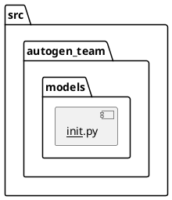
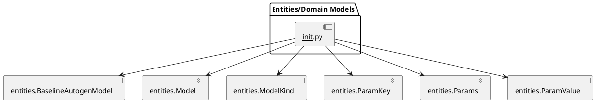
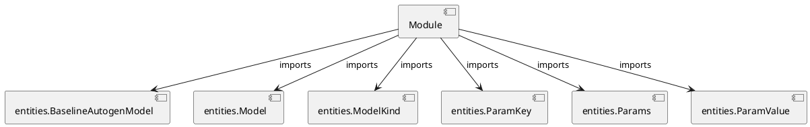

# Module Specification: __init__

* **Source Reference:** `src/autogen_team/models/__init__.py`

## 1. Architectural Role & Responsibilities
**Purpose:**
Provides functionality related to   init  .

**Architecture Layer:**
- Entities/Domain Models

**Responsibilities:**
- Not explicitly defined.

**Main Workflow:**
- Not explicitly defined.

## 2. Dependencies
**Imports:**
- `entities.BaselineAutogenModel`
- `entities.Model`
- `entities.ModelKind`
- `entities.ParamKey`
- `entities.Params`
- `entities.ParamValue`

**Exported Classes:**
- None

**Exported Functions:**
- None

**Exported Interfaces:**
- Not explicitly defined.

**Public API:**
- Not explicitly defined.

## 3. Architecture & Execution
### Internal Architecture
Not explicitly defined.

### Execution Flow
Not explicitly defined.

### Sequence Explanation
Not explicitly defined.

### Examples
Not explicitly defined.

## 4. UML 2.0 Diagrams
### Class Diagram

### Package Diagram

### Sequence Diagram

### Component Diagram

### Dependency Graph

## 5. Class & Method Specifications
## 6. Module Functions
## 7. Call Graph
- No public API calls detected.

## 8. Cross References
- **Dependencies:** [Dependencies](../../../../dependencies/index.md)
- **Used by:** None
- **Calls:** None
- **Called from:** None
- **Related classes:** [Classes](../../../../classes/index.md)
- **Related diagrams:** [Diagrams](../../../../diagrams/index.md)
