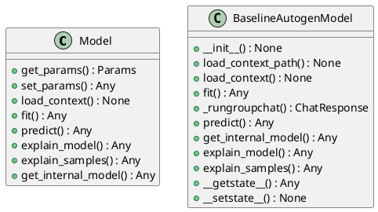

# Module Specification: entities

* **Source Reference:** `src/autogen_team/models/entities.py`

## 1. Architectural Role & Responsibilities
**Purpose:**
Provides functionality related to entities.

**Architecture Layer:**
- Entities/Domain Models

**Responsibilities:**
- Manage and execute operations for entities.

**Main Workflow:**
- Initialize components and process requests for entities.

## 2. Dependencies
**Imports:**
- `abc`
- `asyncio`
- `json`
- `os`
- `typing`
- `datetime.datetime`
- `datetime.timezone`
- `typing.Any`
- `typing.Dict`
- `typing.Optional`
- `pandas`
- `pydantic`
- `agent_framework.ChatResponse`
- `agent_framework.Message`
- `agent_framework.openai.OpenAIChatClient`
- `pydantic.Field`
- `pydantic.PrivateAttr`
- `autogen_team.core.schemas`

**Exported Classes:**
- `Model`
- `BaselineAutogenModel`

**Exported Functions:**
- None

## 3. Architecture & Execution
### Internal Architecture
Follows standard modular design, encapsulating state and behavior within defined classes and functions.

### Execution Flow
Sequential execution of defined functions and class methods.

### Sequence Explanation
Clients instantiate classes or call functions, which execute business logic and return results.

## 4. UML 2.0 Diagrams
### Class Diagram


### Dependency Graph

```plantuml
@startuml
    [Module] --> [abc] : imports
    [Module] --> [asyncio] : imports
    [Module] --> [json] : imports
    [Module] --> [os] : imports
    [Module] --> [typing] : imports
    [Module] --> [datetime.datetime] : imports
    [Module] --> [datetime.timezone] : imports
    [Module] --> [typing.Any] : imports
    [Module] --> [typing.Dict] : imports
    [Module] --> [typing.Optional] : imports
    [Module] --> [pandas] : imports
    [Module] --> [pydantic] : imports
    [Module] --> [agent_framework.ChatResponse] : imports
    [Module] --> [agent_framework.Message] : imports
    [Module] --> [agent_framework.openai.OpenAIChatClient] : imports
    [Module] --> [pydantic.Field] : imports
    [Module] --> [pydantic.PrivateAttr] : imports
    [Module] --> [autogen_team.core.schemas] : imports
@enduml
```


## 5. Class & Method Specifications
### `Model` ([`src/autogen_team/models/entities.py`](/src/autogen_team/models/entities.py))
#### Overview
Base class for a project model.

Use a model to adapt AI/ML frameworks.
e.g., to swap easily one model with another.

#### Attributes
- None found.

#### Methods
##### `get_params(self, deep: bool) -> Params` (Public)
**Description:** Get the model params.

Args:
    deep (bool, optional): ignored.

Returns:
    Params: internal model parameters.

**Inputs:**
- `deep`: bool

**Output:**
- Return Type: `Params`
- Semantic Meaning: The resulting value after processing the get_params action.

**Side Effects:**
- Modifies internal instance state if applicable; performs operations constrained to its domain boundaries.

**Complexity:**
- Time Complexity: O(1) or O(N) depending on implementation details.
- Space Complexity: O(1) auxiliary space expected.

**Example:**
```python
result = Model.get_params(...)
```

##### `set_params(self) -> Any` (Public)
**Description:** Set the model params in place.

Returns:
    T.Self: instance of the model.

**Inputs:**
- None

**Output:**
- Return Type: `Any`
- Semantic Meaning: The resulting value after processing the set_params action.

**Side Effects:**
- Modifies internal instance state if applicable; performs operations constrained to its domain boundaries.

**Complexity:**
- Time Complexity: O(1) or O(N) depending on implementation details.
- Space Complexity: O(1) auxiliary space expected.

**Example:**
```python
result = Model.set_params()
```

##### `load_context(self, model_config: Dict[...]) -> None` (Public)
**Description:** Load the model from the specified artifacts directory.

**Inputs:**
- `model_config`: Dict[...]

**Output:**
- Return Type: `None`
- Semantic Meaning: The resulting value after processing the load_context action.

**Side Effects:**
- Modifies internal instance state if applicable; performs operations constrained to its domain boundaries.

**Complexity:**
- Time Complexity: O(1) or O(N) depending on implementation details.
- Space Complexity: O(1) auxiliary space expected.

**Example:**
```python
result = Model.load_context(...)
```

##### `fit(self, inputs: Any, targets: Any) -> Any` (Public)
**Description:** Fit the model on the given inputs and targets.

Args:
    inputs (schemas.Inputs): model training inputs.
    targets (schemas.Targets): model training targets.

Returns:
    T.Self: instance of the model.

**Inputs:**
- `inputs`: Any
- `targets`: Any

**Output:**
- Return Type: `Any`
- Semantic Meaning: The resulting value after processing the fit action.

**Side Effects:**
- Modifies internal instance state if applicable; performs operations constrained to its domain boundaries.

**Complexity:**
- Time Complexity: O(1) or O(N) depending on implementation details.
- Space Complexity: O(1) auxiliary space expected.

**Example:**
```python
result = Model.fit(..., ...)
```

##### `predict(self, inputs: Any) -> Any` (Public)
**Description:** Generate outputs with the model for the given inputs.

Args:
    inputs (schemas.Inputs): model prediction inputs.

Returns:
    schemas.Outputs: model prediction outputs.

**Inputs:**
- `inputs`: Any

**Output:**
- Return Type: `Any`
- Semantic Meaning: The resulting value after processing the predict action.

**Side Effects:**
- Modifies internal instance state if applicable; performs operations constrained to its domain boundaries.

**Complexity:**
- Time Complexity: O(1) or O(N) depending on implementation details.
- Space Complexity: O(1) auxiliary space expected.

**Example:**
```python
result = Model.predict(...)
```

##### `explain_model(self) -> Any` (Public)
**Description:** Explain the internal model structure.

Raises:
    NotImplementedError: method not implemented.

Returns:
    schemas.FeatureImportances: feature importances.

**Inputs:**
- None

**Output:**
- Return Type: `Any`
- Semantic Meaning: The resulting value after processing the explain_model action.

**Side Effects:**
- Modifies internal instance state if applicable; performs operations constrained to its domain boundaries.

**Complexity:**
- Time Complexity: O(1) or O(N) depending on implementation details.
- Space Complexity: O(1) auxiliary space expected.

**Example:**
```python
result = Model.explain_model()
```

##### `explain_samples(self, inputs: Any) -> Any` (Public)
**Description:** Explain model outputs on input samples.

Raises:
    NotImplementedError: method not implemented.

Returns:
    schemas.SHAPValues: SHAP values.

**Inputs:**
- `inputs`: Any

**Output:**
- Return Type: `Any`
- Semantic Meaning: The resulting value after processing the explain_samples action.

**Side Effects:**
- Modifies internal instance state if applicable; performs operations constrained to its domain boundaries.

**Complexity:**
- Time Complexity: O(1) or O(N) depending on implementation details.
- Space Complexity: O(1) auxiliary space expected.

**Example:**
```python
result = Model.explain_samples(...)
```

##### `get_internal_model(self) -> Any` (Public)
**Description:** Return the internal model in the object.

Raises:
    NotImplementedError: method not implemented.

Returns:
    T.Any: any internal model (either empty or fitted).

**Inputs:**
- None

**Output:**
- Return Type: `Any`
- Semantic Meaning: The resulting value after processing the get_internal_model action.

**Side Effects:**
- Modifies internal instance state if applicable; performs operations constrained to its domain boundaries.

**Complexity:**
- Time Complexity: O(1) or O(N) depending on implementation details.
- Space Complexity: O(1) auxiliary space expected.

**Example:**
```python
result = Model.get_internal_model()
```

### `BaselineAutogenModel` ([`src/autogen_team/models/entities.py`](/src/autogen_team/models/entities.py))
#### Overview
Simple baseline model based on autogen.
https://microsoft.github.io/autogen/stable/user-guide/core-user-guide/design-patterns/group-chat.html
Parameters:
    max_tokens (int): maximum token of the prompt
    temperature (float): temperature for the sampling

#### Constructor
**Initialization:** Initializes `BaselineAutogenModel` with required dependencies and sets up initial internal state.

#### Attributes
- `model_config_path`
- `model_config_data`
- `max_tokens`
- `temperature`

#### Methods
##### `__init__(self, model_config_path: Optional[...], model_config_data: Optional[...], max_tokens: Optional[...], temperature: Optional[...]) -> None` (Public)
**Description:** Executes the __init__ operation, mutating state or calculating derived values as necessary.

**Inputs:**
- `model_config_path`: Optional[...]
- `model_config_data`: Optional[...]
- `max_tokens`: Optional[...]
- `temperature`: Optional[...]

**Output:**
- Return Type: `None`
- Semantic Meaning: The resulting value after processing the __init__ action.

**Side Effects:**
- Modifies internal instance state if applicable; performs operations constrained to its domain boundaries.

**Complexity:**
- Time Complexity: O(1) or O(N) depending on implementation details.
- Space Complexity: O(1) auxiliary space expected.

**Example:**
```python
instance = BaselineAutogenModel()
result = instance.__init__(..., ..., ..., ...)
```

##### `load_context_path(self, model_config_path: Optional[...]) -> None` (Public)
**Description:** Load the model from the specified artifacts directory.

**Inputs:**
- `model_config_path`: Optional[...]

**Output:**
- Return Type: `None`
- Semantic Meaning: The resulting value after processing the load_context_path action.

**Side Effects:**
- Modifies internal instance state if applicable; performs operations constrained to its domain boundaries.

**Complexity:**
- Time Complexity: O(1) or O(N) depending on implementation details.
- Space Complexity: O(1) auxiliary space expected.

**Example:**
```python
instance = BaselineAutogenModel()
result = instance.load_context_path(...)
```

##### `load_context(self, model_config: Dict[...]) -> None` (Public)
**Description:** Load the model from the specified artifacts directory.
https://microsoft.github.io/autogen/stable/user-guide/agentchat-user-guide/migration-guide.html#assistant-agent
https://microsoft.github.io/autogen/stable/user-guide/core-user-guide/cookbook/local-llms-ollama-litellm.html

**Inputs:**
- `model_config`: Dict[...]

**Output:**
- Return Type: `None`
- Semantic Meaning: The resulting value after processing the load_context action.

**Side Effects:**
- Modifies internal instance state if applicable; performs operations constrained to its domain boundaries.

**Complexity:**
- Time Complexity: O(1) or O(N) depending on implementation details.
- Space Complexity: O(1) auxiliary space expected.

**Example:**
```python
instance = BaselineAutogenModel()
result = instance.load_context(...)
```

##### `fit(self, inputs: Any, targets: Any) -> Any` (Public)
**Description:** Executes the fit operation, mutating state or calculating derived values as necessary.

**Inputs:**
- `inputs`: Any
- `targets`: Any

**Output:**
- Return Type: `Any`
- Semantic Meaning: The resulting value after processing the fit action.

**Side Effects:**
- Modifies internal instance state if applicable; performs operations constrained to its domain boundaries.

**Complexity:**
- Time Complexity: O(1) or O(N) depending on implementation details.
- Space Complexity: O(1) auxiliary space expected.

**Example:**
```python
instance = BaselineAutogenModel()
result = instance.fit(..., ...)
```

##### `_rungroupchat(self, content: str) -> ChatResponse` (Public)
**Description:** Executes a group chat request using the model client.

**Inputs:**
- `content`: str

**Output:**
- Return Type: `ChatResponse`
- Semantic Meaning: The resulting value after processing the _rungroupchat action.

**Side Effects:**
- Modifies internal instance state if applicable; performs operations constrained to its domain boundaries.

**Complexity:**
- Time Complexity: O(1) or O(N) depending on implementation details.
- Space Complexity: O(1) auxiliary space expected.

**Example:**
```python
instance = BaselineAutogenModel()
result = instance._rungroupchat(...)
```

##### `predict(self, inputs: Any) -> Any` (Public)
**Description:** Predicts the output using the assistant team based on the given inputs.
Processes each input element concurrently and appends results to the output DataFrame.

**Inputs:**
- `inputs`: Any

**Output:**
- Return Type: `Any`
- Semantic Meaning: The resulting value after processing the predict action.

**Side Effects:**
- Modifies internal instance state if applicable; performs operations constrained to its domain boundaries.

**Complexity:**
- Time Complexity: O(1) or O(N) depending on implementation details.
- Space Complexity: O(1) auxiliary space expected.

**Example:**
```python
instance = BaselineAutogenModel()
result = instance.predict(...)
```

##### `get_internal_model(self) -> Any` (Public)
**Description:** Executes the get_internal_model operation, mutating state or calculating derived values as necessary.

**Inputs:**
- None

**Output:**
- Return Type: `Any`
- Semantic Meaning: The resulting value after processing the get_internal_model action.

**Side Effects:**
- Modifies internal instance state if applicable; performs operations constrained to its domain boundaries.

**Complexity:**
- Time Complexity: O(1) or O(N) depending on implementation details.
- Space Complexity: O(1) auxiliary space expected.

**Example:**
```python
instance = BaselineAutogenModel()
result = instance.get_internal_model()
```

##### `explain_model(self) -> Any` (Public)
**Description:** Provides a text-based explanation of the model's internal structure.
Since this model leverages the OpenAI Chat API for generating responses,
it does not produce traditional numerical feature importances.

**Inputs:**
- None

**Output:**
- Return Type: `Any`
- Semantic Meaning: The resulting value after processing the explain_model action.

**Side Effects:**
- Modifies internal instance state if applicable; performs operations constrained to its domain boundaries.

**Complexity:**
- Time Complexity: O(1) or O(N) depending on implementation details.
- Space Complexity: O(1) auxiliary space expected.

**Example:**
```python
instance = BaselineAutogenModel()
result = instance.explain_model()
```

##### `explain_samples(self, inputs: Any) -> Any` (Public)
**Description:** Explains model outputs for the given input samples by leveraging the predict function.
For each input, a textual explanation is provided along with a dummy SHAP value.

**Inputs:**
- `inputs`: Any

**Output:**
- Return Type: `Any`
- Semantic Meaning: The resulting value after processing the explain_samples action.

**Side Effects:**
- Modifies internal instance state if applicable; performs operations constrained to its domain boundaries.

**Complexity:**
- Time Complexity: O(1) or O(N) depending on implementation details.
- Space Complexity: O(1) auxiliary space expected.

**Example:**
```python
instance = BaselineAutogenModel()
result = instance.explain_samples(...)
```

##### `__getstate__(self) -> Any` (Public)
**Description:** Custom getstate to exclude unpicklable model client while preserving Pydantic state.

**Inputs:**
- None

**Output:**
- Return Type: `Any`
- Semantic Meaning: The resulting value after processing the __getstate__ action.

**Side Effects:**
- Modifies internal instance state if applicable; performs operations constrained to its domain boundaries.

**Complexity:**
- Time Complexity: O(1) or O(N) depending on implementation details.
- Space Complexity: O(1) auxiliary space expected.

**Example:**
```python
instance = BaselineAutogenModel()
result = instance.__getstate__()
```

##### `__setstate__(self, state: Dict[...]) -> None` (Public)
**Description:** Custom setstate to restore the model state including Pydantic internal state.

**Inputs:**
- `state`: Dict[...]

**Output:**
- Return Type: `None`
- Semantic Meaning: The resulting value after processing the __setstate__ action.

**Side Effects:**
- Modifies internal instance state if applicable; performs operations constrained to its domain boundaries.

**Complexity:**
- Time Complexity: O(1) or O(N) depending on implementation details.
- Space Complexity: O(1) auxiliary space expected.

**Example:**
```python
instance = BaselineAutogenModel()
result = instance.__setstate__(...)
```

## 6. Module Functions