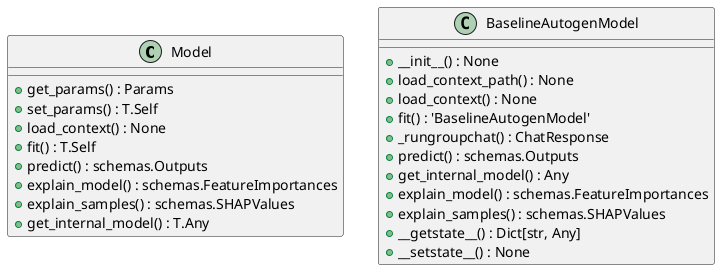
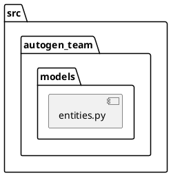

# Module Specification: entities

* **Source Reference:** `src/autogen_team/models/entities.py`

## 1. Architectural Role & Responsibilities
**Purpose:**
Provides functionality related to entities.

**Architecture Layer:**
- Entities/Domain Models

**Responsibilities:**
- Not explicitly defined.

**Main Workflow:**
- Not explicitly defined.

## 2. Dependencies
**Imports:**
- `abc`
- `asyncio`
- `json`
- `os`
- `typing`
- `datetime.datetime`
- `datetime.timezone`
- `typing.Any`
- `typing.Dict`
- `typing.Optional`
- `pandas`
- `pydantic`
- `agent_framework.ChatResponse`
- `agent_framework.Message`
- `agent_framework.openai.OpenAIChatClient`
- `pydantic.Field`
- `pydantic.PrivateAttr`
- `autogen_team.core.schemas`

**Exported Classes:**
- `Model`
- `BaselineAutogenModel`

**Exported Functions:**
- None

**Exported Interfaces:**
- Not explicitly defined.

**Public API:**
- Not explicitly defined.

## 3. Architecture & Execution
### Internal Architecture
Not explicitly defined.

### Execution Flow
Not explicitly defined.

### Sequence Explanation
Not explicitly defined.

### Examples
Not explicitly defined.

## 4. UML 2.0 Diagrams
### Class Diagram

```plantuml
@startuml
    class Model {
        +get_params() : Params
        +set_params() : T.Self
        +load_context() : None
        +fit() : T.Self
        +predict() : schemas.Outputs
        +explain_model() : schemas.FeatureImportances
        +explain_samples() : schemas.SHAPValues
        +get_internal_model() : T.Any
    }
    class BaselineAutogenModel {
        +__init__() : None
        +load_context_path() : None
        +load_context() : None
        +fit() : 'BaselineAutogenModel'
        +_rungroupchat() : ChatResponse
        +predict() : schemas.Outputs
        +get_internal_model() : Any
        +explain_model() : schemas.FeatureImportances
        +explain_samples() : schemas.SHAPValues
        +__getstate__() : Dict[str, Any]
        +__setstate__() : None
    }
@enduml
```

### Package Diagram

```plantuml
@startuml
    package "src" {
        package "autogen_team" {
            package "models" {
                [entities.py]
            }
        }
    }
@enduml
```

### Sequence Diagram

```plantuml
@startuml
    ' No functions for sequence
@enduml
```

### Component Diagram

```plantuml
@startuml
    package "Entities/Domain Models" {
        [entities.py]
    }
    [entities.py] --> [abc]
    [entities.py] --> [asyncio]
    [entities.py] --> [json]
    [entities.py] --> [os]
    [entities.py] --> [typing]
    [entities.py] --> [datetime.datetime]
    [entities.py] --> [datetime.timezone]
    [entities.py] --> [typing.Any]
    [entities.py] --> [typing.Dict]
    [entities.py] --> [typing.Optional]
    [entities.py] --> [pandas]
    [entities.py] --> [pydantic]
    [entities.py] --> [agent_framework.ChatResponse]
    [entities.py] --> [agent_framework.Message]
    [entities.py] --> [agent_framework.openai.OpenAIChatClient]
    [entities.py] --> [pydantic.Field]
    [entities.py] --> [pydantic.PrivateAttr]
    [entities.py] --> [autogen_team.core.schemas]
@enduml
```

### Dependency Graph

```plantuml
@startuml
    [Module] --> [abc] : imports
    [Module] --> [asyncio] : imports
    [Module] --> [json] : imports
    [Module] --> [os] : imports
    [Module] --> [typing] : imports
    [Module] --> [datetime.datetime] : imports
    [Module] --> [datetime.timezone] : imports
    [Module] --> [typing.Any] : imports
    [Module] --> [typing.Dict] : imports
    [Module] --> [typing.Optional] : imports
    [Module] --> [pandas] : imports
    [Module] --> [pydantic] : imports
    [Module] --> [agent_framework.ChatResponse] : imports
    [Module] --> [agent_framework.Message] : imports
    [Module] --> [agent_framework.openai.OpenAIChatClient] : imports
    [Module] --> [pydantic.Field] : imports
    [Module] --> [pydantic.PrivateAttr] : imports
    [Module] --> [autogen_team.core.schemas] : imports
@enduml
```

## 5. Class & Method Specifications
### `Model` ([`src/autogen_team/models/entities.py`](/src/autogen_team/models/entities.py))
#### Overview
Base class for a project model.

Use a model to adapt AI/ML frameworks.
e.g., to swap easily one model with another.

#### Attributes
- None found.

#### Methods
##### `get_params(self, deep: bool) -> Params` (Public)
**Description:** Get the model params.

Args:
    deep (bool, optional): ignored.

Returns:
    Params: internal model parameters.

**Inputs:**
- `deep`
  - type: bool
  - meaning: Not explicitly defined.
  - valid values: Not explicitly defined.
  - optional?: True
  - default value: True

**Output:**
- return type: `Params`
- semantic meaning: Not explicitly defined.
- possible null values: Not explicitly defined.
- exceptions: Not explicitly defined.

**Side Effects:**
- Database updates: Not explicitly defined.
- File operations: Not explicitly defined.
- Network calls: Not explicitly defined.
- Cache: Not explicitly defined.
- State changes: Not explicitly defined.

**Complexity:**
- Time Complexity: Not explicitly defined.
- Space Complexity: Not explicitly defined.

**Example:**
```python
result = Model.get_params(...)
```

##### `set_params(self) -> T.Self` (Public)
**Description:** Set the model params in place.

Returns:
    T.Self: instance of the model.

**Inputs:**
- None

**Output:**
- return type: `T.Self`
- semantic meaning: Not explicitly defined.
- possible null values: Not explicitly defined.
- exceptions: Not explicitly defined.

**Side Effects:**
- Database updates: Not explicitly defined.
- File operations: Not explicitly defined.
- Network calls: Not explicitly defined.
- Cache: Not explicitly defined.
- State changes: Not explicitly defined.

**Complexity:**
- Time Complexity: Not explicitly defined.
- Space Complexity: Not explicitly defined.

**Example:**
```python
result = Model.set_params()
```

##### `load_context(self, model_config: Dict[str, Any]) -> None` (Public)
**Description:** Load the model from the specified artifacts directory.

**Inputs:**
- `model_config`
  - type: Dict[str, Any]
  - meaning: Not explicitly defined.
  - valid values: Not explicitly defined.
  - optional?: False
  - default value: None

**Output:**
- return type: `None`
- semantic meaning: Not explicitly defined.
- possible null values: Not explicitly defined.
- exceptions: Not explicitly defined.

**Side Effects:**
- Database updates: Not explicitly defined.
- File operations: Not explicitly defined.
- Network calls: Not explicitly defined.
- Cache: Not explicitly defined.
- State changes: Not explicitly defined.

**Complexity:**
- Time Complexity: Not explicitly defined.
- Space Complexity: Not explicitly defined.

**Example:**
```python
result = Model.load_context(...)
```

##### `fit(self, inputs: schemas.Inputs, targets: schemas.Targets) -> T.Self` (Public)
**Description:** Fit the model on the given inputs and targets.

Args:
    inputs (schemas.Inputs): model training inputs.
    targets (schemas.Targets): model training targets.

Returns:
    T.Self: instance of the model.

**Inputs:**
- `inputs`
  - type: schemas.Inputs
  - meaning: Not explicitly defined.
  - valid values: Not explicitly defined.
  - optional?: False
  - default value: None
- `targets`
  - type: schemas.Targets
  - meaning: Not explicitly defined.
  - valid values: Not explicitly defined.
  - optional?: False
  - default value: None

**Output:**
- return type: `T.Self`
- semantic meaning: Not explicitly defined.
- possible null values: Not explicitly defined.
- exceptions: Not explicitly defined.

**Side Effects:**
- Database updates: Not explicitly defined.
- File operations: Not explicitly defined.
- Network calls: Not explicitly defined.
- Cache: Not explicitly defined.
- State changes: Not explicitly defined.

**Complexity:**
- Time Complexity: Not explicitly defined.
- Space Complexity: Not explicitly defined.

**Example:**
```python
result = Model.fit(..., ...)
```

##### `predict(self, inputs: schemas.Inputs) -> schemas.Outputs` (Public)
**Description:** Generate outputs with the model for the given inputs.

Args:
    inputs (schemas.Inputs): model prediction inputs.

Returns:
    schemas.Outputs: model prediction outputs.

**Inputs:**
- `inputs`
  - type: schemas.Inputs
  - meaning: Not explicitly defined.
  - valid values: Not explicitly defined.
  - optional?: False
  - default value: None

**Output:**
- return type: `schemas.Outputs`
- semantic meaning: Not explicitly defined.
- possible null values: Not explicitly defined.
- exceptions: Not explicitly defined.

**Side Effects:**
- Database updates: Not explicitly defined.
- File operations: Not explicitly defined.
- Network calls: Not explicitly defined.
- Cache: Not explicitly defined.
- State changes: Not explicitly defined.

**Complexity:**
- Time Complexity: Not explicitly defined.
- Space Complexity: Not explicitly defined.

**Example:**
```python
result = Model.predict(...)
```

##### `explain_model(self) -> schemas.FeatureImportances` (Public)
**Description:** Explain the internal model structure.

Raises:
    NotImplementedError: method not implemented.

Returns:
    schemas.FeatureImportances: feature importances.

**Inputs:**
- None

**Output:**
- return type: `schemas.FeatureImportances`
- semantic meaning: Not explicitly defined.
- possible null values: Not explicitly defined.
- exceptions: Not explicitly defined.

**Side Effects:**
- Database updates: Not explicitly defined.
- File operations: Not explicitly defined.
- Network calls: Not explicitly defined.
- Cache: Not explicitly defined.
- State changes: Not explicitly defined.

**Complexity:**
- Time Complexity: Not explicitly defined.
- Space Complexity: Not explicitly defined.

**Example:**
```python
result = Model.explain_model()
```

##### `explain_samples(self, inputs: schemas.Inputs) -> schemas.SHAPValues` (Public)
**Description:** Explain model outputs on input samples.

Raises:
    NotImplementedError: method not implemented.

Returns:
    schemas.SHAPValues: SHAP values.

**Inputs:**
- `inputs`
  - type: schemas.Inputs
  - meaning: Not explicitly defined.
  - valid values: Not explicitly defined.
  - optional?: False
  - default value: None

**Output:**
- return type: `schemas.SHAPValues`
- semantic meaning: Not explicitly defined.
- possible null values: Not explicitly defined.
- exceptions: Not explicitly defined.

**Side Effects:**
- Database updates: Not explicitly defined.
- File operations: Not explicitly defined.
- Network calls: Not explicitly defined.
- Cache: Not explicitly defined.
- State changes: Not explicitly defined.

**Complexity:**
- Time Complexity: Not explicitly defined.
- Space Complexity: Not explicitly defined.

**Example:**
```python
result = Model.explain_samples(...)
```

##### `get_internal_model(self) -> T.Any` (Public)
**Description:** Return the internal model in the object.

Raises:
    NotImplementedError: method not implemented.

Returns:
    T.Any: any internal model (either empty or fitted).

**Inputs:**
- None

**Output:**
- return type: `T.Any`
- semantic meaning: Not explicitly defined.
- possible null values: Not explicitly defined.
- exceptions: Not explicitly defined.

**Side Effects:**
- Database updates: Not explicitly defined.
- File operations: Not explicitly defined.
- Network calls: Not explicitly defined.
- Cache: Not explicitly defined.
- State changes: Not explicitly defined.

**Complexity:**
- Time Complexity: Not explicitly defined.
- Space Complexity: Not explicitly defined.

**Example:**
```python
result = Model.get_internal_model()
```

### `BaselineAutogenModel` ([`src/autogen_team/models/entities.py`](/src/autogen_team/models/entities.py))
#### Overview
Simple baseline model based on autogen.
https://microsoft.github.io/autogen/stable/user-guide/core-user-guide/design-patterns/group-chat.html
Parameters:
    max_tokens (int): maximum token of the prompt
    temperature (float): temperature for the sampling

#### Constructor
**Initialization:** Initializes `BaselineAutogenModel` with required dependencies and sets up initial internal state.

#### Attributes
- `model_config_path`
  - Type: Any
  - Purpose: Not explicitly defined.
  - Constraints: Not explicitly defined.
- `model_config_data`
  - Type: Any
  - Purpose: Not explicitly defined.
  - Constraints: Not explicitly defined.
- `max_tokens`
  - Type: Any
  - Purpose: Not explicitly defined.
  - Constraints: Not explicitly defined.
- `temperature`
  - Type: Any
  - Purpose: Not explicitly defined.
  - Constraints: Not explicitly defined.

#### Methods
##### `__init__(self, model_config_path: Optional[str], model_config_data: Optional[Dict[str, Any]], max_tokens: Optional[int], temperature: Optional[float]) -> None` (Public)
**Description:** No description provided.

**Inputs:**
- `model_config_path`
  - type: Optional[str]
  - meaning: Not explicitly defined.
  - valid values: Not explicitly defined.
  - optional?: True
  - default value: None
- `model_config_data`
  - type: Optional[Dict[str, Any]]
  - meaning: Not explicitly defined.
  - valid values: Not explicitly defined.
  - optional?: True
  - default value: None
- `max_tokens`
  - type: Optional[int]
  - meaning: Not explicitly defined.
  - valid values: Not explicitly defined.
  - optional?: True
  - default value: 320000
- `temperature`
  - type: Optional[float]
  - meaning: Not explicitly defined.
  - valid values: Not explicitly defined.
  - optional?: True
  - default value: 0.5

**Output:**
- return type: `None`
- semantic meaning: Not explicitly defined.
- possible null values: Not explicitly defined.
- exceptions: Not explicitly defined.

**Side Effects:**
- Database updates: Not explicitly defined.
- File operations: Not explicitly defined.
- Network calls: Not explicitly defined.
- Cache: Not explicitly defined.
- State changes: Not explicitly defined.

**Complexity:**
- Time Complexity: Not explicitly defined.
- Space Complexity: Not explicitly defined.

**Example:**
```python
instance = BaselineAutogenModel()
result = instance.__init__(..., ..., ..., ...)
```

##### `load_context_path(self, model_config_path: Optional[str]) -> None` (Public)
**Description:** Load the model from the specified artifacts directory.

**Inputs:**
- `model_config_path`
  - type: Optional[str]
  - meaning: Not explicitly defined.
  - valid values: Not explicitly defined.
  - optional?: True
  - default value: None

**Output:**
- return type: `None`
- semantic meaning: Not explicitly defined.
- possible null values: Not explicitly defined.
- exceptions: Not explicitly defined.

**Side Effects:**
- Database updates: Not explicitly defined.
- File operations: Not explicitly defined.
- Network calls: Not explicitly defined.
- Cache: Not explicitly defined.
- State changes: Not explicitly defined.

**Complexity:**
- Time Complexity: Not explicitly defined.
- Space Complexity: Not explicitly defined.

**Example:**
```python
instance = BaselineAutogenModel()
result = instance.load_context_path(...)
```

##### `load_context(self, model_config: Dict[str, Any]) -> None` (Public)
**Description:** Load the model from the specified artifacts directory.
https://microsoft.github.io/autogen/stable/user-guide/agentchat-user-guide/migration-guide.html#assistant-agent
https://microsoft.github.io/autogen/stable/user-guide/core-user-guide/cookbook/local-llms-ollama-litellm.html

**Inputs:**
- `model_config`
  - type: Dict[str, Any]
  - meaning: Not explicitly defined.
  - valid values: Not explicitly defined.
  - optional?: False
  - default value: None

**Output:**
- return type: `None`
- semantic meaning: Not explicitly defined.
- possible null values: Not explicitly defined.
- exceptions: Not explicitly defined.

**Side Effects:**
- Database updates: Not explicitly defined.
- File operations: Not explicitly defined.
- Network calls: Not explicitly defined.
- Cache: Not explicitly defined.
- State changes: Not explicitly defined.

**Complexity:**
- Time Complexity: Not explicitly defined.
- Space Complexity: Not explicitly defined.

**Example:**
```python
instance = BaselineAutogenModel()
result = instance.load_context(...)
```

##### `fit(self, inputs: schemas.Inputs, targets: schemas.Targets) -> 'BaselineAutogenModel'` (Public)
**Description:** No description provided.

**Inputs:**
- `inputs`
  - type: schemas.Inputs
  - meaning: Not explicitly defined.
  - valid values: Not explicitly defined.
  - optional?: False
  - default value: None
- `targets`
  - type: schemas.Targets
  - meaning: Not explicitly defined.
  - valid values: Not explicitly defined.
  - optional?: False
  - default value: None

**Output:**
- return type: `'BaselineAutogenModel'`
- semantic meaning: Not explicitly defined.
- possible null values: Not explicitly defined.
- exceptions: Not explicitly defined.

**Side Effects:**
- Database updates: Not explicitly defined.
- File operations: Not explicitly defined.
- Network calls: Not explicitly defined.
- Cache: Not explicitly defined.
- State changes: Not explicitly defined.

**Complexity:**
- Time Complexity: Not explicitly defined.
- Space Complexity: Not explicitly defined.

**Example:**
```python
instance = BaselineAutogenModel()
result = instance.fit(..., ...)
```

##### `_rungroupchat(self, content: str) -> ChatResponse` (Private)
**Purpose:** Executes a group chat request using the model client.

**Parameters:**
- `content`: str

**Return value:**
- `ChatResponse`

##### `predict(self, inputs: schemas.Inputs) -> schemas.Outputs` (Public)
**Description:** Predicts the output using the assistant team based on the given inputs.
Processes each input element concurrently and appends results to the output DataFrame.

**Inputs:**
- `inputs`
  - type: schemas.Inputs
  - meaning: Not explicitly defined.
  - valid values: Not explicitly defined.
  - optional?: False
  - default value: None

**Output:**
- return type: `schemas.Outputs`
- semantic meaning: Not explicitly defined.
- possible null values: Not explicitly defined.
- exceptions: Not explicitly defined.

**Side Effects:**
- Database updates: Not explicitly defined.
- File operations: Not explicitly defined.
- Network calls: Not explicitly defined.
- Cache: Not explicitly defined.
- State changes: Not explicitly defined.

**Complexity:**
- Time Complexity: Not explicitly defined.
- Space Complexity: Not explicitly defined.

**Example:**
```python
instance = BaselineAutogenModel()
result = instance.predict(...)
```

##### `get_internal_model(self) -> Any` (Public)
**Description:** No description provided.

**Inputs:**
- None

**Output:**
- return type: `Any`
- semantic meaning: Not explicitly defined.
- possible null values: Not explicitly defined.
- exceptions: Not explicitly defined.

**Side Effects:**
- Database updates: Not explicitly defined.
- File operations: Not explicitly defined.
- Network calls: Not explicitly defined.
- Cache: Not explicitly defined.
- State changes: Not explicitly defined.

**Complexity:**
- Time Complexity: Not explicitly defined.
- Space Complexity: Not explicitly defined.

**Example:**
```python
instance = BaselineAutogenModel()
result = instance.get_internal_model()
```

##### `explain_model(self) -> schemas.FeatureImportances` (Public)
**Description:** Provides a text-based explanation of the model's internal structure.
Since this model leverages the OpenAI Chat API for generating responses,
it does not produce traditional numerical feature importances.

**Inputs:**
- None

**Output:**
- return type: `schemas.FeatureImportances`
- semantic meaning: Not explicitly defined.
- possible null values: Not explicitly defined.
- exceptions: Not explicitly defined.

**Side Effects:**
- Database updates: Not explicitly defined.
- File operations: Not explicitly defined.
- Network calls: Not explicitly defined.
- Cache: Not explicitly defined.
- State changes: Not explicitly defined.

**Complexity:**
- Time Complexity: Not explicitly defined.
- Space Complexity: Not explicitly defined.

**Example:**
```python
instance = BaselineAutogenModel()
result = instance.explain_model()
```

##### `explain_samples(self, inputs: schemas.Inputs) -> schemas.SHAPValues` (Public)
**Description:** Explains model outputs for the given input samples by leveraging the predict function.
For each input, a textual explanation is provided along with a dummy SHAP value.

**Inputs:**
- `inputs`
  - type: schemas.Inputs
  - meaning: Not explicitly defined.
  - valid values: Not explicitly defined.
  - optional?: False
  - default value: None

**Output:**
- return type: `schemas.SHAPValues`
- semantic meaning: Not explicitly defined.
- possible null values: Not explicitly defined.
- exceptions: Not explicitly defined.

**Side Effects:**
- Database updates: Not explicitly defined.
- File operations: Not explicitly defined.
- Network calls: Not explicitly defined.
- Cache: Not explicitly defined.
- State changes: Not explicitly defined.

**Complexity:**
- Time Complexity: Not explicitly defined.
- Space Complexity: Not explicitly defined.

**Example:**
```python
instance = BaselineAutogenModel()
result = instance.explain_samples(...)
```

##### `__getstate__(self) -> Dict[str, Any]` (Private)
**Purpose:** Custom getstate to exclude unpicklable model client while preserving Pydantic state.

**Parameters:**
- None

**Return value:**
- `Dict[str, Any]`

##### `__setstate__(self, state: Dict[str, Any]) -> None` (Private)
**Purpose:** Custom setstate to restore the model state including Pydantic internal state.

**Parameters:**
- `state`: Dict[str, Any]

**Return value:**
- `None`

## 6. Module Functions
## 7. Call Graph

```plantuml
@startuml
[entities] --> [update] : calls
[entities] --> [open] : calls
[entities] --> [getenv] : calls
[entities] --> [OpenAIChatClient] : calls
[entities] --> [hasattr] : calls
[entities] --> [isinstance] : calls
[entities] --> [endswith] : calls
[entities] --> [_rungroupchat] : calls
[entities] --> [DataFrame] : calls
[entities] --> [FileNotFoundError] : calls
[entities] --> [get] : calls
[entities] --> [gather] : calls
[entities] --> [expand_env] : calls
[entities] --> [load_context] : calls
[entities] --> [setattr] : calls
[entities] --> [isfile] : calls
[entities] --> [__setattr__] : calls
[entities] --> [super] : calls
[entities] --> [get_response] : calls
[entities] --> [str] : calls
[entities] --> [__init__] : calls
[entities] --> [now] : calls
[entities] --> [pop] : calls
[entities] --> [PrivateAttr] : calls
[entities] --> [_run_all_predictions] : calls
[entities] --> [OpenAIChatCompletionClient] : calls
[entities] --> [append] : calls
[entities] --> [RuntimeError] : calls
[entities] --> [items] : calls
[entities] --> [isupper] : calls
[entities] --> [run] : calls
[entities] --> [Field] : calls
[entities] --> [SHAPValues] : calls
[entities] --> [ValueError] : calls
[entities] --> [isoformat] : calls
[entities] --> [itertuples] : calls
[entities] --> [load] : calls
[entities] --> [Outputs] : calls
[entities] --> [getattr] : calls
[entities] --> [copy] : calls
[entities] --> [FeatureImportances] : calls
[entities] --> [ChatMessage] : calls
[entities] --> [predict] : calls
[entities] --> [zip] : calls
[entities] --> [NotImplementedError] : calls
[entities] --> [startswith] : calls
@enduml
```

## 8. Cross References
- **Dependencies:** [Dependencies](../../../../dependencies/index.md)
- **Used by:** ../application/jobs/training.md, ../../../tests/conftest.md, ../application/jobs/tuning.md, ../../../tests/models/test_models.md
- **Calls:** update, open, getenv, OpenAIChatClient, hasattr, isinstance, endswith, _rungroupchat, DataFrame, FileNotFoundError, get, gather, expand_env, load_context, setattr, isfile, __setattr__, super, get_response, str, __init__, now, pop, PrivateAttr, _run_all_predictions, OpenAIChatCompletionClient, append, RuntimeError, items, isupper, run, Field, SHAPValues, ValueError, isoformat, itertuples, load, Outputs, getattr, copy, FeatureImportances, ChatMessage, predict, zip, NotImplementedError, startswith
- **Called from:** None
- **Related classes:** [Classes](../../../../classes/index.md)
- **Related diagrams:** [Diagrams](../../../../diagrams/index.md)
