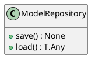
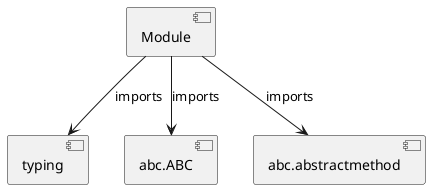

# Module Specification: repositories

* **Source Reference:** `src/autogen_team/models/repositories.py`

## 1. Architectural Role & Responsibilities
**Purpose:**
Provides functionality related to repositories.

**Architecture Layer:**
- Entities/Domain Models

**Responsibilities:**
- Not explicitly defined.

**Main Workflow:**
- Not explicitly defined.

## 2. Dependencies
**Imports:**
- `typing`
- `abc.ABC`
- `abc.abstractmethod`

**Exported Classes:**
- `ModelRepository`

**Exported Functions:**
- None

## 3. Architecture & Execution
### Internal Architecture
Not explicitly defined.

### Execution Flow
Not explicitly defined.

### Sequence Explanation
Not explicitly defined.

## 4. UML 2.0 Diagrams
### Class Diagram


### Dependency Graph


## 5. Class & Method Specifications
### `ModelRepository` ([`src/autogen_team/models/repositories.py`](/src/autogen_team/models/repositories.py))
#### Overview
Abstract repository for model persistence.

#### Attributes
- None found.

#### Methods
##### `save(self, model: T.Any, path: str) -> None` (Public)
**Description:** Save model to storage.

**Inputs:**
- `model`: T.Any
- `path`: str

**Output:**
- Return Type: `None`
- Semantic Meaning: Not explicitly defined.

**Side Effects:**
- Not explicitly defined.

**Complexity:**
- Time Complexity: Not explicitly defined.
- Space Complexity: Not explicitly defined.

**Example:**
```python
result = ModelRepository.save(..., ...)
```

##### `load(self, path: str) -> T.Any` (Public)
**Description:** Load model from storage.

**Inputs:**
- `path`: str

**Output:**
- Return Type: `T.Any`
- Semantic Meaning: Not explicitly defined.

**Side Effects:**
- Not explicitly defined.

**Complexity:**
- Time Complexity: Not explicitly defined.
- Space Complexity: Not explicitly defined.

**Example:**
```python
result = ModelRepository.load(...)
```

## 6. Module Functions