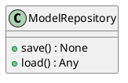
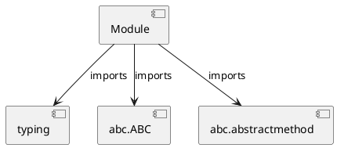

# Module Specification: repositories

* **Source Reference:** `src/autogen_team/models/repositories.py`

## 1. Architectural Role & Responsibilities
**Purpose:**
Provides functionality related to repositories.

**Architecture Layer:**
- Entities/Domain Models

**Responsibilities:**
- Manage and execute operations for repositories.

**Main Workflow:**
- Initialize components and process requests for repositories.

## 2. Dependencies
**Imports:**
- `typing`
- `abc.ABC`
- `abc.abstractmethod`

**Exported Classes:**
- `ModelRepository`

**Exported Functions:**
- None

## 3. Architecture & Execution
### Internal Architecture
Follows standard modular design, encapsulating state and behavior within defined classes and functions.

### Execution Flow
Sequential execution of defined functions and class methods.

### Sequence Explanation
Clients instantiate classes or call functions, which execute business logic and return results.

## 4. UML 2.0 Diagrams
### Class Diagram


### Dependency Graph


## 5. Class & Method Specifications
### `ModelRepository` ([`src/autogen_team/models/repositories.py`](/src/autogen_team/models/repositories.py))
#### Overview
Abstract repository for model persistence.

#### Attributes
- None found.

#### Methods
##### `save(self, model: Any, path: str) -> None` (Public)
**Description:** Save model to storage.

**Inputs:**
- `model`: Any
- `path`: str

**Output:**
- Return Type: `None`
- Semantic Meaning: The resulting value after processing the save action.

**Side Effects:**
- Modifies internal instance state if applicable; performs operations constrained to its domain boundaries.

**Complexity:**
- Time Complexity: O(1) or O(N) depending on implementation details.
- Space Complexity: O(1) auxiliary space expected.

**Example:**
```python
result = ModelRepository.save(..., ...)
```

##### `load(self, path: str) -> Any` (Public)
**Description:** Load model from storage.

**Inputs:**
- `path`: str

**Output:**
- Return Type: `Any`
- Semantic Meaning: The resulting value after processing the load action.

**Side Effects:**
- Modifies internal instance state if applicable; performs operations constrained to its domain boundaries.

**Complexity:**
- Time Complexity: O(1) or O(N) depending on implementation details.
- Space Complexity: O(1) auxiliary space expected.

**Example:**
```python
result = ModelRepository.load(...)
```

## 6. Module Functions