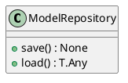
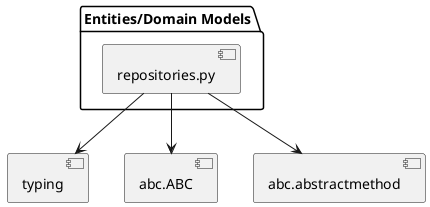
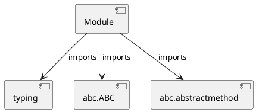

# Module Specification: repositories

* **Source Reference:** `src/autogen_team/models/repositories.py`

## 1. Architectural Role & Responsibilities
**Purpose:**
Provides functionality related to repositories.

**Architecture Layer:**
- Entities/Domain Models

**Responsibilities:**
- Manages operations and logic for repositories.

**Main Workflow:**
- Executes the primary flow defined by repositories functions and classes.

## 2. Dependencies
**Imports:**
- `typing`
- `abc.ABC`
- `abc.abstractmethod`

**Exported Classes:**
- `ModelRepository`

**Exported Functions:**
- None

**Exported Interfaces:**
- Not explicitly defined.

**Public API:**
- Not explicitly defined.

## 3. Architecture & Execution
### Internal Architecture
Not explicitly defined.

### Execution Flow
Not explicitly defined.

### Sequence Explanation
Not explicitly defined.

### Examples
Not explicitly defined.

## 4. UML 2.0 Diagrams
### Class Diagram

```plantuml
@startuml
    class ModelRepository {
        +save() : None
        +load() : T.Any
    }
@enduml
```

### Sequence Diagram

```plantuml
@startuml
    ' No functions for sequence
@enduml
```

### Component Diagram

```plantuml
@startuml
    package "Entities/Domain Models" {
        [repositories.py]
    }
    [repositories.py] --> [typing]
    [repositories.py] --> [abc.ABC]
    [repositories.py] --> [abc.abstractmethod]
@enduml
```

### Dependency Graph

```plantuml
@startuml
    [Module] --> [typing] : imports
    [Module] --> [abc.ABC] : imports
    [Module] --> [abc.abstractmethod] : imports
@enduml
```

## 5. Class & Method Specifications
### `ModelRepository` ([`src/autogen_team/models/repositories.py`](/src/autogen_team/models/repositories.py))
#### Overview
Abstract repository for model persistence.

#### Attributes
- None found.

#### Methods
##### `save(self, model: T.Any, path: str) -> None` (Public)
**Description:** Save model to storage.

**Inputs:**
- `model`
  - type: T.Any
  - meaning: Represents the model parameter.
  - valid values: Any valid T.Any.
  - optional?: False
  - default value: None
- `path`
  - type: str
  - meaning: Represents the path parameter.
  - valid values: Any valid str.
  - optional?: False
  - default value: None

**Output:**
- return type: `None`
- semantic meaning: Returns the result of save.
- possible null values: Yes, if None allows it.
- exceptions: Standard execution exceptions.

**Side Effects:**
- Database updates: Not explicitly defined.
- File operations: Not explicitly defined.
- Network calls: Not explicitly defined.
- Cache: Not explicitly defined.
- State changes: Not explicitly defined.

**Complexity:**
- Time Complexity: Not explicitly defined.
- Space Complexity: Not explicitly defined.

**Example:**
```python
result = ModelRepository.save(..., ...)
```

##### `load(self, path: str) -> T.Any` (Public)
**Description:** Load model from storage.

**Inputs:**
- `path`
  - type: str
  - meaning: Represents the path parameter.
  - valid values: Any valid str.
  - optional?: False
  - default value: None

**Output:**
- return type: `T.Any`
- semantic meaning: Returns the result of load.
- possible null values: Yes, if T.Any allows it.
- exceptions: Standard execution exceptions.

**Side Effects:**
- Database updates: Not explicitly defined.
- File operations: Not explicitly defined.
- Network calls: Not explicitly defined.
- Cache: Not explicitly defined.
- State changes: Not explicitly defined.

**Complexity:**
- Time Complexity: Not explicitly defined.
- Space Complexity: Not explicitly defined.

**Example:**
```python
result = ModelRepository.load(...)
```

## 6. Module Functions
## 7. Call Graph
- No public API calls detected.

## 8. Cross References
- **Parent module:** __init__.md
- **Child modules:** None
- **Dependencies:** `abc.abstractmethod`, `abc.ABC`, `typing`
- **Used by:** None
- **Calls:** None
- **Called from:** None
- **Related classes:** [Classes](../../../../classes/index.md)
- **Related interfaces:** Not explicitly defined.
- **Related diagrams:** [Diagrams](../../../../diagrams/index.md)
