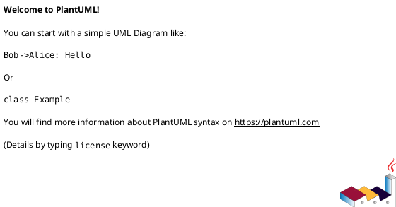

# Module Specification: __init__

* **Source Reference:** `src/autogen_team/registry/adapters/__init__.py`

## 1. Architectural Role & Responsibilities
**Purpose:**
Provides functionality related to   init  .

**Architecture Layer:**
- Infrastructure/Other

**Responsibilities:**
- Not explicitly defined.

**Main Workflow:**
- Not explicitly defined.

## 2. Dependencies
**Imports:**
- `mlflow_adapter.Alias`
- `mlflow_adapter.CustomLoader`
- `mlflow_adapter.CustomSaver`
- `mlflow_adapter.Info`
- `mlflow_adapter.Loader`
- `mlflow_adapter.LoaderKind`
- `mlflow_adapter.MlflowRegister`
- `mlflow_adapter.Register`
- `mlflow_adapter.RegisterKind`
- `mlflow_adapter.Saver`
- `mlflow_adapter.SaverKind`
- `mlflow_adapter.Version`
- `mlflow_adapter.uri_for_model_alias`
- `mlflow_adapter.uri_for_model_alias_or_version`
- `mlflow_adapter.uri_for_model_version`

**Exported Classes:**
- None

**Exported Functions:**
- None

## 3. Architecture & Execution
### Internal Architecture
Not explicitly defined.

### Execution Flow
Not explicitly defined.

### Sequence Explanation
Not explicitly defined.

## 4. UML 2.0 Diagrams
### Class Diagram

### Dependency Graph

```plantuml
@startuml
    [Module] --> [mlflow_adapter.Alias] : imports
    [Module] --> [mlflow_adapter.CustomLoader] : imports
    [Module] --> [mlflow_adapter.CustomSaver] : imports
    [Module] --> [mlflow_adapter.Info] : imports
    [Module] --> [mlflow_adapter.Loader] : imports
    [Module] --> [mlflow_adapter.LoaderKind] : imports
    [Module] --> [mlflow_adapter.MlflowRegister] : imports
    [Module] --> [mlflow_adapter.Register] : imports
    [Module] --> [mlflow_adapter.RegisterKind] : imports
    [Module] --> [mlflow_adapter.Saver] : imports
    [Module] --> [mlflow_adapter.SaverKind] : imports
    [Module] --> [mlflow_adapter.Version] : imports
    [Module] --> [mlflow_adapter.uri_for_model_alias] : imports
    [Module] --> [mlflow_adapter.uri_for_model_alias_or_version] : imports
    [Module] --> [mlflow_adapter.uri_for_model_version] : imports
@enduml
```

## 5. Class & Method Specifications
## 6. Module Functions