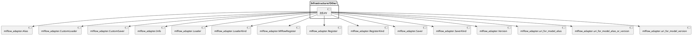
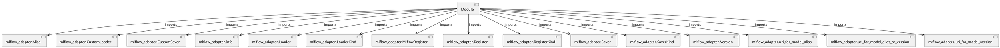

# Module Specification: __init__

* **Source Reference:** `src/autogen_team/registry/adapters/__init__.py`

## 1. Architectural Role & Responsibilities
**Purpose:**
Provides functionality related to   init  .

**Architecture Layer:**
- Infrastructure/Other

**Responsibilities:**
- Manages operations and logic for   init  .

**Main Workflow:**
- Executes the primary flow defined by   init   functions and classes.

## 2. Dependencies
**Imports:**
- `mlflow_adapter.Alias`
- `mlflow_adapter.CustomLoader`
- `mlflow_adapter.CustomSaver`
- `mlflow_adapter.Info`
- `mlflow_adapter.Loader`
- `mlflow_adapter.LoaderKind`
- `mlflow_adapter.MlflowRegister`
- `mlflow_adapter.Register`
- `mlflow_adapter.RegisterKind`
- `mlflow_adapter.Saver`
- `mlflow_adapter.SaverKind`
- `mlflow_adapter.Version`
- `mlflow_adapter.uri_for_model_alias`
- `mlflow_adapter.uri_for_model_alias_or_version`
- `mlflow_adapter.uri_for_model_version`

**Exported Classes:**
- None

**Exported Functions:**
- None

**Exported Interfaces:**
- Not explicitly defined.

**Public API:**
- Not explicitly defined.

## 3. Architecture & Execution
### Internal Architecture
Not explicitly defined.

### Execution Flow
Not explicitly defined.

### Sequence Explanation
Not explicitly defined.

### Examples
Not explicitly defined.

## 4. UML 2.0 Diagrams
### Class Diagram

```plantuml
@startuml
    ' No classes found in module
@enduml
```

### Sequence Diagram

```plantuml
@startuml
    ' No functions for sequence
@enduml
```

### Component Diagram

```plantuml
@startuml
    package "Infrastructure/Other" {
        [__init__.py]
    }
    [__init__.py] --> [mlflow_adapter.Alias]
    [__init__.py] --> [mlflow_adapter.CustomLoader]
    [__init__.py] --> [mlflow_adapter.CustomSaver]
    [__init__.py] --> [mlflow_adapter.Info]
    [__init__.py] --> [mlflow_adapter.Loader]
    [__init__.py] --> [mlflow_adapter.LoaderKind]
    [__init__.py] --> [mlflow_adapter.MlflowRegister]
    [__init__.py] --> [mlflow_adapter.Register]
    [__init__.py] --> [mlflow_adapter.RegisterKind]
    [__init__.py] --> [mlflow_adapter.Saver]
    [__init__.py] --> [mlflow_adapter.SaverKind]
    [__init__.py] --> [mlflow_adapter.Version]
    [__init__.py] --> [mlflow_adapter.uri_for_model_alias]
    [__init__.py] --> [mlflow_adapter.uri_for_model_alias_or_version]
    [__init__.py] --> [mlflow_adapter.uri_for_model_version]
@enduml
```

### Dependency Graph

```plantuml
@startuml
    [Module] --> [mlflow_adapter.Alias] : imports
    [Module] --> [mlflow_adapter.CustomLoader] : imports
    [Module] --> [mlflow_adapter.CustomSaver] : imports
    [Module] --> [mlflow_adapter.Info] : imports
    [Module] --> [mlflow_adapter.Loader] : imports
    [Module] --> [mlflow_adapter.LoaderKind] : imports
    [Module] --> [mlflow_adapter.MlflowRegister] : imports
    [Module] --> [mlflow_adapter.Register] : imports
    [Module] --> [mlflow_adapter.RegisterKind] : imports
    [Module] --> [mlflow_adapter.Saver] : imports
    [Module] --> [mlflow_adapter.SaverKind] : imports
    [Module] --> [mlflow_adapter.Version] : imports
    [Module] --> [mlflow_adapter.uri_for_model_alias] : imports
    [Module] --> [mlflow_adapter.uri_for_model_alias_or_version] : imports
    [Module] --> [mlflow_adapter.uri_for_model_version] : imports
@enduml
```

## 5. Class & Method Specifications
## 6. Module Functions
## 7. Call Graph
- No public API calls detected.

## 8. Cross References
- **Parent module:** ../__init__.md
- **Child modules:** mlflow_adapter.md
- **Dependencies:** `mlflow_adapter.uri_for_model_version`, `mlflow_adapter.Info`, `mlflow_adapter.MlflowRegister`, `mlflow_adapter.SaverKind`, `mlflow_adapter.LoaderKind`, `mlflow_adapter.uri_for_model_alias`, `mlflow_adapter.RegisterKind`, `mlflow_adapter.Loader`, `mlflow_adapter.Alias`, `mlflow_adapter.Register`, `mlflow_adapter.uri_for_model_alias_or_version`, `mlflow_adapter.CustomSaver`, `mlflow_adapter.Version`, `mlflow_adapter.CustomLoader`, `mlflow_adapter.Saver`
- **Used by:** None
- **Calls:** None
- **Called from:** None
- **Related classes:** [Classes](../../../../../classes/index.md)
- **Related interfaces:** Not explicitly defined.
- **Related diagrams:** [Diagrams](../../../../../diagrams/index.md)
