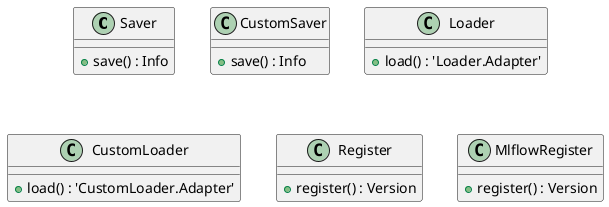
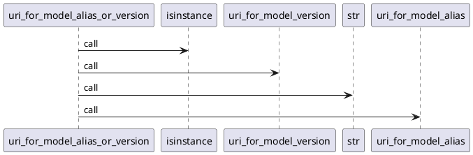

# Module Specification: mlflow_adapter

* **Source Reference:** `src/autogen_team/registry/adapters/mlflow_adapter.py`

## 1. Architectural Role & Responsibilities
**Purpose:**
Provides functionality related to mlflow adapter.

**Architecture Layer:**
- Infrastructure/Other

**Responsibilities:**
- Manages operations and logic for mlflow adapter.

**Main Workflow:**
- Executes the primary flow defined by mlflow adapter functions and classes.

## 2. Dependencies
**Imports:**
- `abc`
- `json`
- `os`
- `typing`
- `typing.Any`
- `typing.Dict`
- `mlflow`
- `mlflow.entities`
- `mlflow.entities.model_registry`
- `mlflow.models.model`
- `pandas`
- `pydantic`
- `mlflow.pyfunc.model.PythonModel`
- `mlflow.pyfunc.model.PythonModelContext`
- `autogen_team.core.schemas`
- `autogen_team.infrastructure.utils.signers`
- `autogen_team.models.entities`

**Exported Classes:**
- `Saver`
- `CustomSaver`
- `Loader`
- `CustomLoader`
- `Register`
- `MlflowRegister`

**Exported Functions:**
- `uri_for_model_alias`
- `uri_for_model_version`
- `uri_for_model_alias_or_version`

**Exported Interfaces:**
- Not explicitly defined.

**Public API:**
- Not explicitly defined.

## 3. Architecture & Execution
### Internal Architecture
Not explicitly defined.

### Execution Flow
Not explicitly defined.

### Sequence Explanation
Not explicitly defined.

### Examples
Not explicitly defined.

## 4. UML 2.0 Diagrams
### Class Diagram


### Sequence Diagram


### Component Diagram

```plantuml
@startuml
    package "Infrastructure/Other" {
        [mlflow_adapter.py]
    }
    [mlflow_adapter.py] --> [abc]
    [mlflow_adapter.py] --> [json]
    [mlflow_adapter.py] --> [os]
    [mlflow_adapter.py] --> [typing]
    [mlflow_adapter.py] --> [typing.Any]
    [mlflow_adapter.py] --> [typing.Dict]
    [mlflow_adapter.py] --> [mlflow]
    [mlflow_adapter.py] --> [mlflow.entities]
    [mlflow_adapter.py] --> [mlflow.entities.model_registry]
    [mlflow_adapter.py] --> [mlflow.models.model]
    [mlflow_adapter.py] --> [pandas]
    [mlflow_adapter.py] --> [pydantic]
    [mlflow_adapter.py] --> [mlflow.pyfunc.model.PythonModel]
    [mlflow_adapter.py] --> [mlflow.pyfunc.model.PythonModelContext]
    [mlflow_adapter.py] --> [autogen_team.core.schemas]
    [mlflow_adapter.py] --> [autogen_team.infrastructure.utils.signers]
    [mlflow_adapter.py] --> [autogen_team.models.entities]
@enduml
```


### Dependency Graph

```plantuml
@startuml
    [Module] --> [abc] : imports
    [Module] --> [json] : imports
    [Module] --> [os] : imports
    [Module] --> [typing] : imports
    [Module] --> [typing.Any] : imports
    [Module] --> [typing.Dict] : imports
    [Module] --> [mlflow] : imports
    [Module] --> [mlflow.entities] : imports
    [Module] --> [mlflow.entities.model_registry] : imports
    [Module] --> [mlflow.models.model] : imports
    [Module] --> [pandas] : imports
    [Module] --> [pydantic] : imports
    [Module] --> [mlflow.pyfunc.model.PythonModel] : imports
    [Module] --> [mlflow.pyfunc.model.PythonModelContext] : imports
    [Module] --> [autogen_team.core.schemas] : imports
    [Module] --> [autogen_team.infrastructure.utils.signers] : imports
    [Module] --> [autogen_team.models.entities] : imports
@enduml
```


## 5. Class & Method Specifications
### `Saver` ([`src/autogen_team/registry/adapters/mlflow_adapter.py`](/src/autogen_team/registry/adapters/mlflow_adapter.py))
#### Overview
Base class for saving models in registry.

Separate model definition from serialization.
e.g., to switch between serialization flavors.

Parameters:
    path (str): model path inside the Mlflow store.

#### Attributes
- None found.

#### Methods
##### `save(self, model: models.Model, signature: signers.Signature, input_example: schemas.Inputs) -> Info` (Public)
**Description:** Save a model in the model registry.

Args:
    model (models.Model): project model to save.
    signature (signers.Signature): model signature.
    input_example (schemas.Inputs): sample of inputs.

Returns:
    Info: model saving information.

**Inputs:**
- `model`
  - type: models.Model
  - meaning: Represents the model parameter.
  - valid values: Any valid models.Model.
  - optional?: False
  - default value: None
- `signature`
  - type: signers.Signature
  - meaning: Represents the signature parameter.
  - valid values: Any valid signers.Signature.
  - optional?: False
  - default value: None
- `input_example`
  - type: schemas.Inputs
  - meaning: Represents the input example parameter.
  - valid values: Any valid schemas.Inputs.
  - optional?: False
  - default value: None

**Output:**
- return type: `Info`
- semantic meaning: Returns the result of save.
- possible null values: Yes, if Info allows it.
- exceptions: Standard execution exceptions.

**Side Effects:**
- Database updates: Not explicitly defined.
- File operations: Not explicitly defined.
- Network calls: Not explicitly defined.
- Cache: Not explicitly defined.
- State changes: Not explicitly defined.

**Complexity:**
- Time Complexity: Not explicitly defined.
- Space Complexity: Not explicitly defined.

**Example:**
```python
result = Saver.save(..., ..., ...)
```

### `CustomSaver` ([`src/autogen_team/registry/adapters/mlflow_adapter.py`](/src/autogen_team/registry/adapters/mlflow_adapter.py))
#### Overview
Saver for project models using the Mlflow PyFunc module.

https://mlflow.org/docs/latest/python_api/mlflow.pyfunc.html
https://mlflow.org/blog/autogen-image-agent
https://mlflow.org/blog/custom-pyfunc

#### Attributes
- None found.

#### Methods
##### `save(self, model: models.Model, signature: signers.Signature, input_example: schemas.Inputs) -> Info` (Public)
**Description:** Executes the save operation.

**Inputs:**
- `model`
  - type: models.Model
  - meaning: Represents the model parameter.
  - valid values: Any valid models.Model.
  - optional?: False
  - default value: None
- `signature`
  - type: signers.Signature
  - meaning: Represents the signature parameter.
  - valid values: Any valid signers.Signature.
  - optional?: False
  - default value: None
- `input_example`
  - type: schemas.Inputs
  - meaning: Represents the input example parameter.
  - valid values: Any valid schemas.Inputs.
  - optional?: False
  - default value: None

**Output:**
- return type: `Info`
- semantic meaning: Returns the result of save.
- possible null values: Yes, if Info allows it.
- exceptions: Standard execution exceptions.

**Side Effects:**
- Database updates: Not explicitly defined.
- File operations: Not explicitly defined.
- Network calls: Not explicitly defined.
- Cache: Not explicitly defined.
- State changes: Not explicitly defined.

**Complexity:**
- Time Complexity: Not explicitly defined.
- Space Complexity: Not explicitly defined.

**Example:**
```python
result = CustomSaver.save(..., ..., ...)
```

### `Loader` ([`src/autogen_team/registry/adapters/mlflow_adapter.py`](/src/autogen_team/registry/adapters/mlflow_adapter.py))
#### Overview
Base class for loading models from registry.

Separate model definition from deserialization.
e.g., to switch between deserialization flavors.

#### Attributes
- None found.

#### Methods
##### `load(self, uri: str) -> 'Loader.Adapter'` (Public)
**Description:** Load a model from the model registry.

Args:
    uri (str): URI of a model to load.

Returns:
    Loader.Adapter: model loaded.

**Inputs:**
- `uri`
  - type: str
  - meaning: Represents the uri parameter.
  - valid values: Any valid str.
  - optional?: False
  - default value: None

**Output:**
- return type: `'Loader.Adapter'`
- semantic meaning: Returns the result of load.
- possible null values: Yes, if 'Loader.Adapter' allows it.
- exceptions: Standard execution exceptions.

**Side Effects:**
- Database updates: Not explicitly defined.
- File operations: Not explicitly defined.
- Network calls: Not explicitly defined.
- Cache: Not explicitly defined.
- State changes: Not explicitly defined.

**Complexity:**
- Time Complexity: Not explicitly defined.
- Space Complexity: Not explicitly defined.

**Example:**
```python
result = Loader.load(...)
```

### `CustomLoader` ([`src/autogen_team/registry/adapters/mlflow_adapter.py`](/src/autogen_team/registry/adapters/mlflow_adapter.py))
#### Overview
Loader for custom models using the Mlflow PyFunc module.

https://mlflow.org/docs/latest/python_api/mlflow.pyfunc.html

#### Attributes
- None found.

#### Methods
##### `load(self, uri: str) -> 'CustomLoader.Adapter'` (Public)
**Description:** Executes the load operation.

**Inputs:**
- `uri`
  - type: str
  - meaning: Represents the uri parameter.
  - valid values: Any valid str.
  - optional?: False
  - default value: None

**Output:**
- return type: `'CustomLoader.Adapter'`
- semantic meaning: Returns the result of load.
- possible null values: Yes, if 'CustomLoader.Adapter' allows it.
- exceptions: Standard execution exceptions.

**Side Effects:**
- Database updates: Not explicitly defined.
- File operations: Not explicitly defined.
- Network calls: Not explicitly defined.
- Cache: Not explicitly defined.
- State changes: Not explicitly defined.

**Complexity:**
- Time Complexity: Not explicitly defined.
- Space Complexity: Not explicitly defined.

**Example:**
```python
result = CustomLoader.load(...)
```

### `Register` ([`src/autogen_team/registry/adapters/mlflow_adapter.py`](/src/autogen_team/registry/adapters/mlflow_adapter.py))
#### Overview
Base class for registring models to a location.

Separate model definition from its registration.
e.g., to change the model registry backend.

Parameters:
    tags (dict[str, T.Any]): tags for the model.

#### Attributes
- None found.

#### Methods
##### `register(self, name: str, model_uri: str) -> Version` (Public)
**Description:** Register a model given its name and URI.

Args:
    name (str): name of the model to register.
    model_uri (str): URI of a model to register.

Returns:
    Version: information about the registered model.

**Inputs:**
- `name`
  - type: str
  - meaning: Represents the name parameter.
  - valid values: Any valid str.
  - optional?: False
  - default value: None
- `model_uri`
  - type: str
  - meaning: Represents the model uri parameter.
  - valid values: Any valid str.
  - optional?: False
  - default value: None

**Output:**
- return type: `Version`
- semantic meaning: Returns the result of register.
- possible null values: Yes, if Version allows it.
- exceptions: Standard execution exceptions.

**Side Effects:**
- Database updates: Not explicitly defined.
- File operations: Not explicitly defined.
- Network calls: Not explicitly defined.
- Cache: Not explicitly defined.
- State changes: Not explicitly defined.

**Complexity:**
- Time Complexity: Not explicitly defined.
- Space Complexity: Not explicitly defined.

**Example:**
```python
result = Register.register(..., ...)
```

### `MlflowRegister` ([`src/autogen_team/registry/adapters/mlflow_adapter.py`](/src/autogen_team/registry/adapters/mlflow_adapter.py))
#### Overview
Register for models in the Mlflow Model Registry.

https://mlflow.org/docs/latest/model-registry.html

#### Attributes
- None found.

#### Methods
##### `register(self, name: str, model_uri: str) -> Version` (Public)
**Description:** Executes the register operation.

**Inputs:**
- `name`
  - type: str
  - meaning: Represents the name parameter.
  - valid values: Any valid str.
  - optional?: False
  - default value: None
- `model_uri`
  - type: str
  - meaning: Represents the model uri parameter.
  - valid values: Any valid str.
  - optional?: False
  - default value: None

**Output:**
- return type: `Version`
- semantic meaning: Returns the result of register.
- possible null values: Yes, if Version allows it.
- exceptions: Standard execution exceptions.

**Side Effects:**
- Database updates: Not explicitly defined.
- File operations: Not explicitly defined.
- Network calls: Not explicitly defined.
- Cache: Not explicitly defined.
- State changes: Not explicitly defined.

**Complexity:**
- Time Complexity: Not explicitly defined.
- Space Complexity: Not explicitly defined.

**Example:**
```python
result = MlflowRegister.register(..., ...)
```

## 6. Module Functions
### `uri_for_model_alias(name: str, alias: str)`
Create a model URI from a model name and an alias.

Args:
    name (str): name of the mlflow registered model.
    alias (str): alias of the registered model.

Returns:
    str: model URI as "models:/name@alias".

**Inputs:**
- `name`
  - type: str
  - meaning: Represents the name parameter.
  - valid values: Any valid str.
  - optional?: False
  - default value: None
- `alias`
  - type: str
  - meaning: Represents the alias parameter.
  - valid values: Any valid str.
  - optional?: False
  - default value: None

**Output:**
- return type: `str`
- semantic meaning: Returns the result of uri for model alias.
- possible null values: Yes, if str allows it.
- exceptions: Standard execution exceptions.

**Side Effects:**
- Database updates: Not explicitly defined.
- File operations: Not explicitly defined.
- Network calls: Not explicitly defined.
- Cache: Not explicitly defined.
- State changes: Not explicitly defined.

### `uri_for_model_version(name: str, version: str)`
Create a model URI from a model name and a version.

Args:
    name (str): name of the mlflow registered model.
    version (int): version of the registered model.

Returns:
    str: model URI as "models:/name/version."

**Inputs:**
- `name`
  - type: str
  - meaning: Represents the name parameter.
  - valid values: Any valid str.
  - optional?: False
  - default value: None
- `version`
  - type: str
  - meaning: Represents the version parameter.
  - valid values: Any valid str.
  - optional?: False
  - default value: None

**Output:**
- return type: `str`
- semantic meaning: Returns the result of uri for model version.
- possible null values: Yes, if str allows it.
- exceptions: Standard execution exceptions.

**Side Effects:**
- Database updates: Not explicitly defined.
- File operations: Not explicitly defined.
- Network calls: Not explicitly defined.
- Cache: Not explicitly defined.
- State changes: Not explicitly defined.

### `uri_for_model_alias_or_version(name: str, alias_or_version: str | int)`
Create a model URi from a model name and an alias or version.

Args:
    name (str): name of the mlflow registered model.
    alias_or_version (str | int): alias or version of the registered model.

Returns:
    str: model URI as "models:/name@alias" or "models:/name/version" based on input.

**Inputs:**
- `name`
  - type: str
  - meaning: Represents the name parameter.
  - valid values: Any valid str.
  - optional?: False
  - default value: None
- `alias_or_version`
  - type: str | int
  - meaning: Represents the alias or version parameter.
  - valid values: Any valid str | int.
  - optional?: False
  - default value: None

**Output:**
- return type: `str`
- semantic meaning: Returns the result of uri for model alias or version.
- possible null values: Yes, if str allows it.
- exceptions: Standard execution exceptions.

**Side Effects:**
- Database updates: Not explicitly defined.
- File operations: Not explicitly defined.
- Network calls: Not explicitly defined.
- Cache: Not explicitly defined.
- State changes: Not explicitly defined.

## 7. Call Graph

```plantuml
@startuml
[mlflow_adapter] --> [predict] : calls
[mlflow_adapter] --> [print] : calls
[mlflow_adapter] --> [uri_for_model_alias] : calls
[mlflow_adapter] --> [save_model] : calls
[mlflow_adapter] --> [mkdtemp] : calls
[mlflow_adapter] --> [uri_for_model_version] : calls
[mlflow_adapter] --> [abspath] : calls
[mlflow_adapter] --> [ModelInfo] : calls
[mlflow_adapter] --> [join] : calls
[mlflow_adapter] --> [load_context] : calls
[mlflow_adapter] --> [Outputs] : calls
[mlflow_adapter] --> [makedirs] : calls
[mlflow_adapter] --> [load] : calls
[mlflow_adapter] --> [Adapter] : calls
[mlflow_adapter] --> [log_model] : calls
[mlflow_adapter] --> [register_model] : calls
[mlflow_adapter] --> [isinstance] : calls
[mlflow_adapter] --> [load_model] : calls
[mlflow_adapter] --> [open] : calls
[mlflow_adapter] --> [str] : calls
[mlflow_adapter] --> [now] : calls
[mlflow_adapter] --> [isoformat] : calls
[mlflow_adapter] --> [DataFrame] : calls
@enduml
```


## 8. Cross References
- **Parent module:** __init__.md
- **Child modules:** None
- **Dependencies:** `os`, `mlflow.entities`, `mlflow.models.model`, `mlflow.pyfunc.model.PythonModelContext`, `pandas`, `typing`, `autogen_team.infrastructure.utils.signers`, `typing.Dict`, `mlflow`, `autogen_team.core.schemas`, `autogen_team.models.entities`, `abc`, `typing.Any`, `json`, `mlflow.entities.model_registry`, `pydantic`, `mlflow.pyfunc.model.PythonModel`
- **Used by:** ../../application/jobs/training.md, ../../../../tests/registry/adapters/test_registries.md, ../../application/jobs/inference.md, ../../application/jobs/explanations.md, ../../infrastructure/messaging/kafka_app.md, ../../application/jobs/hatchet_inference.md, ../../../../tests/conftest.md
- **Calls:** predict, print, uri_for_model_alias, save_model, mkdtemp, uri_for_model_version, abspath, ModelInfo, join, load_context, Outputs, makedirs, load, Adapter, log_model, register_model, isinstance, load_model, open, str, now, isoformat, DataFrame
- **Called from:** ../../application/jobs/inference.md, ../../application/jobs/explanations.md, ../../application/jobs/evaluations.md, ../../../../tests/registry/adapters/test_registries.md
- **Related classes:** [Classes](../../../../../classes/index.md)
- **Related interfaces:** Not explicitly defined.
- **Related diagrams:** [Diagrams](../../../../../diagrams/index.md)
