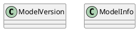
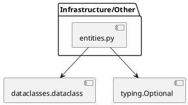
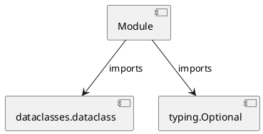

# Module Specification: entities

* **Source Reference:** `src/autogen_team/registry/entities.py`

## 1. Architectural Role & Responsibilities
**Purpose:**
Provides functionality related to entities.

**Architecture Layer:**
- Infrastructure/Other

**Responsibilities:**
- Manages operations and logic for entities.

**Main Workflow:**
- Executes the primary flow defined by entities functions and classes.

## 2. Dependencies
**Imports:**
- `dataclasses.dataclass`
- `typing.Optional`

**Exported Classes:**
- `ModelVersion`
- `ModelInfo`

**Exported Functions:**
- None

**Exported Interfaces:**
- Not explicitly defined.

**Public API:**
- Not explicitly defined.

## 3. Architecture & Execution
### Internal Architecture
Not explicitly defined.

### Execution Flow
Not explicitly defined.

### Sequence Explanation
Not explicitly defined.

### Examples
Not explicitly defined.

## 4. UML 2.0 Diagrams
### Class Diagram

### Sequence Diagram

### Component Diagram

### Dependency Graph

## 5. Class & Method Specifications
### `ModelVersion` ([`src/autogen_team/registry/entities.py`](/src/autogen_team/registry/entities.py))
#### Overview
Represents a registered model version.

#### Attributes
- None found.

#### Methods
### `ModelInfo` ([`src/autogen_team/registry/entities.py`](/src/autogen_team/registry/entities.py))
#### Overview
Represents model metadata.

#### Attributes
- None found.

#### Methods
## 6. Module Functions
## 7. Call Graph
- No public API calls detected.

## 8. Cross References
- **Parent module:** __init__.md
- **Child modules:** None
- **Dependencies:** `dataclasses.dataclass`, `typing.Optional`
- **Used by:** adapters/mlflow_adapter.md
- **Calls:** None
- **Called from:** None
- **Related classes:** [Classes](../../../../classes/index.md)
- **Related interfaces:** Not explicitly defined.
- **Related diagrams:** [Diagrams](../../../../diagrams/index.md)
