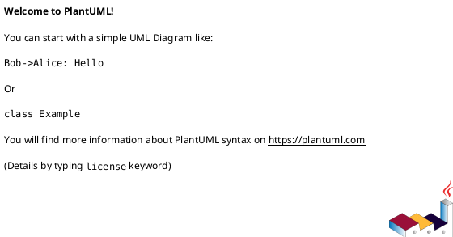
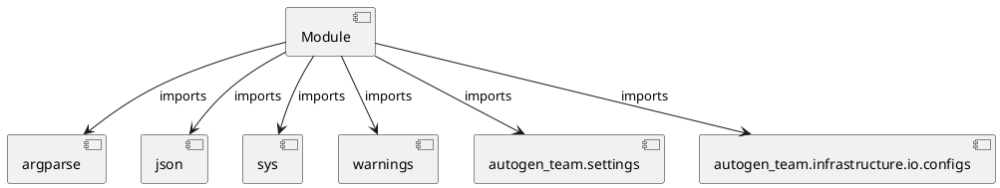

# Module Specification: scripts

* **Source Reference:** `src/autogen_team/scripts.py`

## 1. Architectural Role & Responsibilities
**Purpose:**
Provides functionality related to scripts.

**Architecture Layer:**
- Infrastructure/Other

**Responsibilities:**
- Manage and execute operations for scripts.

**Main Workflow:**
- Initialize components and process requests for scripts.

## 2. Dependencies
**Imports:**
- `argparse`
- `json`
- `sys`
- `warnings`
- `autogen_team.settings`
- `autogen_team.infrastructure.io.configs`

**Exported Classes:**
- None

**Exported Functions:**
- `main`

## 3. Architecture & Execution
### Internal Architecture
Follows standard modular design, encapsulating state and behavior within defined classes and functions.

### Execution Flow
Sequential execution of defined functions and class methods.

### Sequence Explanation
Clients instantiate classes or call functions, which execute business logic and return results.

## 4. UML 2.0 Diagrams
### Class Diagram

### Dependency Graph

## 5. Class & Method Specifications
## 6. Module Functions
### `main(argv: Any)`
Main script for the application.

**Inputs:**
- `argv`: Any

**Output:**
- Return Type: `int`
