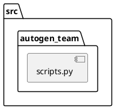
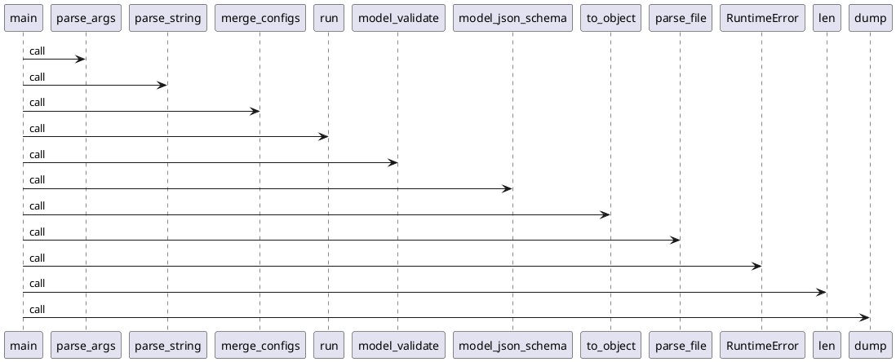
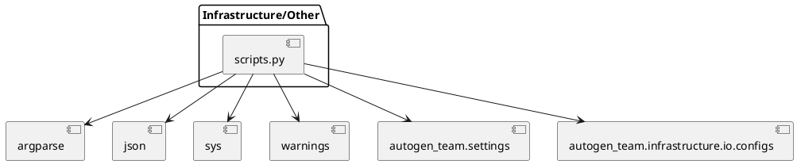
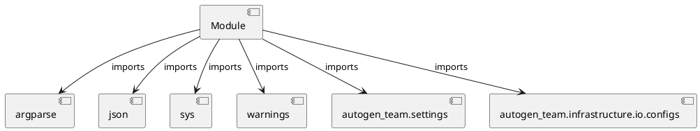
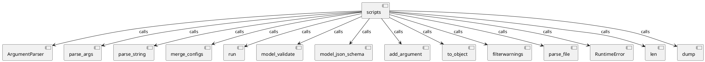

# Module Specification: scripts

* **Source Reference:** `src/autogen_team/scripts.py`

## 1. Architectural Role & Responsibilities
**Purpose:**
Provides functionality related to scripts.

**Architecture Layer:**
- Infrastructure/Other

**Responsibilities:**
- Not explicitly defined.

**Main Workflow:**
- Not explicitly defined.

## 2. Dependencies
**Imports:**
- `argparse`
- `json`
- `sys`
- `warnings`
- `autogen_team.settings`
- `autogen_team.infrastructure.io.configs`

**Exported Classes:**
- None

**Exported Functions:**
- `main`

**Exported Interfaces:**
- Not explicitly defined.

**Public API:**
- Not explicitly defined.

## 3. Architecture & Execution
### Internal Architecture
Not explicitly defined.

### Execution Flow
Not explicitly defined.

### Sequence Explanation
Not explicitly defined.

### Examples
Not explicitly defined.

## 4. UML 2.0 Diagrams
### Class Diagram

```plantuml
@startuml
    ' No classes found in module
@enduml
```

### Package Diagram

```plantuml
@startuml
    package "src" {
        package "autogen_team" {
            [scripts.py]
        }
    }
@enduml
```

### Sequence Diagram

```plantuml
@startuml
    main -> parse_args : call
    main -> parse_string : call
    main -> merge_configs : call
    main -> run : call
    main -> model_validate : call
    main -> model_json_schema : call
    main -> to_object : call
    main -> parse_file : call
    main -> RuntimeError : call
    main -> len : call
    main -> dump : call
@enduml
```

### Component Diagram

```plantuml
@startuml
    package "Infrastructure/Other" {
        [scripts.py]
    }
    [scripts.py] --> [argparse]
    [scripts.py] --> [json]
    [scripts.py] --> [sys]
    [scripts.py] --> [warnings]
    [scripts.py] --> [autogen_team.settings]
    [scripts.py] --> [autogen_team.infrastructure.io.configs]
@enduml
```

### Dependency Graph

```plantuml
@startuml
    [Module] --> [argparse] : imports
    [Module] --> [json] : imports
    [Module] --> [sys] : imports
    [Module] --> [warnings] : imports
    [Module] --> [autogen_team.settings] : imports
    [Module] --> [autogen_team.infrastructure.io.configs] : imports
@enduml
```

## 5. Class & Method Specifications
## 6. Module Functions
### `main(argv: list[str] | None) -> int` (Public)
**Description:** Main script for the application.

**Inputs:**
- `argv`
  - type: list[str] | None
  - meaning: Not explicitly defined.
  - valid values: Not explicitly defined.
  - optional?: True
  - default value: None

**Output:**
- return type: `int`
- semantic meaning: Not explicitly defined.
- possible null values: Not explicitly defined.
- exceptions: Not explicitly defined.

**Side Effects:**
- Database updates: Not explicitly defined.
- File operations: Not explicitly defined.
- Network calls: Not explicitly defined.
- Cache: Not explicitly defined.
- State changes: Not explicitly defined.

**Complexity:**
- Time Complexity: Not explicitly defined.
- Space Complexity: Not explicitly defined.

**Example:**
```python
result = main(...)
```

## 7. Call Graph

```plantuml
@startuml
[scripts] --> [ArgumentParser] : calls
[scripts] --> [parse_args] : calls
[scripts] --> [parse_string] : calls
[scripts] --> [merge_configs] : calls
[scripts] --> [run] : calls
[scripts] --> [model_validate] : calls
[scripts] --> [model_json_schema] : calls
[scripts] --> [add_argument] : calls
[scripts] --> [to_object] : calls
[scripts] --> [filterwarnings] : calls
[scripts] --> [parse_file] : calls
[scripts] --> [RuntimeError] : calls
[scripts] --> [len] : calls
[scripts] --> [dump] : calls
@enduml
```

## 8. Cross References
- **Dependencies:** [Dependencies](../../../dependencies/index.md)
- **Used by:** None
- **Calls:** ArgumentParser, parse_args, parse_string, merge_configs, run, model_validate, model_json_schema, add_argument, to_object, filterwarnings, parse_file, RuntimeError, len, dump
- **Called from:** ../../tests/registry/adapters/test_security_mlflow_adapter.md, ../../Scripts/run_hatchet_worker.md, ../../Scripts/send_kafka_test.md, ../../tests/test_scripts.md, ../../tests/repro_kafka_log.md, ../../Scripts/trigger_mission.md, ../../Scripts/verify_agent_mcp.md, __main__.md, infrastructure/messaging/kafka_app.md, ../../tests/evaluation/metrics/test_metrics.md, ../../Scripts/test_mcp_client_simple.md, ../../tests/infrastructure/messaging/test_kafka_app.md, ../../skills/validate/scripts/convert_links.md, ../../skills/validate/scripts/okf_validate.md
- **Related classes:** [Classes](../../../classes/index.md)
- **Related diagrams:** [Diagrams](../../../diagrams/index.md)
