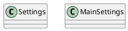
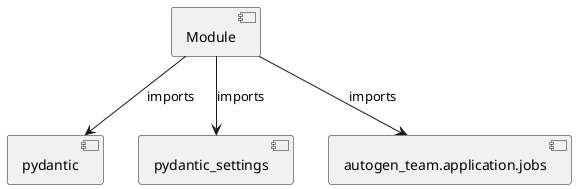

# Module Specification: settings

* **Source Reference:** `src/autogen_team/settings.py`

## 1. Architectural Role & Responsibilities
**Purpose:**
Provides functionality related to settings.

**Architecture Layer:**
- Infrastructure/Other

**Responsibilities:**
- Manage and execute operations for settings.

**Main Workflow:**
- Initialize components and process requests for settings.

## 2. Dependencies
**Imports:**
- `pydantic`
- `pydantic_settings`
- `autogen_team.application.jobs`

**Exported Classes:**
- `Settings`
- `MainSettings`

**Exported Functions:**
- None

## 3. Architecture & Execution
### Internal Architecture
Follows standard modular design, encapsulating state and behavior within defined classes and functions.

### Execution Flow
Sequential execution of defined functions and class methods.

### Sequence Explanation
Clients instantiate classes or call functions, which execute business logic and return results.

## 4. UML 2.0 Diagrams
### Class Diagram

### Dependency Graph

## 5. Class & Method Specifications
### `Settings` ([`src/autogen_team/settings.py`](/src/autogen_team/settings.py))
#### Overview
Base class for application settings.

Use settings to provide high-level preferences.
i.e., to separate settings from provider (e.g., CLI).

#### Attributes
- None found.

#### Methods
### `MainSettings` ([`src/autogen_team/settings.py`](/src/autogen_team/settings.py))
#### Overview
Main settings of the application.

Parameters:
    job (jobs.JobKind): job to run.

#### Attributes
- None found.

#### Methods
## 6. Module Functions