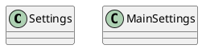
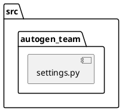
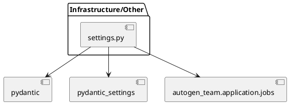
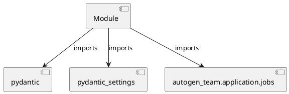
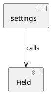

# Module Specification: settings

* **Source Reference:** `src/autogen_team/settings.py`

## 1. Architectural Role & Responsibilities
**Purpose:**
Provides functionality related to settings.

**Architecture Layer:**
- Infrastructure/Other

**Responsibilities:**
- Not explicitly defined.

**Main Workflow:**
- Not explicitly defined.

## 2. Dependencies
**Imports:**
- `pydantic`
- `pydantic_settings`
- `autogen_team.application.jobs`

**Exported Classes:**
- `Settings`
- `MainSettings`

**Exported Functions:**
- None

**Exported Interfaces:**
- Not explicitly defined.

**Public API:**
- Not explicitly defined.

## 3. Architecture & Execution
### Internal Architecture
Not explicitly defined.

### Execution Flow
Not explicitly defined.

### Sequence Explanation
Not explicitly defined.

### Examples
Not explicitly defined.

## 4. UML 2.0 Diagrams
### Class Diagram

```plantuml
@startuml
    class Settings {
    }
    class MainSettings {
    }
@enduml
```

### Package Diagram

```plantuml
@startuml
    package "src" {
        package "autogen_team" {
            [settings.py]
        }
    }
@enduml
```

### Sequence Diagram

```plantuml
@startuml
    ' No functions for sequence
@enduml
```

### Component Diagram

```plantuml
@startuml
    package "Infrastructure/Other" {
        [settings.py]
    }
    [settings.py] --> [pydantic]
    [settings.py] --> [pydantic_settings]
    [settings.py] --> [autogen_team.application.jobs]
@enduml
```

### Dependency Graph

```plantuml
@startuml
    [Module] --> [pydantic] : imports
    [Module] --> [pydantic_settings] : imports
    [Module] --> [autogen_team.application.jobs] : imports
@enduml
```

## 5. Class & Method Specifications
### `Settings` ([`src/autogen_team/settings.py`](/src/autogen_team/settings.py))
#### Overview
Base class for application settings.

Use settings to provide high-level preferences.
i.e., to separate settings from provider (e.g., CLI).

#### Attributes
- None found.

#### Methods
### `MainSettings` ([`src/autogen_team/settings.py`](/src/autogen_team/settings.py))
#### Overview
Main settings of the application.

Parameters:
    job (jobs.JobKind): job to run.

#### Attributes
- None found.

#### Methods
## 6. Module Functions
## 7. Call Graph

```plantuml
@startuml
[settings] --> [Field] : calls
@enduml
```

## 8. Cross References
- **Dependencies:** [Dependencies](../../../dependencies/index.md)
- **Used by:** None
- **Calls:** Field
- **Called from:** None
- **Related classes:** [Classes](../../../classes/index.md)
- **Related diagrams:** [Diagrams](../../../diagrams/index.md)
