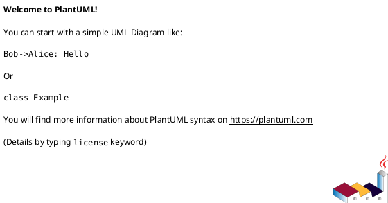

# Module Specification: weather

* **Source Reference:** `src/autogen_team/tools/weather.py`

## 1. Architectural Role & Responsibilities
**Purpose:**
Provides functionality related to weather.

**Architecture Layer:**
- Infrastructure/Other

**Responsibilities:**
- Manage and execute operations for weather.

**Main Workflow:**
- Initialize components and process requests for weather.

## 2. Dependencies
**Imports:**
- None

**Exported Classes:**
- None

**Exported Functions:**
- `get_weather`

## 3. Architecture & Execution
### Internal Architecture
Follows standard modular design, encapsulating state and behavior within defined classes and functions.

### Execution Flow
Sequential execution of defined functions and class methods.

### Sequence Explanation
Clients instantiate classes or call functions, which execute business logic and return results.

## 4. UML 2.0 Diagrams
### Class Diagram

### Dependency Graph

## 5. Class & Method Specifications
## 6. Module Functions
### `get_weather(city: str)`
Executes the get_weather operation.

**Inputs:**
- `city`: str

**Output:**
- Return Type: `str`
