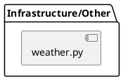

# Module Specification: weather

* **Source Reference:** `src/autogen_team/tools/weather.py`

## 1. Architectural Role & Responsibilities
**Purpose:**
Provides functionality related to weather.

**Architecture Layer:**
- Infrastructure/Other

**Responsibilities:**
- Manages operations and logic for weather.

**Main Workflow:**
- Executes the primary flow defined by weather functions and classes.

## 2. Dependencies
**Imports:**
- None

**Exported Classes:**
- None

**Exported Functions:**
- `get_weather`

**Exported Interfaces:**
- Not explicitly defined.

**Public API:**
- Not explicitly defined.

## 3. Architecture & Execution
### Internal Architecture
Not explicitly defined.

### Execution Flow
Not explicitly defined.

### Sequence Explanation
Not explicitly defined.

### Examples
Not explicitly defined.

## 4. UML 2.0 Diagrams
### Class Diagram

```plantuml
@startuml
    ' No classes found in module
@enduml
```

### Sequence Diagram

```plantuml
@startuml
@enduml
```

### Component Diagram

```plantuml
@startuml
    package "Infrastructure/Other" {
        [weather.py]
    }
@enduml
```

### Dependency Graph

```plantuml
@startuml
    ' No imports found in module
@enduml
```

## 5. Class & Method Specifications
## 6. Module Functions
### `get_weather(city: str)`
Executes the get weather operation.

**Inputs:**
- `city`
  - type: str
  - meaning: Represents the city parameter.
  - valid values: Any valid str.
  - optional?: False
  - default value: None

**Output:**
- return type: `str`
- semantic meaning: Returns the result of get weather.
- possible null values: Yes, if str allows it.
- exceptions: Standard execution exceptions.

**Side Effects:**
- Database updates: Not explicitly defined.
- File operations: Not explicitly defined.
- Network calls: Not explicitly defined.
- Cache: Not explicitly defined.
- State changes: Not explicitly defined.

## 7. Call Graph
- No public API calls detected.

## 8. Cross References
- **Parent module:** None
- **Child modules:** None
- **Dependencies:** None
- **Used by:** None
- **Calls:** None
- **Called from:** None
- **Related classes:** [Classes](../../../../classes/index.md)
- **Related interfaces:** Not explicitly defined.
- **Related diagrams:** [Diagrams](../../../../diagrams/index.md)
