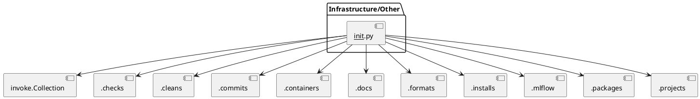
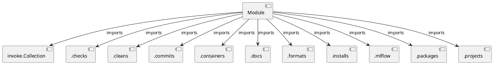
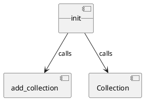

# Module Specification: __init__

* **Source Reference:** `tasks/__init__.py`

## 1. Architectural Role & Responsibilities
**Purpose:**
Provides functionality related to   init  .

**Architecture Layer:**
- Infrastructure/Other

**Responsibilities:**
- Manages operations and logic for   init  .

**Main Workflow:**
- Executes the primary flow defined by   init   functions and classes.

## 2. Dependencies
**Imports:**
- `invoke.Collection`
- `.checks`
- `.cleans`
- `.commits`
- `.containers`
- `.docs`
- `.formats`
- `.installs`
- `.mlflow`
- `.packages`
- `.projects`

**Exported Classes:**
- None

**Exported Functions:**
- None

**Exported Interfaces:**
- Not explicitly defined.

**Public API:**
- Not explicitly defined.

## 3. Architecture & Execution
### Internal Architecture
Not explicitly defined.

### Execution Flow
Not explicitly defined.

### Sequence Explanation
Not explicitly defined.

### Examples
Not explicitly defined.

## 4. UML 2.0 Diagrams
### Class Diagram

### Sequence Diagram

### Component Diagram

### Dependency Graph

## 5. Class & Method Specifications
## 6. Module Functions
## 7. Call Graph

## 8. Cross References
- **Parent module:** None
- **Child modules:** mlflow.md, formats.md, containers.md, docs.md, packages.md, projects.md, installs.md, checks.md, commits.md, cleans.md
- **Dependencies:** `.mlflow`, `.formats`, `invoke.Collection`, `.installs`, `.commits`, `.docs`, `.projects`, `.checks`, `.packages`, `.containers`, `.cleans`
- **Used by:** None
- **Calls:** add_collection, Collection
- **Called from:** None
- **Related classes:** [Classes](../../classes/index.md)
- **Related interfaces:** Not explicitly defined.
- **Related diagrams:** [Diagrams](../../diagrams/index.md)
