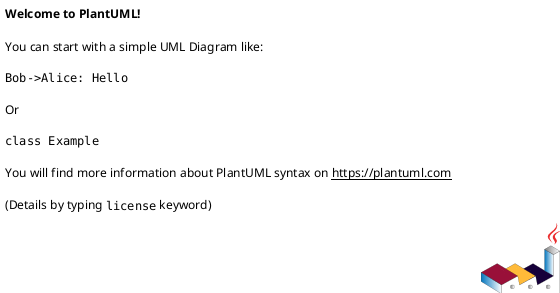
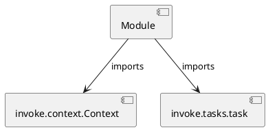

# Module Specification: checks

* **Source Reference:** `tasks/checks.py`

## 1. Architectural Role & Responsibilities
**Purpose:**
Provides functionality related to checks.

**Architecture Layer:**
- Infrastructure/Other

**Responsibilities:**
- Not explicitly defined.

**Main Workflow:**
- Not explicitly defined.

## 2. Dependencies
**Imports:**
- `invoke.context.Context`
- `invoke.tasks.task`

**Exported Classes:**
- None

**Exported Functions:**
- `poetry`
- `format`
- `type`
- `code`
- `test`
- `security`
- `coverage`
- `all`

## 3. Architecture & Execution
### Internal Architecture
Not explicitly defined.

### Execution Flow
Not explicitly defined.

### Sequence Explanation
Not explicitly defined.

## 4. UML 2.0 Diagrams
### Class Diagram

### Dependency Graph

## 5. Class & Method Specifications
## 6. Module Functions
### `poetry(ctx: Context)`
Check poetry config files.

**Inputs:**
- `ctx`: Context

**Output:**
- Return Type: `None`

### `format(ctx: Context)`
Check the formats with ruff.

**Inputs:**
- `ctx`: Context

**Output:**
- Return Type: `None`

### `type(ctx: Context)`
Check the types with mypy.

**Inputs:**
- `ctx`: Context

**Output:**
- Return Type: `None`

### `code(ctx: Context)`
Check the codes with ruff.

**Inputs:**
- `ctx`: Context

**Output:**
- Return Type: `None`

### `test(ctx: Context)`
Check the tests with pytest.

**Inputs:**
- `ctx`: Context

**Output:**
- Return Type: `None`

### `security(ctx: Context)`
Check the security with bandit.

**Inputs:**
- `ctx`: Context

**Output:**
- Return Type: `None`

### `coverage(ctx: Context)`
Check the coverage with coverage.

**Inputs:**
- `ctx`: Context

**Output:**
- Return Type: `None`

### `all(_: Context)`
Run all check tasks.

**Inputs:**
- `_`: Context

**Output:**
- Return Type: `None`
