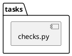
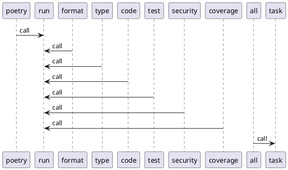
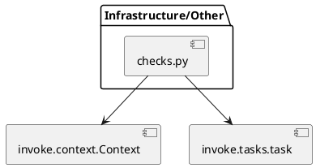
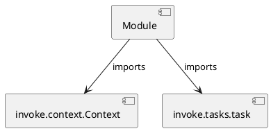
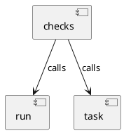

# Module Specification: checks

* **Source Reference:** `tasks/checks.py`

## 1. Architectural Role & Responsibilities
**Purpose:**
Provides functionality related to checks.

**Architecture Layer:**
- Infrastructure/Other

**Responsibilities:**
- Not explicitly defined.

**Main Workflow:**
- Not explicitly defined.

## 2. Dependencies
**Imports:**
- `invoke.context.Context`
- `invoke.tasks.task`

**Exported Classes:**
- None

**Exported Functions:**
- `poetry`
- `format`
- `type`
- `code`
- `test`
- `security`
- `coverage`
- `all`

**Exported Interfaces:**
- Not explicitly defined.

**Public API:**
- Not explicitly defined.

## 3. Architecture & Execution
### Internal Architecture
Not explicitly defined.

### Execution Flow
Not explicitly defined.

### Sequence Explanation
Not explicitly defined.

### Examples
Not explicitly defined.

## 4. UML 2.0 Diagrams
### Class Diagram

```plantuml
@startuml
    ' No classes found in module
@enduml
```

### Package Diagram

```plantuml
@startuml
    package "tasks" {
        [checks.py]
    }
@enduml
```

### Sequence Diagram

```plantuml
@startuml
    poetry -> run : call
    format -> run : call
    type -> run : call
    code -> run : call
    test -> run : call
    security -> run : call
    coverage -> run : call
    all -> task : call
@enduml
```

### Component Diagram

```plantuml
@startuml
    package "Infrastructure/Other" {
        [checks.py]
    }
    [checks.py] --> [invoke.context.Context]
    [checks.py] --> [invoke.tasks.task]
@enduml
```

### Dependency Graph

```plantuml
@startuml
    [Module] --> [invoke.context.Context] : imports
    [Module] --> [invoke.tasks.task] : imports
@enduml
```

## 5. Class & Method Specifications
## 6. Module Functions
### `poetry(ctx: Context) -> None` (Public)
**Description:** Check poetry config files.

**Inputs:**
- `ctx`
  - type: Context
  - meaning: Not explicitly defined.
  - valid values: Not explicitly defined.
  - optional?: False
  - default value: None

**Output:**
- return type: `None`
- semantic meaning: Not explicitly defined.
- possible null values: Not explicitly defined.
- exceptions: Not explicitly defined.

**Side Effects:**
- Database updates: Not explicitly defined.
- File operations: Not explicitly defined.
- Network calls: Not explicitly defined.
- Cache: Not explicitly defined.
- State changes: Not explicitly defined.

**Complexity:**
- Time Complexity: Not explicitly defined.
- Space Complexity: Not explicitly defined.

**Example:**
```python
result = poetry(...)
```

### `format(ctx: Context) -> None` (Public)
**Description:** Check the formats with ruff.

**Inputs:**
- `ctx`
  - type: Context
  - meaning: Not explicitly defined.
  - valid values: Not explicitly defined.
  - optional?: False
  - default value: None

**Output:**
- return type: `None`
- semantic meaning: Not explicitly defined.
- possible null values: Not explicitly defined.
- exceptions: Not explicitly defined.

**Side Effects:**
- Database updates: Not explicitly defined.
- File operations: Not explicitly defined.
- Network calls: Not explicitly defined.
- Cache: Not explicitly defined.
- State changes: Not explicitly defined.

**Complexity:**
- Time Complexity: Not explicitly defined.
- Space Complexity: Not explicitly defined.

**Example:**
```python
result = format(...)
```

### `type(ctx: Context) -> None` (Public)
**Description:** Check the types with mypy.

**Inputs:**
- `ctx`
  - type: Context
  - meaning: Not explicitly defined.
  - valid values: Not explicitly defined.
  - optional?: False
  - default value: None

**Output:**
- return type: `None`
- semantic meaning: Not explicitly defined.
- possible null values: Not explicitly defined.
- exceptions: Not explicitly defined.

**Side Effects:**
- Database updates: Not explicitly defined.
- File operations: Not explicitly defined.
- Network calls: Not explicitly defined.
- Cache: Not explicitly defined.
- State changes: Not explicitly defined.

**Complexity:**
- Time Complexity: Not explicitly defined.
- Space Complexity: Not explicitly defined.

**Example:**
```python
result = type(...)
```

### `code(ctx: Context) -> None` (Public)
**Description:** Check the codes with ruff.

**Inputs:**
- `ctx`
  - type: Context
  - meaning: Not explicitly defined.
  - valid values: Not explicitly defined.
  - optional?: False
  - default value: None

**Output:**
- return type: `None`
- semantic meaning: Not explicitly defined.
- possible null values: Not explicitly defined.
- exceptions: Not explicitly defined.

**Side Effects:**
- Database updates: Not explicitly defined.
- File operations: Not explicitly defined.
- Network calls: Not explicitly defined.
- Cache: Not explicitly defined.
- State changes: Not explicitly defined.

**Complexity:**
- Time Complexity: Not explicitly defined.
- Space Complexity: Not explicitly defined.

**Example:**
```python
result = code(...)
```

### `test(ctx: Context) -> None` (Public)
**Description:** Check the tests with pytest.

**Inputs:**
- `ctx`
  - type: Context
  - meaning: Not explicitly defined.
  - valid values: Not explicitly defined.
  - optional?: False
  - default value: None

**Output:**
- return type: `None`
- semantic meaning: Not explicitly defined.
- possible null values: Not explicitly defined.
- exceptions: Not explicitly defined.

**Side Effects:**
- Database updates: Not explicitly defined.
- File operations: Not explicitly defined.
- Network calls: Not explicitly defined.
- Cache: Not explicitly defined.
- State changes: Not explicitly defined.

**Complexity:**
- Time Complexity: Not explicitly defined.
- Space Complexity: Not explicitly defined.

**Example:**
```python
result = test(...)
```

### `security(ctx: Context) -> None` (Public)
**Description:** Check the security with bandit.

**Inputs:**
- `ctx`
  - type: Context
  - meaning: Not explicitly defined.
  - valid values: Not explicitly defined.
  - optional?: False
  - default value: None

**Output:**
- return type: `None`
- semantic meaning: Not explicitly defined.
- possible null values: Not explicitly defined.
- exceptions: Not explicitly defined.

**Side Effects:**
- Database updates: Not explicitly defined.
- File operations: Not explicitly defined.
- Network calls: Not explicitly defined.
- Cache: Not explicitly defined.
- State changes: Not explicitly defined.

**Complexity:**
- Time Complexity: Not explicitly defined.
- Space Complexity: Not explicitly defined.

**Example:**
```python
result = security(...)
```

### `coverage(ctx: Context) -> None` (Public)
**Description:** Check the coverage with coverage.

**Inputs:**
- `ctx`
  - type: Context
  - meaning: Not explicitly defined.
  - valid values: Not explicitly defined.
  - optional?: False
  - default value: None

**Output:**
- return type: `None`
- semantic meaning: Not explicitly defined.
- possible null values: Not explicitly defined.
- exceptions: Not explicitly defined.

**Side Effects:**
- Database updates: Not explicitly defined.
- File operations: Not explicitly defined.
- Network calls: Not explicitly defined.
- Cache: Not explicitly defined.
- State changes: Not explicitly defined.

**Complexity:**
- Time Complexity: Not explicitly defined.
- Space Complexity: Not explicitly defined.

**Example:**
```python
result = coverage(...)
```

### `all(_: Context) -> None` (Public)
**Description:** Run all check tasks.

**Inputs:**
- `_`
  - type: Context
  - meaning: Not explicitly defined.
  - valid values: Not explicitly defined.
  - optional?: False
  - default value: None

**Output:**
- return type: `None`
- semantic meaning: Not explicitly defined.
- possible null values: Not explicitly defined.
- exceptions: Not explicitly defined.

**Side Effects:**
- Database updates: Not explicitly defined.
- File operations: Not explicitly defined.
- Network calls: Not explicitly defined.
- Cache: Not explicitly defined.
- State changes: Not explicitly defined.

**Complexity:**
- Time Complexity: Not explicitly defined.
- Space Complexity: Not explicitly defined.

**Example:**
```python
result = all(...)
```

## 7. Call Graph

```plantuml
@startuml
[checks] --> [run] : calls
[checks] --> [task] : calls
@enduml
```

## 8. Cross References
- **Dependencies:** [Dependencies](../../dependencies/index.md)
- **Used by:** None
- **Calls:** run, task
- **Called from:** ../src/autogen_team/infrastructure/messaging/kafka_app.md, ../Scripts/send_kafka_test.md, ../src/autogen_team/application/mcp/tools/index_code.md, ../src/autogen_team/application/mcp/tools/retrieve_context.md, ../tests/infrastructure/orchestration/test_hatchet_orchestration.md, ../tests/application/mcp/tools/test_index_code.md, ../src/autogen_team/application/mcp/tools/generate_mission_docs.md, ../tests/application/mcp/tools/test_retrieve_context.md, ../src/autogen_team/application/mcp/tools/security_review.md
- **Related classes:** [Classes](../../classes/index.md)
- **Related diagrams:** [Diagrams](../../diagrams/index.md)
