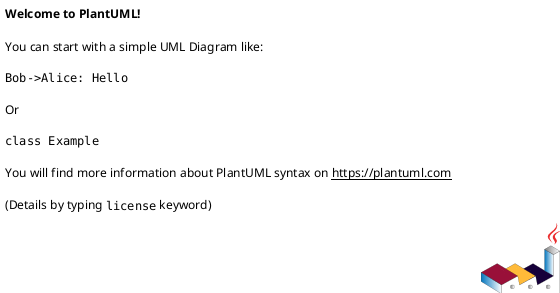
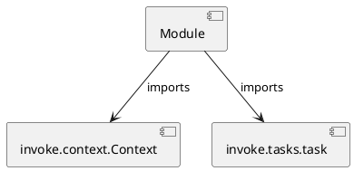

# Module Specification: cleans

* **Source Reference:** `tasks/cleans.py`

## 1. Architectural Role & Responsibilities
**Purpose:**
Provides functionality related to cleans.

**Architecture Layer:**
- Infrastructure/Other

**Responsibilities:**
- Manage and execute operations for cleans.

**Main Workflow:**
- Initialize components and process requests for cleans.

## 2. Dependencies
**Imports:**
- `invoke.context.Context`
- `invoke.tasks.task`

**Exported Classes:**
- None

**Exported Functions:**
- `mypy`
- `ruff`
- `pytest`
- `coverage`
- `dist`
- `docs`
- `cache`
- `mlruns`
- `outputs`
- `venv`
- `poetry`
- `python`
- `requirements`
- `environment`
- `tools`
- `folders`
- `sources`
- `projects`
- `all`
- `reset`

## 3. Architecture & Execution
### Internal Architecture
Follows standard modular design, encapsulating state and behavior within defined classes and functions.

### Execution Flow
Sequential execution of defined functions and class methods.

### Sequence Explanation
Clients instantiate classes or call functions, which execute business logic and return results.

## 4. UML 2.0 Diagrams
### Class Diagram

### Dependency Graph

## 5. Class & Method Specifications
## 6. Module Functions
### `mypy(ctx: Context)`
Clean the mypy tool.

**Inputs:**
- `ctx`: Context

**Output:**
- Return Type: `None`

### `ruff(ctx: Context)`
Clean the ruff tool.

**Inputs:**
- `ctx`: Context

**Output:**
- Return Type: `None`

### `pytest(ctx: Context)`
Clean the pytest tool.

**Inputs:**
- `ctx`: Context

**Output:**
- Return Type: `None`

### `coverage(ctx: Context)`
Clean the coverage tool.

**Inputs:**
- `ctx`: Context

**Output:**
- Return Type: `None`

### `dist(ctx: Context)`
Clean the dist folder.

**Inputs:**
- `ctx`: Context

**Output:**
- Return Type: `None`

### `docs(ctx: Context)`
Clean the docs folder.

**Inputs:**
- `ctx`: Context

**Output:**
- Return Type: `None`

### `cache(ctx: Context)`
Clean the cache folder.

**Inputs:**
- `ctx`: Context

**Output:**
- Return Type: `None`

### `mlruns(ctx: Context)`
Clean the mlruns folder.

**Inputs:**
- `ctx`: Context

**Output:**
- Return Type: `None`

### `outputs(ctx: Context)`
Clean the outputs folder.

**Inputs:**
- `ctx`: Context

**Output:**
- Return Type: `None`

### `venv(ctx: Context)`
Clean the venv folder.

**Inputs:**
- `ctx`: Context

**Output:**
- Return Type: `None`

### `poetry(ctx: Context)`
Clean poetry lock file.

**Inputs:**
- `ctx`: Context

**Output:**
- Return Type: `None`

### `python(ctx: Context)`
Clean python caches and bytecodes.

**Inputs:**
- `ctx`: Context

**Output:**
- Return Type: `None`

### `requirements(ctx: Context)`
Clean the project requirements file.

**Inputs:**
- `ctx`: Context

**Output:**
- Return Type: `None`

### `environment(ctx: Context)`
Clean the project environment file.

**Inputs:**
- `ctx`: Context

**Output:**
- Return Type: `None`

### `tools(_: Context)`
Run all tools tasks.

**Inputs:**
- `_`: Context

**Output:**
- Return Type: `None`

### `folders(_: Context)`
Run all folders tasks.

**Inputs:**
- `_`: Context

**Output:**
- Return Type: `None`

### `sources(_: Context)`
Run all sources tasks.

**Inputs:**
- `_`: Context

**Output:**
- Return Type: `None`

### `projects(_: Context)`
Run all projects tasks.

**Inputs:**
- `_`: Context

**Output:**
- Return Type: `None`

### `all(_: Context)`
Run all tools and folders tasks.

**Inputs:**
- `_`: Context

**Output:**
- Return Type: `None`

### `reset(_: Context)`
Run all tools, folders, sources, and projects tasks.

**Inputs:**
- `_`: Context

**Output:**
- Return Type: `None`
