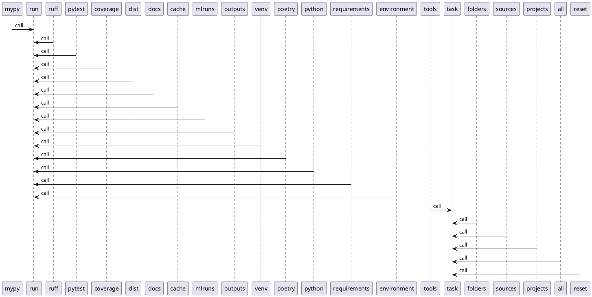
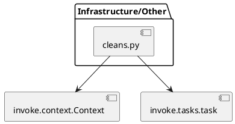
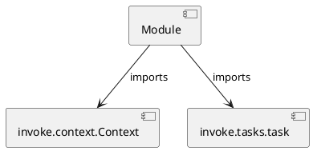
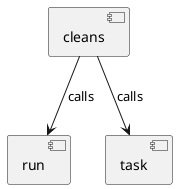

# Module Specification: cleans

* **Source Reference:** `tasks/cleans.py`

## 1. Architectural Role & Responsibilities
**Purpose:**
Provides functionality related to cleans.

**Architecture Layer:**
- Infrastructure/Other

**Responsibilities:**
- Manages operations and logic for cleans.

**Main Workflow:**
- Executes the primary flow defined by cleans functions and classes.

## 2. Dependencies
**Imports:**
- `invoke.context.Context`
- `invoke.tasks.task`

**Exported Classes:**
- None

**Exported Functions:**
- `mypy`
- `ruff`
- `pytest`
- `coverage`
- `dist`
- `docs`
- `cache`
- `mlruns`
- `outputs`
- `venv`
- `poetry`
- `python`
- `requirements`
- `environment`
- `tools`
- `folders`
- `sources`
- `projects`
- `all`
- `reset`

**Exported Interfaces:**
- Not explicitly defined.

**Public API:**
- Not explicitly defined.

## 3. Architecture & Execution
### Internal Architecture
Not explicitly defined.

### Execution Flow
Not explicitly defined.

### Sequence Explanation
Not explicitly defined.

### Examples
Not explicitly defined.

## 4. UML 2.0 Diagrams
### Class Diagram

```plantuml
@startuml
    ' No classes found in module
@enduml
```

### Sequence Diagram

```plantuml
@startuml
    mypy -> run : call
    ruff -> run : call
    pytest -> run : call
    coverage -> run : call
    dist -> run : call
    docs -> run : call
    cache -> run : call
    mlruns -> run : call
    outputs -> run : call
    venv -> run : call
    poetry -> run : call
    python -> run : call
    requirements -> run : call
    environment -> run : call
    tools -> task : call
    folders -> task : call
    sources -> task : call
    projects -> task : call
    all -> task : call
    reset -> task : call
@enduml
```

### Component Diagram

```plantuml
@startuml
    package "Infrastructure/Other" {
        [cleans.py]
    }
    [cleans.py] --> [invoke.context.Context]
    [cleans.py] --> [invoke.tasks.task]
@enduml
```

### Dependency Graph

```plantuml
@startuml
    [Module] --> [invoke.context.Context] : imports
    [Module] --> [invoke.tasks.task] : imports
@enduml
```

## 5. Class & Method Specifications
## 6. Module Functions
### `mypy(ctx: Context)`
Clean the mypy tool.

**Inputs:**
- `ctx`
  - type: Context
  - meaning: Represents the ctx parameter.
  - valid values: Any valid Context.
  - optional?: False
  - default value: None

**Output:**
- return type: `None`
- semantic meaning: Returns the result of mypy.
- possible null values: Yes, if None allows it.
- exceptions: Standard execution exceptions.

**Side Effects:**
- Database updates: Not explicitly defined.
- File operations: Not explicitly defined.
- Network calls: Not explicitly defined.
- Cache: Not explicitly defined.
- State changes: Not explicitly defined.

### `ruff(ctx: Context)`
Clean the ruff tool.

**Inputs:**
- `ctx`
  - type: Context
  - meaning: Represents the ctx parameter.
  - valid values: Any valid Context.
  - optional?: False
  - default value: None

**Output:**
- return type: `None`
- semantic meaning: Returns the result of ruff.
- possible null values: Yes, if None allows it.
- exceptions: Standard execution exceptions.

**Side Effects:**
- Database updates: Not explicitly defined.
- File operations: Not explicitly defined.
- Network calls: Not explicitly defined.
- Cache: Not explicitly defined.
- State changes: Not explicitly defined.

### `pytest(ctx: Context)`
Clean the pytest tool.

**Inputs:**
- `ctx`
  - type: Context
  - meaning: Represents the ctx parameter.
  - valid values: Any valid Context.
  - optional?: False
  - default value: None

**Output:**
- return type: `None`
- semantic meaning: Returns the result of pytest.
- possible null values: Yes, if None allows it.
- exceptions: Standard execution exceptions.

**Side Effects:**
- Database updates: Not explicitly defined.
- File operations: Not explicitly defined.
- Network calls: Not explicitly defined.
- Cache: Not explicitly defined.
- State changes: Not explicitly defined.

### `coverage(ctx: Context)`
Clean the coverage tool.

**Inputs:**
- `ctx`
  - type: Context
  - meaning: Represents the ctx parameter.
  - valid values: Any valid Context.
  - optional?: False
  - default value: None

**Output:**
- return type: `None`
- semantic meaning: Returns the result of coverage.
- possible null values: Yes, if None allows it.
- exceptions: Standard execution exceptions.

**Side Effects:**
- Database updates: Not explicitly defined.
- File operations: Not explicitly defined.
- Network calls: Not explicitly defined.
- Cache: Not explicitly defined.
- State changes: Not explicitly defined.

### `dist(ctx: Context)`
Clean the dist folder.

**Inputs:**
- `ctx`
  - type: Context
  - meaning: Represents the ctx parameter.
  - valid values: Any valid Context.
  - optional?: False
  - default value: None

**Output:**
- return type: `None`
- semantic meaning: Returns the result of dist.
- possible null values: Yes, if None allows it.
- exceptions: Standard execution exceptions.

**Side Effects:**
- Database updates: Not explicitly defined.
- File operations: Not explicitly defined.
- Network calls: Not explicitly defined.
- Cache: Not explicitly defined.
- State changes: Not explicitly defined.

### `docs(ctx: Context)`
Clean the docs folder.

**Inputs:**
- `ctx`
  - type: Context
  - meaning: Represents the ctx parameter.
  - valid values: Any valid Context.
  - optional?: False
  - default value: None

**Output:**
- return type: `None`
- semantic meaning: Returns the result of docs.
- possible null values: Yes, if None allows it.
- exceptions: Standard execution exceptions.

**Side Effects:**
- Database updates: Not explicitly defined.
- File operations: Not explicitly defined.
- Network calls: Not explicitly defined.
- Cache: Not explicitly defined.
- State changes: Not explicitly defined.

### `cache(ctx: Context)`
Clean the cache folder.

**Inputs:**
- `ctx`
  - type: Context
  - meaning: Represents the ctx parameter.
  - valid values: Any valid Context.
  - optional?: False
  - default value: None

**Output:**
- return type: `None`
- semantic meaning: Returns the result of cache.
- possible null values: Yes, if None allows it.
- exceptions: Standard execution exceptions.

**Side Effects:**
- Database updates: Not explicitly defined.
- File operations: Not explicitly defined.
- Network calls: Not explicitly defined.
- Cache: Not explicitly defined.
- State changes: Not explicitly defined.

### `mlruns(ctx: Context)`
Clean the mlruns folder.

**Inputs:**
- `ctx`
  - type: Context
  - meaning: Represents the ctx parameter.
  - valid values: Any valid Context.
  - optional?: False
  - default value: None

**Output:**
- return type: `None`
- semantic meaning: Returns the result of mlruns.
- possible null values: Yes, if None allows it.
- exceptions: Standard execution exceptions.

**Side Effects:**
- Database updates: Not explicitly defined.
- File operations: Not explicitly defined.
- Network calls: Not explicitly defined.
- Cache: Not explicitly defined.
- State changes: Not explicitly defined.

### `outputs(ctx: Context)`
Clean the outputs folder.

**Inputs:**
- `ctx`
  - type: Context
  - meaning: Represents the ctx parameter.
  - valid values: Any valid Context.
  - optional?: False
  - default value: None

**Output:**
- return type: `None`
- semantic meaning: Returns the result of outputs.
- possible null values: Yes, if None allows it.
- exceptions: Standard execution exceptions.

**Side Effects:**
- Database updates: Not explicitly defined.
- File operations: Not explicitly defined.
- Network calls: Not explicitly defined.
- Cache: Not explicitly defined.
- State changes: Not explicitly defined.

### `venv(ctx: Context)`
Clean the venv folder.

**Inputs:**
- `ctx`
  - type: Context
  - meaning: Represents the ctx parameter.
  - valid values: Any valid Context.
  - optional?: False
  - default value: None

**Output:**
- return type: `None`
- semantic meaning: Returns the result of venv.
- possible null values: Yes, if None allows it.
- exceptions: Standard execution exceptions.

**Side Effects:**
- Database updates: Not explicitly defined.
- File operations: Not explicitly defined.
- Network calls: Not explicitly defined.
- Cache: Not explicitly defined.
- State changes: Not explicitly defined.

### `poetry(ctx: Context)`
Clean poetry lock file.

**Inputs:**
- `ctx`
  - type: Context
  - meaning: Represents the ctx parameter.
  - valid values: Any valid Context.
  - optional?: False
  - default value: None

**Output:**
- return type: `None`
- semantic meaning: Returns the result of poetry.
- possible null values: Yes, if None allows it.
- exceptions: Standard execution exceptions.

**Side Effects:**
- Database updates: Not explicitly defined.
- File operations: Not explicitly defined.
- Network calls: Not explicitly defined.
- Cache: Not explicitly defined.
- State changes: Not explicitly defined.

### `python(ctx: Context)`
Clean python caches and bytecodes.

**Inputs:**
- `ctx`
  - type: Context
  - meaning: Represents the ctx parameter.
  - valid values: Any valid Context.
  - optional?: False
  - default value: None

**Output:**
- return type: `None`
- semantic meaning: Returns the result of python.
- possible null values: Yes, if None allows it.
- exceptions: Standard execution exceptions.

**Side Effects:**
- Database updates: Not explicitly defined.
- File operations: Not explicitly defined.
- Network calls: Not explicitly defined.
- Cache: Not explicitly defined.
- State changes: Not explicitly defined.

### `requirements(ctx: Context)`
Clean the project requirements file.

**Inputs:**
- `ctx`
  - type: Context
  - meaning: Represents the ctx parameter.
  - valid values: Any valid Context.
  - optional?: False
  - default value: None

**Output:**
- return type: `None`
- semantic meaning: Returns the result of requirements.
- possible null values: Yes, if None allows it.
- exceptions: Standard execution exceptions.

**Side Effects:**
- Database updates: Not explicitly defined.
- File operations: Not explicitly defined.
- Network calls: Not explicitly defined.
- Cache: Not explicitly defined.
- State changes: Not explicitly defined.

### `environment(ctx: Context)`
Clean the project environment file.

**Inputs:**
- `ctx`
  - type: Context
  - meaning: Represents the ctx parameter.
  - valid values: Any valid Context.
  - optional?: False
  - default value: None

**Output:**
- return type: `None`
- semantic meaning: Returns the result of environment.
- possible null values: Yes, if None allows it.
- exceptions: Standard execution exceptions.

**Side Effects:**
- Database updates: Not explicitly defined.
- File operations: Not explicitly defined.
- Network calls: Not explicitly defined.
- Cache: Not explicitly defined.
- State changes: Not explicitly defined.

### `tools(_: Context)`
Run all tools tasks.

**Inputs:**
- `_`
  - type: Context
  - meaning: Represents the   parameter.
  - valid values: Any valid Context.
  - optional?: False
  - default value: None

**Output:**
- return type: `None`
- semantic meaning: Returns the result of tools.
- possible null values: Yes, if None allows it.
- exceptions: Standard execution exceptions.

**Side Effects:**
- Database updates: Not explicitly defined.
- File operations: Not explicitly defined.
- Network calls: Not explicitly defined.
- Cache: Not explicitly defined.
- State changes: Not explicitly defined.

### `folders(_: Context)`
Run all folders tasks.

**Inputs:**
- `_`
  - type: Context
  - meaning: Represents the   parameter.
  - valid values: Any valid Context.
  - optional?: False
  - default value: None

**Output:**
- return type: `None`
- semantic meaning: Returns the result of folders.
- possible null values: Yes, if None allows it.
- exceptions: Standard execution exceptions.

**Side Effects:**
- Database updates: Not explicitly defined.
- File operations: Not explicitly defined.
- Network calls: Not explicitly defined.
- Cache: Not explicitly defined.
- State changes: Not explicitly defined.

### `sources(_: Context)`
Run all sources tasks.

**Inputs:**
- `_`
  - type: Context
  - meaning: Represents the   parameter.
  - valid values: Any valid Context.
  - optional?: False
  - default value: None

**Output:**
- return type: `None`
- semantic meaning: Returns the result of sources.
- possible null values: Yes, if None allows it.
- exceptions: Standard execution exceptions.

**Side Effects:**
- Database updates: Not explicitly defined.
- File operations: Not explicitly defined.
- Network calls: Not explicitly defined.
- Cache: Not explicitly defined.
- State changes: Not explicitly defined.

### `projects(_: Context)`
Run all projects tasks.

**Inputs:**
- `_`
  - type: Context
  - meaning: Represents the   parameter.
  - valid values: Any valid Context.
  - optional?: False
  - default value: None

**Output:**
- return type: `None`
- semantic meaning: Returns the result of projects.
- possible null values: Yes, if None allows it.
- exceptions: Standard execution exceptions.

**Side Effects:**
- Database updates: Not explicitly defined.
- File operations: Not explicitly defined.
- Network calls: Not explicitly defined.
- Cache: Not explicitly defined.
- State changes: Not explicitly defined.

### `all(_: Context)`
Run all tools and folders tasks.

**Inputs:**
- `_`
  - type: Context
  - meaning: Represents the   parameter.
  - valid values: Any valid Context.
  - optional?: False
  - default value: None

**Output:**
- return type: `None`
- semantic meaning: Returns the result of all.
- possible null values: Yes, if None allows it.
- exceptions: Standard execution exceptions.

**Side Effects:**
- Database updates: Not explicitly defined.
- File operations: Not explicitly defined.
- Network calls: Not explicitly defined.
- Cache: Not explicitly defined.
- State changes: Not explicitly defined.

### `reset(_: Context)`
Run all tools, folders, sources, and projects tasks.

**Inputs:**
- `_`
  - type: Context
  - meaning: Represents the   parameter.
  - valid values: Any valid Context.
  - optional?: False
  - default value: None

**Output:**
- return type: `None`
- semantic meaning: Returns the result of reset.
- possible null values: Yes, if None allows it.
- exceptions: Standard execution exceptions.

**Side Effects:**
- Database updates: Not explicitly defined.
- File operations: Not explicitly defined.
- Network calls: Not explicitly defined.
- Cache: Not explicitly defined.
- State changes: Not explicitly defined.

## 7. Call Graph

```plantuml
@startuml
[cleans] --> [run] : calls
[cleans] --> [task] : calls
@enduml
```

## 8. Cross References
- **Parent module:** __init__.md
- **Child modules:** None
- **Dependencies:** `invoke.context.Context`, `invoke.tasks.task`
- **Used by:** None
- **Calls:** run, task
- **Called from:** None
- **Related classes:** [Classes](../../classes/index.md)
- **Related interfaces:** Not explicitly defined.
- **Related diagrams:** [Diagrams](../../diagrams/index.md)
