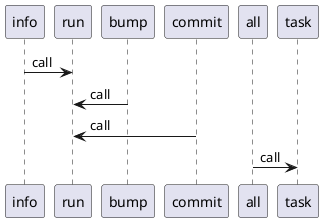
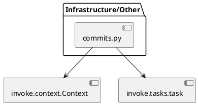
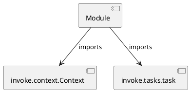
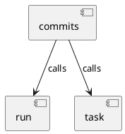

# Module Specification: commits

* **Source Reference:** `tasks/commits.py`

## 1. Architectural Role & Responsibilities
**Purpose:**
Provides functionality related to commits.

**Architecture Layer:**
- Infrastructure/Other

**Responsibilities:**
- Manages operations and logic for commits.

**Main Workflow:**
- Executes the primary flow defined by commits functions and classes.

## 2. Dependencies
**Imports:**
- `invoke.context.Context`
- `invoke.tasks.task`

**Exported Classes:**
- None

**Exported Functions:**
- `info`
- `bump`
- `commit`
- `all`

**Exported Interfaces:**
- Not explicitly defined.

**Public API:**
- Not explicitly defined.

## 3. Architecture & Execution
### Internal Architecture
Not explicitly defined.

### Execution Flow
Not explicitly defined.

### Sequence Explanation
Not explicitly defined.

### Examples
Not explicitly defined.

## 4. UML 2.0 Diagrams
### Class Diagram

```plantuml
@startuml
    ' No classes found in module
@enduml
```

### Sequence Diagram

```plantuml
@startuml
    info -> run : call
    bump -> run : call
    commit -> run : call
    all -> task : call
@enduml
```

### Component Diagram

```plantuml
@startuml
    package "Infrastructure/Other" {
        [commits.py]
    }
    [commits.py] --> [invoke.context.Context]
    [commits.py] --> [invoke.tasks.task]
@enduml
```

### Dependency Graph

```plantuml
@startuml
    [Module] --> [invoke.context.Context] : imports
    [Module] --> [invoke.tasks.task] : imports
@enduml
```

## 5. Class & Method Specifications
## 6. Module Functions
### `info(ctx: Context)`
Print a guide for messages.

**Inputs:**
- `ctx`
  - type: Context
  - meaning: Represents the ctx parameter.
  - valid values: Any valid Context.
  - optional?: False
  - default value: None

**Output:**
- return type: `None`
- semantic meaning: Returns the result of info.
- possible null values: Yes, if None allows it.
- exceptions: Standard execution exceptions.

**Side Effects:**
- Database updates: Not explicitly defined.
- File operations: Not explicitly defined.
- Network calls: Not explicitly defined.
- Cache: Not explicitly defined.
- State changes: Not explicitly defined.

### `bump(ctx: Context)`
Bump the version of the package.

**Inputs:**
- `ctx`
  - type: Context
  - meaning: Represents the ctx parameter.
  - valid values: Any valid Context.
  - optional?: False
  - default value: None

**Output:**
- return type: `None`
- semantic meaning: Returns the result of bump.
- possible null values: Yes, if None allows it.
- exceptions: Standard execution exceptions.

**Side Effects:**
- Database updates: Not explicitly defined.
- File operations: Not explicitly defined.
- Network calls: Not explicitly defined.
- Cache: Not explicitly defined.
- State changes: Not explicitly defined.

### `commit(ctx: Context)`
Commit all changes with a message.

**Inputs:**
- `ctx`
  - type: Context
  - meaning: Represents the ctx parameter.
  - valid values: Any valid Context.
  - optional?: False
  - default value: None

**Output:**
- return type: `None`
- semantic meaning: Returns the result of commit.
- possible null values: Yes, if None allows it.
- exceptions: Standard execution exceptions.

**Side Effects:**
- Database updates: Not explicitly defined.
- File operations: Not explicitly defined.
- Network calls: Not explicitly defined.
- Cache: Not explicitly defined.
- State changes: Not explicitly defined.

### `all(_: Context)`
Run all commit tasks.

**Inputs:**
- `_`
  - type: Context
  - meaning: Represents the   parameter.
  - valid values: Any valid Context.
  - optional?: False
  - default value: None

**Output:**
- return type: `None`
- semantic meaning: Returns the result of all.
- possible null values: Yes, if None allows it.
- exceptions: Standard execution exceptions.

**Side Effects:**
- Database updates: Not explicitly defined.
- File operations: Not explicitly defined.
- Network calls: Not explicitly defined.
- Cache: Not explicitly defined.
- State changes: Not explicitly defined.

## 7. Call Graph

```plantuml
@startuml
[commits] --> [run] : calls
[commits] --> [task] : calls
@enduml
```

## 8. Cross References
- **Parent module:** __init__.md
- **Child modules:** None
- **Dependencies:** `invoke.context.Context`, `invoke.tasks.task`
- **Used by:** None
- **Calls:** run, task
- **Called from:** ../src/autogen_team/application/jobs/tuning.md, ../src/autogen_team/application/jobs/evaluations.md, ../src/autogen_team/application/jobs/inference.md, ../src/autogen_team/application/jobs/promotion.md, ../src/autogen_team/infrastructure/messaging/kafka_app.md, ../src/autogen_team/application/jobs/explanations.md, ../src/autogen_team/application/jobs/training.md, ../src/autogen_team/infrastructure/services/logger_service.md, ../src/autogen_team/application/jobs/hatchet_inference.md, ../src/autogen_team/infrastructure/services/sandbox_service.md
- **Related classes:** [Classes](../../classes/index.md)
- **Related interfaces:** Not explicitly defined.
- **Related diagrams:** [Diagrams](../../diagrams/index.md)
