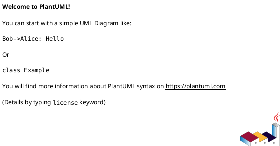
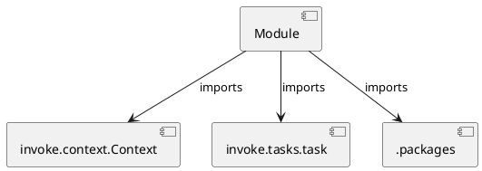

# Module Specification: containers

* **Source Reference:** `tasks/containers.py`

## 1. Architectural Role & Responsibilities
**Purpose:**
Provides functionality related to containers.

**Architecture Layer:**
- Infrastructure/Other

**Responsibilities:**
- Manage and execute operations for containers.

**Main Workflow:**
- Initialize components and process requests for containers.

## 2. Dependencies
**Imports:**
- `invoke.context.Context`
- `invoke.tasks.task`
- `.packages`

**Exported Classes:**
- None

**Exported Functions:**
- `compose`
- `build`
- `run`
- `all`

## 3. Architecture & Execution
### Internal Architecture
Follows standard modular design, encapsulating state and behavior within defined classes and functions.

### Execution Flow
Sequential execution of defined functions and class methods.

### Sequence Explanation
Clients instantiate classes or call functions, which execute business logic and return results.

## 4. UML 2.0 Diagrams
### Class Diagram

### Dependency Graph

## 5. Class & Method Specifications
## 6. Module Functions
### `compose(ctx: Context)`
Start up docker compose.

**Inputs:**
- `ctx`: Context

**Output:**
- Return Type: `None`

### `build(ctx: Context, tag: str)`
Build the container image.

**Inputs:**
- `ctx`: Context
- `tag`: str

**Output:**
- Return Type: `None`

### `run(ctx: Context, tag: str)`
Run the container image.

**Inputs:**
- `ctx`: Context
- `tag`: str

**Output:**
- Return Type: `None`

### `all(_: Context)`
Run all container tasks.

**Inputs:**
- `_`: Context

**Output:**
- Return Type: `None`
