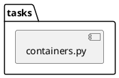
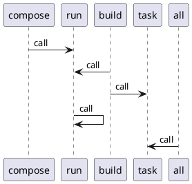
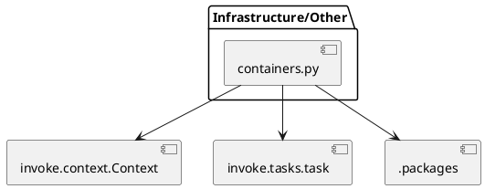
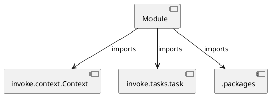
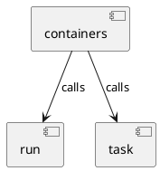

# Module Specification: containers

* **Source Reference:** `tasks/containers.py`

## 1. Architectural Role & Responsibilities
**Purpose:**
Provides functionality related to containers.

**Architecture Layer:**
- Infrastructure/Other

**Responsibilities:**
- Not explicitly defined.

**Main Workflow:**
- Not explicitly defined.

## 2. Dependencies
**Imports:**
- `invoke.context.Context`
- `invoke.tasks.task`
- `.packages`

**Exported Classes:**
- None

**Exported Functions:**
- `compose`
- `build`
- `run`
- `all`

**Exported Interfaces:**
- Not explicitly defined.

**Public API:**
- Not explicitly defined.

## 3. Architecture & Execution
### Internal Architecture
Not explicitly defined.

### Execution Flow
Not explicitly defined.

### Sequence Explanation
Not explicitly defined.

### Examples
Not explicitly defined.

## 4. UML 2.0 Diagrams
### Class Diagram

```plantuml
@startuml
    ' No classes found in module
@enduml
```

### Package Diagram

```plantuml
@startuml
    package "tasks" {
        [containers.py]
    }
@enduml
```

### Sequence Diagram

```plantuml
@startuml
    compose -> run : call
    build -> run : call
    build -> task : call
    run -> run : call
    all -> task : call
@enduml
```

### Component Diagram

```plantuml
@startuml
    package "Infrastructure/Other" {
        [containers.py]
    }
    [containers.py] --> [invoke.context.Context]
    [containers.py] --> [invoke.tasks.task]
    [containers.py] --> [.packages]
@enduml
```

### Dependency Graph

```plantuml
@startuml
    [Module] --> [invoke.context.Context] : imports
    [Module] --> [invoke.tasks.task] : imports
    [Module] --> [.packages] : imports
@enduml
```

## 5. Class & Method Specifications
## 6. Module Functions
### `compose(ctx: Context) -> None` (Public)
**Description:** Start up docker compose.

**Inputs:**
- `ctx`
  - type: Context
  - meaning: Not explicitly defined.
  - valid values: Not explicitly defined.
  - optional?: False
  - default value: None

**Output:**
- return type: `None`
- semantic meaning: Not explicitly defined.
- possible null values: Not explicitly defined.
- exceptions: Not explicitly defined.

**Side Effects:**
- Database updates: Not explicitly defined.
- File operations: Not explicitly defined.
- Network calls: Not explicitly defined.
- Cache: Not explicitly defined.
- State changes: Not explicitly defined.

**Complexity:**
- Time Complexity: Not explicitly defined.
- Space Complexity: Not explicitly defined.

**Example:**
```python
result = compose(...)
```

### `build(ctx: Context, tag: str) -> None` (Public)
**Description:** Build the container image.

**Inputs:**
- `ctx`
  - type: Context
  - meaning: Not explicitly defined.
  - valid values: Not explicitly defined.
  - optional?: False
  - default value: None
- `tag`
  - type: str
  - meaning: Not explicitly defined.
  - valid values: Not explicitly defined.
  - optional?: True
  - default value: IMAGE_TAG

**Output:**
- return type: `None`
- semantic meaning: Not explicitly defined.
- possible null values: Not explicitly defined.
- exceptions: Not explicitly defined.

**Side Effects:**
- Database updates: Not explicitly defined.
- File operations: Not explicitly defined.
- Network calls: Not explicitly defined.
- Cache: Not explicitly defined.
- State changes: Not explicitly defined.

**Complexity:**
- Time Complexity: Not explicitly defined.
- Space Complexity: Not explicitly defined.

**Example:**
```python
result = build(..., ...)
```

### `run(ctx: Context, tag: str) -> None` (Public)
**Description:** Run the container image.

**Inputs:**
- `ctx`
  - type: Context
  - meaning: Not explicitly defined.
  - valid values: Not explicitly defined.
  - optional?: False
  - default value: None
- `tag`
  - type: str
  - meaning: Not explicitly defined.
  - valid values: Not explicitly defined.
  - optional?: True
  - default value: IMAGE_TAG

**Output:**
- return type: `None`
- semantic meaning: Not explicitly defined.
- possible null values: Not explicitly defined.
- exceptions: Not explicitly defined.

**Side Effects:**
- Database updates: Not explicitly defined.
- File operations: Not explicitly defined.
- Network calls: Not explicitly defined.
- Cache: Not explicitly defined.
- State changes: Not explicitly defined.

**Complexity:**
- Time Complexity: Not explicitly defined.
- Space Complexity: Not explicitly defined.

**Example:**
```python
result = run(..., ...)
```

### `all(_: Context) -> None` (Public)
**Description:** Run all container tasks.

**Inputs:**
- `_`
  - type: Context
  - meaning: Not explicitly defined.
  - valid values: Not explicitly defined.
  - optional?: False
  - default value: None

**Output:**
- return type: `None`
- semantic meaning: Not explicitly defined.
- possible null values: Not explicitly defined.
- exceptions: Not explicitly defined.

**Side Effects:**
- Database updates: Not explicitly defined.
- File operations: Not explicitly defined.
- Network calls: Not explicitly defined.
- Cache: Not explicitly defined.
- State changes: Not explicitly defined.

**Complexity:**
- Time Complexity: Not explicitly defined.
- Space Complexity: Not explicitly defined.

**Example:**
```python
result = all(...)
```

## 7. Call Graph

```plantuml
@startuml
[containers] --> [run] : calls
[containers] --> [task] : calls
@enduml
```

## 8. Cross References
- **Dependencies:** [Dependencies](../../dependencies/index.md)
- **Used by:** None
- **Calls:** run, task
- **Called from:** ../tests/application/jobs/test_inference.md, ../Scripts/verify_agent_mcp.md, ../tests/application/jobs/test_hatchet_inference.md, ../Scripts/trigger_mission.md, ../tests/application/jobs/test_evaluations.md, ../tests/application/jobs/test_base.md, checks.md, ../tests/application/jobs/test_promotion.md, ../Scripts/test_mcp_server.md, installs.md, ../src/autogen_team/scripts.md, mlflow.md, ../tests/application/jobs/test_training.md, ../Scripts/check_mcp_health.md, cleans.md, projects.md, ../src/autogen_team/infrastructure/messaging/kafka_app.md, ../src/autogen_team/models/entities.md, docs.md, ../tests/e2e/test_autonomous_mission_e2e.md, formats.md, commits.md, ../tests/infrastructure/orchestration/test_hatchet_orchestration.md, ../src/autogen_team/application/mcp/tools/run_tests.md, ../Scripts/test_mcp_client_simple.md, packages.md, ../fix_test.md, ../tests/application/jobs/test_tuning.md, ../src/autogen_team/infrastructure/orchestration/hatchet_workflows.md, ../tests/application/jobs/test_explanations.md
- **Related classes:** [Classes](../../classes/index.md)
- **Related diagrams:** [Diagrams](../../diagrams/index.md)
