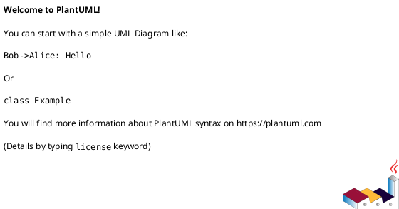
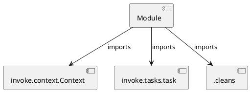

# Module Specification: docs

* **Source Reference:** `tasks/docs.py`

## 1. Architectural Role & Responsibilities
**Purpose:**
Provides functionality related to docs.

**Architecture Layer:**
- Infrastructure/Other

**Responsibilities:**
- Not explicitly defined.

**Main Workflow:**
- Not explicitly defined.

## 2. Dependencies
**Imports:**
- `invoke.context.Context`
- `invoke.tasks.task`
- `.cleans`

**Exported Classes:**
- None

**Exported Functions:**
- `serve`
- `api`
- `all`

## 3. Architecture & Execution
### Internal Architecture
Not explicitly defined.

### Execution Flow
Not explicitly defined.

### Sequence Explanation
Not explicitly defined.

## 4. UML 2.0 Diagrams
### Class Diagram

### Dependency Graph

## 5. Class & Method Specifications
## 6. Module Functions
### `serve(ctx: Context, format: str, port: int)`
Serve the API docs with pdoc.

**Inputs:**
- `ctx`: Context
- `format`: str
- `port`: int

**Output:**
- Return Type: `None`

### `api(ctx: Context, format: str, output_dir: str)`
Generate the API docs with pdoc.

**Inputs:**
- `ctx`: Context
- `format`: str
- `output_dir`: str

**Output:**
- Return Type: `None`

### `all(_: Context)`
Run all docs tasks.

**Inputs:**
- `_`: Context

**Output:**
- Return Type: `None`
