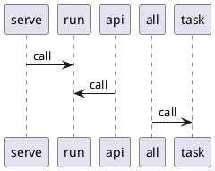
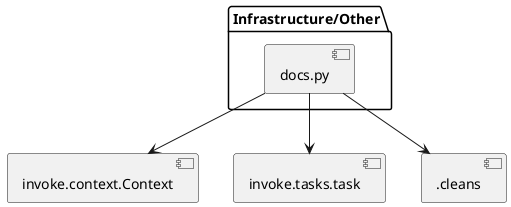
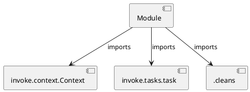
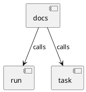

# Module Specification: docs

* **Source Reference:** `tasks/docs.py`

## 1. Architectural Role & Responsibilities
**Purpose:**
Provides functionality related to docs.

**Architecture Layer:**
- Infrastructure/Other

**Responsibilities:**
- Manages operations and logic for docs.

**Main Workflow:**
- Executes the primary flow defined by docs functions and classes.

## 2. Dependencies
**Imports:**
- `invoke.context.Context`
- `invoke.tasks.task`
- `.cleans`

**Exported Classes:**
- None

**Exported Functions:**
- `serve`
- `api`
- `all`

**Exported Interfaces:**
- Not explicitly defined.

**Public API:**
- Not explicitly defined.

## 3. Architecture & Execution
### Internal Architecture
Not explicitly defined.

### Execution Flow
Not explicitly defined.

### Sequence Explanation
Not explicitly defined.

### Examples
Not explicitly defined.

## 4. UML 2.0 Diagrams
### Class Diagram

```plantuml
@startuml
    ' No classes found in module
@enduml
```

### Sequence Diagram

```plantuml
@startuml
    serve -> run : call
    api -> run : call
    all -> task : call
@enduml
```

### Component Diagram

```plantuml
@startuml
    package "Infrastructure/Other" {
        [docs.py]
    }
    [docs.py] --> [invoke.context.Context]
    [docs.py] --> [invoke.tasks.task]
    [docs.py] --> [.cleans]
@enduml
```

### Dependency Graph

```plantuml
@startuml
    [Module] --> [invoke.context.Context] : imports
    [Module] --> [invoke.tasks.task] : imports
    [Module] --> [.cleans] : imports
@enduml
```

## 5. Class & Method Specifications
## 6. Module Functions
### `serve(ctx: Context, format: str, port: int)`
Serve the API docs with pdoc.

**Inputs:**
- `ctx`
  - type: Context
  - meaning: Represents the ctx parameter.
  - valid values: Any valid Context.
  - optional?: False
  - default value: None
- `format`
  - type: str
  - meaning: Represents the format parameter.
  - valid values: Any valid str.
  - optional?: True
  - default value: DOC_FORMAT
- `port`
  - type: int
  - meaning: Represents the port parameter.
  - valid values: Any valid int.
  - optional?: True
  - default value: 8088

**Output:**
- return type: `None`
- semantic meaning: Returns the result of serve.
- possible null values: Yes, if None allows it.
- exceptions: Standard execution exceptions.

**Side Effects:**
- Database updates: Not explicitly defined.
- File operations: Not explicitly defined.
- Network calls: Not explicitly defined.
- Cache: Not explicitly defined.
- State changes: Not explicitly defined.

### `api(ctx: Context, format: str, output_dir: str)`
Generate the API docs with pdoc.

**Inputs:**
- `ctx`
  - type: Context
  - meaning: Represents the ctx parameter.
  - valid values: Any valid Context.
  - optional?: False
  - default value: None
- `format`
  - type: str
  - meaning: Represents the format parameter.
  - valid values: Any valid str.
  - optional?: True
  - default value: DOC_FORMAT
- `output_dir`
  - type: str
  - meaning: Represents the output dir parameter.
  - valid values: Any valid str.
  - optional?: True
  - default value: OUTPUT_DIR

**Output:**
- return type: `None`
- semantic meaning: Returns the result of api.
- possible null values: Yes, if None allows it.
- exceptions: Standard execution exceptions.

**Side Effects:**
- Database updates: Not explicitly defined.
- File operations: Not explicitly defined.
- Network calls: Not explicitly defined.
- Cache: Not explicitly defined.
- State changes: Not explicitly defined.

### `all(_: Context)`
Run all docs tasks.

**Inputs:**
- `_`
  - type: Context
  - meaning: Represents the   parameter.
  - valid values: Any valid Context.
  - optional?: False
  - default value: None

**Output:**
- return type: `None`
- semantic meaning: Returns the result of all.
- possible null values: Yes, if None allows it.
- exceptions: Standard execution exceptions.

**Side Effects:**
- Database updates: Not explicitly defined.
- File operations: Not explicitly defined.
- Network calls: Not explicitly defined.
- Cache: Not explicitly defined.
- State changes: Not explicitly defined.

## 7. Call Graph

```plantuml
@startuml
[docs] --> [run] : calls
[docs] --> [task] : calls
@enduml
```

## 8. Cross References
- **Parent module:** __init__.md
- **Child modules:** None
- **Dependencies:** `invoke.context.Context`, `invoke.tasks.task`, `.cleans`
- **Used by:** None
- **Calls:** run, task
- **Called from:** None
- **Related classes:** [Classes](../../classes/index.md)
- **Related interfaces:** Not explicitly defined.
- **Related diagrams:** [Diagrams](../../diagrams/index.md)
