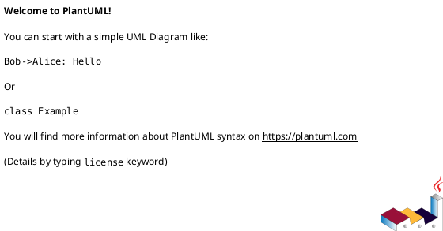
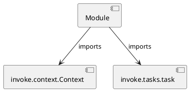

# Module Specification: formats

* **Source Reference:** `tasks/formats.py`

## 1. Architectural Role & Responsibilities
**Purpose:**
Provides functionality related to formats.

**Architecture Layer:**
- Infrastructure/Other

**Responsibilities:**
- Manage and execute operations for formats.

**Main Workflow:**
- Initialize components and process requests for formats.

## 2. Dependencies
**Imports:**
- `invoke.context.Context`
- `invoke.tasks.task`

**Exported Classes:**
- None

**Exported Functions:**
- `imports`
- `sources`
- `all`

## 3. Architecture & Execution
### Internal Architecture
Follows standard modular design, encapsulating state and behavior within defined classes and functions.

### Execution Flow
Sequential execution of defined functions and class methods.

### Sequence Explanation
Clients instantiate classes or call functions, which execute business logic and return results.

## 4. UML 2.0 Diagrams
### Class Diagram

### Dependency Graph

## 5. Class & Method Specifications
## 6. Module Functions
### `imports(ctx: Context)`
Format python imports with ruff.

**Inputs:**
- `ctx`: Context

**Output:**
- Return Type: `None`

### `sources(ctx: Context)`
Format python sources with ruff.

**Inputs:**
- `ctx`: Context

**Output:**
- Return Type: `None`

### `all(_: Context)`
Run all format tasks.

**Inputs:**
- `_`: Context

**Output:**
- Return Type: `None`
