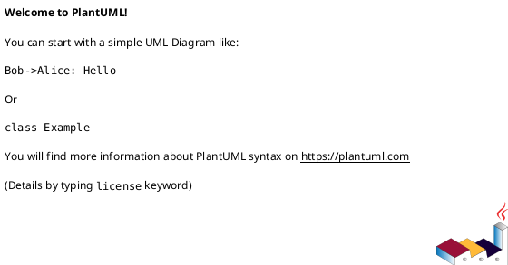
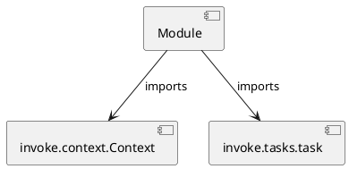

# Module Specification: mlflow

* **Source Reference:** `tasks/mlflow.py`

## 1. Architectural Role & Responsibilities
**Purpose:**
Provides functionality related to mlflow.

**Architecture Layer:**
- Infrastructure/Other

**Responsibilities:**
- Not explicitly defined.

**Main Workflow:**
- Not explicitly defined.

## 2. Dependencies
**Imports:**
- `invoke.context.Context`
- `invoke.tasks.task`

**Exported Classes:**
- None

**Exported Functions:**
- `doctor`
- `serve`
- `all`

## 3. Architecture & Execution
### Internal Architecture
Not explicitly defined.

### Execution Flow
Not explicitly defined.

### Sequence Explanation
Not explicitly defined.

## 4. UML 2.0 Diagrams
### Class Diagram

### Dependency Graph

## 5. Class & Method Specifications
## 6. Module Functions
### `doctor(ctx: Context)`
Run mlflow doctor.

**Inputs:**
- `ctx`: Context

**Output:**
- Return Type: `None`

### `serve(ctx: Context, host: str, port: str, backend_uri: str)`
Start the mlflow server.

**Inputs:**
- `ctx`: Context
- `host`: str
- `port`: str
- `backend_uri`: str

**Output:**
- Return Type: `None`

### `all(_: Context)`
Run all mlflow tasks.

**Inputs:**
- `_`: Context

**Output:**
- Return Type: `None`
