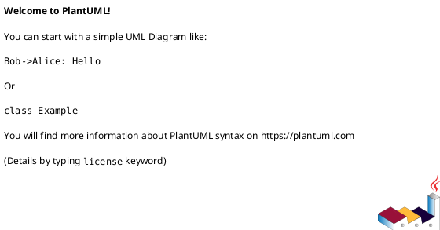
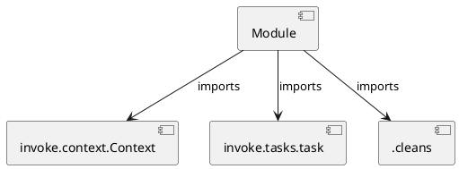

# Module Specification: packages

* **Source Reference:** `tasks/packages.py`

## 1. Architectural Role & Responsibilities
**Purpose:**
Provides functionality related to packages.

**Architecture Layer:**
- Infrastructure/Other

**Responsibilities:**
- Manage and execute operations for packages.

**Main Workflow:**
- Initialize components and process requests for packages.

## 2. Dependencies
**Imports:**
- `invoke.context.Context`
- `invoke.tasks.task`
- `.cleans`

**Exported Classes:**
- None

**Exported Functions:**
- `build`
- `all`

## 3. Architecture & Execution
### Internal Architecture
Follows standard modular design, encapsulating state and behavior within defined classes and functions.

### Execution Flow
Sequential execution of defined functions and class methods.

### Sequence Explanation
Clients instantiate classes or call functions, which execute business logic and return results.

## 4. UML 2.0 Diagrams
### Class Diagram

### Dependency Graph

## 5. Class & Method Specifications
## 6. Module Functions
### `build(ctx: Context, format: str)`
Build the python package.

**Inputs:**
- `ctx`: Context
- `format`: str

**Output:**
- Return Type: `None`

### `all(_: Context)`
Run all package tasks.

**Inputs:**
- `_`: Context

**Output:**
- Return Type: `None`
