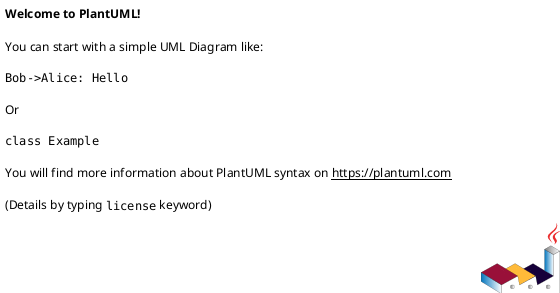
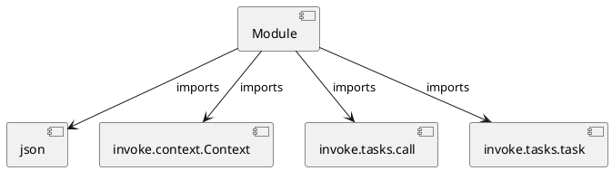

# Module Specification: projects

* **Source Reference:** `tasks/projects.py`

## 1. Architectural Role & Responsibilities
**Purpose:**
Provides functionality related to projects.

**Architecture Layer:**
- Infrastructure/Other

**Responsibilities:**
- Manage and execute operations for projects.

**Main Workflow:**
- Initialize components and process requests for projects.

## 2. Dependencies
**Imports:**
- `json`
- `invoke.context.Context`
- `invoke.tasks.call`
- `invoke.tasks.task`

**Exported Classes:**
- None

**Exported Functions:**
- `requirements`
- `environment`
- `run`
- `mcp`
- `kafka`
- `all`

## 3. Architecture & Execution
### Internal Architecture
Follows standard modular design, encapsulating state and behavior within defined classes and functions.

### Execution Flow
Sequential execution of defined functions and class methods.

### Sequence Explanation
Clients instantiate classes or call functions, which execute business logic and return results.

## 4. UML 2.0 Diagrams
### Class Diagram

### Dependency Graph

## 5. Class & Method Specifications
## 6. Module Functions
### `requirements(ctx: Context)`
Export the project requirements file.

**Inputs:**
- `ctx`: Context

**Output:**
- Return Type: `None`

### `environment(ctx: Context)`
Export the project environment file.

**Inputs:**
- `ctx`: Context

**Output:**
- Return Type: `None`

### `run(ctx: Context, job: str)`
Run an mlflow project from the MLproject file.

**Inputs:**
- `ctx`: Context
- `job`: str

**Output:**
- Return Type: `None`

### `mcp(ctx: Context, prompts: Any)`
Run the MCP server.

Args:
    prompts (str, optional): Path to the prompts YAML config.

**Inputs:**
- `ctx`: Context
- `prompts`: Any

**Output:**
- Return Type: `None`

### `kafka(ctx: Context)`
Run the Kafka inference service.

**Inputs:**
- `ctx`: Context

**Output:**
- Return Type: `None`

### `all(_: Context)`
Run all project tasks.

**Inputs:**
- `_`: Context

**Output:**
- Return Type: `None`
