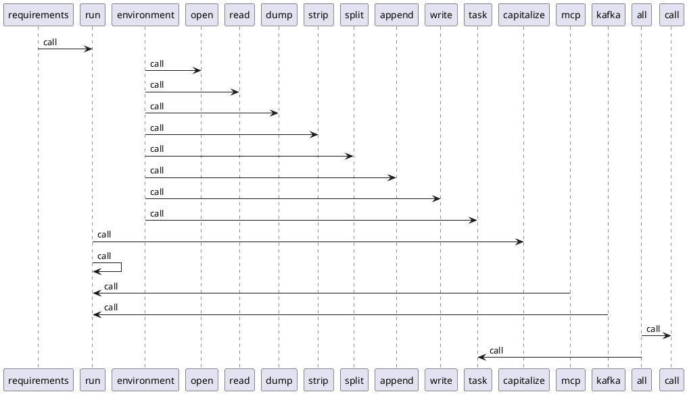
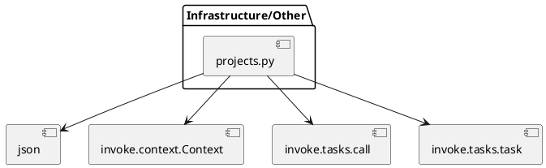
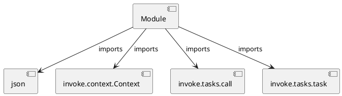
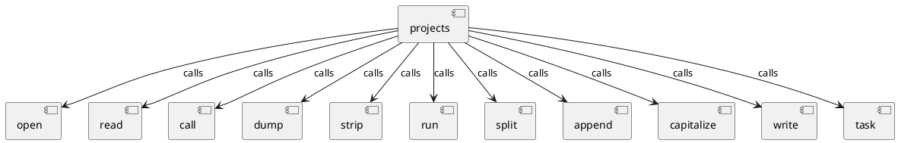

# Module Specification: projects

* **Source Reference:** `tasks/projects.py`

## 1. Architectural Role & Responsibilities
**Purpose:**
Provides functionality related to projects.

**Architecture Layer:**
- Infrastructure/Other

**Responsibilities:**
- Manages operations and logic for projects.

**Main Workflow:**
- Executes the primary flow defined by projects functions and classes.

## 2. Dependencies
**Imports:**
- `json`
- `invoke.context.Context`
- `invoke.tasks.call`
- `invoke.tasks.task`

**Exported Classes:**
- None

**Exported Functions:**
- `requirements`
- `environment`
- `run`
- `mcp`
- `kafka`
- `all`

**Exported Interfaces:**
- Not explicitly defined.

**Public API:**
- Not explicitly defined.

## 3. Architecture & Execution
### Internal Architecture
Not explicitly defined.

### Execution Flow
Not explicitly defined.

### Sequence Explanation
Not explicitly defined.

### Examples
Not explicitly defined.

## 4. UML 2.0 Diagrams
### Class Diagram

```plantuml
@startuml
    ' No classes found in module
@enduml
```

### Sequence Diagram

```plantuml
@startuml
    requirements -> run : call
    environment -> open : call
    environment -> read : call
    environment -> dump : call
    environment -> strip : call
    environment -> split : call
    environment -> append : call
    environment -> write : call
    environment -> task : call
    run -> capitalize : call
    run -> run : call
    mcp -> run : call
    kafka -> run : call
    all -> call : call
    all -> task : call
@enduml
```

### Component Diagram

```plantuml
@startuml
    package "Infrastructure/Other" {
        [projects.py]
    }
    [projects.py] --> [json]
    [projects.py] --> [invoke.context.Context]
    [projects.py] --> [invoke.tasks.call]
    [projects.py] --> [invoke.tasks.task]
@enduml
```

### Dependency Graph

```plantuml
@startuml
    [Module] --> [json] : imports
    [Module] --> [invoke.context.Context] : imports
    [Module] --> [invoke.tasks.call] : imports
    [Module] --> [invoke.tasks.task] : imports
@enduml
```

## 5. Class & Method Specifications
## 6. Module Functions
### `requirements(ctx: Context)`
Export the project requirements file.

**Inputs:**
- `ctx`
  - type: Context
  - meaning: Represents the ctx parameter.
  - valid values: Any valid Context.
  - optional?: False
  - default value: None

**Output:**
- return type: `None`
- semantic meaning: Returns the result of requirements.
- possible null values: Yes, if None allows it.
- exceptions: Standard execution exceptions.

**Side Effects:**
- Database updates: Not explicitly defined.
- File operations: Not explicitly defined.
- Network calls: Not explicitly defined.
- Cache: Not explicitly defined.
- State changes: Not explicitly defined.

### `environment(ctx: Context)`
Export the project environment file.

**Inputs:**
- `ctx`
  - type: Context
  - meaning: Represents the ctx parameter.
  - valid values: Any valid Context.
  - optional?: False
  - default value: None

**Output:**
- return type: `None`
- semantic meaning: Returns the result of environment.
- possible null values: Yes, if None allows it.
- exceptions: Standard execution exceptions.

**Side Effects:**
- Database updates: Not explicitly defined.
- File operations: Not explicitly defined.
- Network calls: Not explicitly defined.
- Cache: Not explicitly defined.
- State changes: Not explicitly defined.

### `run(ctx: Context, job: str)`
Run an mlflow project from the MLproject file.

**Inputs:**
- `ctx`
  - type: Context
  - meaning: Represents the ctx parameter.
  - valid values: Any valid Context.
  - optional?: False
  - default value: None
- `job`
  - type: str
  - meaning: Represents the job parameter.
  - valid values: Any valid str.
  - optional?: False
  - default value: None

**Output:**
- return type: `None`
- semantic meaning: Returns the result of run.
- possible null values: Yes, if None allows it.
- exceptions: Standard execution exceptions.

**Side Effects:**
- Database updates: Not explicitly defined.
- File operations: Not explicitly defined.
- Network calls: Not explicitly defined.
- Cache: Not explicitly defined.
- State changes: Not explicitly defined.

### `mcp(ctx: Context, prompts: str | None)`
Run the MCP server.

Args:
    prompts (str, optional): Path to the prompts YAML config.

**Inputs:**
- `ctx`
  - type: Context
  - meaning: Represents the ctx parameter.
  - valid values: Any valid Context.
  - optional?: False
  - default value: None
- `prompts`
  - type: str | None
  - meaning: Represents the prompts parameter.
  - valid values: Any valid str | None.
  - optional?: True
  - default value: None

**Output:**
- return type: `None`
- semantic meaning: Returns the result of mcp.
- possible null values: Yes, if None allows it.
- exceptions: Standard execution exceptions.

**Side Effects:**
- Database updates: Not explicitly defined.
- File operations: Not explicitly defined.
- Network calls: Not explicitly defined.
- Cache: Not explicitly defined.
- State changes: Not explicitly defined.

### `kafka(ctx: Context)`
Run the Kafka inference service.

**Inputs:**
- `ctx`
  - type: Context
  - meaning: Represents the ctx parameter.
  - valid values: Any valid Context.
  - optional?: False
  - default value: None

**Output:**
- return type: `None`
- semantic meaning: Returns the result of kafka.
- possible null values: Yes, if None allows it.
- exceptions: Standard execution exceptions.

**Side Effects:**
- Database updates: Not explicitly defined.
- File operations: Not explicitly defined.
- Network calls: Not explicitly defined.
- Cache: Not explicitly defined.
- State changes: Not explicitly defined.

### `all(_: Context)`
Run all project tasks.

**Inputs:**
- `_`
  - type: Context
  - meaning: Represents the   parameter.
  - valid values: Any valid Context.
  - optional?: False
  - default value: None

**Output:**
- return type: `None`
- semantic meaning: Returns the result of all.
- possible null values: Yes, if None allows it.
- exceptions: Standard execution exceptions.

**Side Effects:**
- Database updates: Not explicitly defined.
- File operations: Not explicitly defined.
- Network calls: Not explicitly defined.
- Cache: Not explicitly defined.
- State changes: Not explicitly defined.

## 7. Call Graph

```plantuml
@startuml
[projects] --> [open] : calls
[projects] --> [read] : calls
[projects] --> [call] : calls
[projects] --> [dump] : calls
[projects] --> [strip] : calls
[projects] --> [run] : calls
[projects] --> [split] : calls
[projects] --> [append] : calls
[projects] --> [capitalize] : calls
[projects] --> [write] : calls
[projects] --> [task] : calls
@enduml
```

## 8. Cross References
- **Parent module:** __init__.md
- **Child modules:** None
- **Dependencies:** `json`, `invoke.tasks.call`, `invoke.context.Context`, `invoke.tasks.task`
- **Used by:** None
- **Calls:** open, read, call, dump, strip, run, split, append, capitalize, write, task
- **Called from:** ../tests/application/jobs/test_tuning.md, formats.md, packages.md, installs.md, ../src/autogen_team/models/entities.md, ../tests/e2e/test_autonomous_mission_e2e.md, cleans.md, ../Scripts/trigger_mission.md, ../src/autogen_team/application/mcp/tools/run_tests.md, ../src/autogen_team/infrastructure/orchestration/hatchet_workflows.md, ../Scripts/check_mcp_health.md, docs.md, ../src/autogen_team/infrastructure/messaging/kafka_app.md, ../tests/application/jobs/test_evaluations.md, ../tests/application/jobs/test_training.md, ../Scripts/test_mcp_client_simple.md, containers.md, ../tests/application/jobs/test_inference.md, checks.md, ../Scripts/test_mcp_server.md, ../tests/infrastructure/orchestration/test_hatchet_orchestration.md, commits.md, ../tests/application/jobs/test_base.md, ../Scripts/verify_agent_mcp.md, mlflow.md, ../fix_test.md, ../tests/application/jobs/test_explanations.md, ../tests/application/jobs/test_promotion.md, ../src/autogen_team/scripts.md, ../tests/application/jobs/test_hatchet_inference.md
- **Related classes:** [Classes](../../classes/index.md)
- **Related interfaces:** Not explicitly defined.
- **Related diagrams:** [Diagrams](../../diagrams/index.md)
