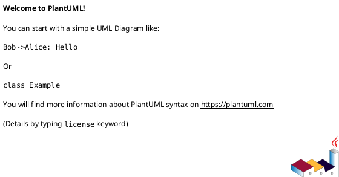
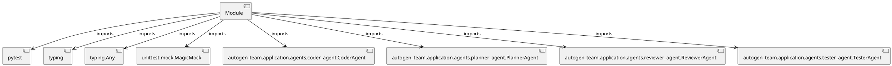

# Module Specification: test_agents

* **Source Reference:** `tests/application/agents/test_agents.py`

## 1. Architectural Role & Responsibilities
**Purpose:**
Provides functionality related to test agents.

**Architecture Layer:**
- Infrastructure/Other

**Responsibilities:**
- Not explicitly defined.

**Main Workflow:**
- Not explicitly defined.

## 2. Dependencies
**Imports:**
- `pytest`
- `typing`
- `typing.Any`
- `unittest.mock.MagicMock`
- `autogen_team.application.agents.coder_agent.CoderAgent`
- `autogen_team.application.agents.planner_agent.PlannerAgent`
- `autogen_team.application.agents.reviewer_agent.ReviewerAgent`
- `autogen_team.application.agents.tester_agent.TesterAgent`

**Exported Classes:**
- None

**Exported Functions:**
- `mock_mcp_client`
- `test_coder_agent_execute_task`
- `test_planner_agent_create_plan`
- `test_reviewer_agent_review_changes`
- `test_tester_agent_run_tests`

## 3. Architecture & Execution
### Internal Architecture
Not explicitly defined.

### Execution Flow
Not explicitly defined.

### Sequence Explanation
Not explicitly defined.

## 4. UML 2.0 Diagrams
### Class Diagram

### Dependency Graph

## 5. Class & Method Specifications
## 6. Module Functions
### `mock_mcp_client(mocker: Any)`
No description provided.

**Inputs:**
- `mocker`: Any

**Output:**
- Return Type: `MagicMock`

### `test_coder_agent_execute_task(mock_mcp_client: MagicMock)`
No description provided.

**Inputs:**
- `mock_mcp_client`: MagicMock

**Output:**
- Return Type: `None`

### `test_planner_agent_create_plan(mock_mcp_client: MagicMock)`
No description provided.

**Inputs:**
- `mock_mcp_client`: MagicMock

**Output:**
- Return Type: `None`

### `test_reviewer_agent_review_changes(mock_mcp_client: MagicMock)`
No description provided.

**Inputs:**
- `mock_mcp_client`: MagicMock

**Output:**
- Return Type: `None`

### `test_tester_agent_run_tests(mock_mcp_client: MagicMock)`
No description provided.

**Inputs:**
- `mock_mcp_client`: MagicMock

**Output:**
- Return Type: `None`
