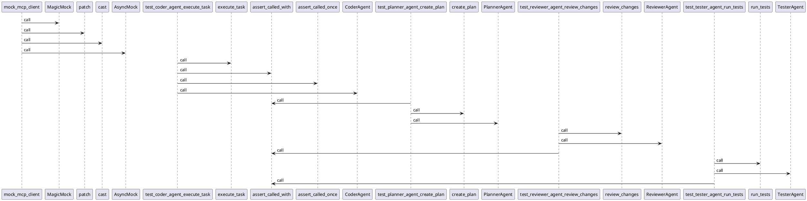
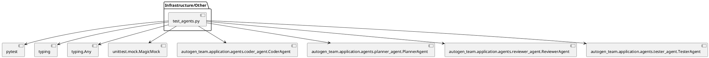
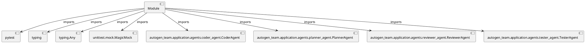
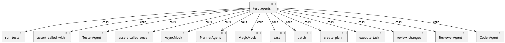

# Module Specification: test_agents

* **Source Reference:** `tests/application/agents/test_agents.py`

## 1. Architectural Role & Responsibilities
**Purpose:**
Provides functionality related to test agents.

**Architecture Layer:**
- Infrastructure/Other

**Responsibilities:**
- Manages operations and logic for test agents.

**Main Workflow:**
- Executes the primary flow defined by test agents functions and classes.

## 2. Dependencies
**Imports:**
- `pytest`
- `typing`
- `typing.Any`
- `unittest.mock.MagicMock`
- `autogen_team.application.agents.coder_agent.CoderAgent`
- `autogen_team.application.agents.planner_agent.PlannerAgent`
- `autogen_team.application.agents.reviewer_agent.ReviewerAgent`
- `autogen_team.application.agents.tester_agent.TesterAgent`

**Exported Classes:**
- None

**Exported Functions:**
- `mock_mcp_client`
- `test_coder_agent_execute_task`
- `test_planner_agent_create_plan`
- `test_reviewer_agent_review_changes`
- `test_tester_agent_run_tests`

**Exported Interfaces:**
- Not explicitly defined.

**Public API:**
- Not explicitly defined.

## 3. Architecture & Execution
### Internal Architecture
Not explicitly defined.

### Execution Flow
Not explicitly defined.

### Sequence Explanation
Not explicitly defined.

### Examples
Not explicitly defined.

## 4. UML 2.0 Diagrams
### Class Diagram

```plantuml
@startuml
    ' No classes found in module
@enduml
```

### Sequence Diagram

```plantuml
@startuml
    mock_mcp_client -> MagicMock : call
    mock_mcp_client -> patch : call
    mock_mcp_client -> cast : call
    mock_mcp_client -> AsyncMock : call
    test_coder_agent_execute_task -> execute_task : call
    test_coder_agent_execute_task -> assert_called_with : call
    test_coder_agent_execute_task -> assert_called_once : call
    test_coder_agent_execute_task -> CoderAgent : call
    test_planner_agent_create_plan -> assert_called_with : call
    test_planner_agent_create_plan -> create_plan : call
    test_planner_agent_create_plan -> PlannerAgent : call
    test_reviewer_agent_review_changes -> review_changes : call
    test_reviewer_agent_review_changes -> ReviewerAgent : call
    test_reviewer_agent_review_changes -> assert_called_with : call
    test_tester_agent_run_tests -> run_tests : call
    test_tester_agent_run_tests -> TesterAgent : call
    test_tester_agent_run_tests -> assert_called_with : call
@enduml
```

### Component Diagram

```plantuml
@startuml
    package "Infrastructure/Other" {
        [test_agents.py]
    }
    [test_agents.py] --> [pytest]
    [test_agents.py] --> [typing]
    [test_agents.py] --> [typing.Any]
    [test_agents.py] --> [unittest.mock.MagicMock]
    [test_agents.py] --> [autogen_team.application.agents.coder_agent.CoderAgent]
    [test_agents.py] --> [autogen_team.application.agents.planner_agent.PlannerAgent]
    [test_agents.py] --> [autogen_team.application.agents.reviewer_agent.ReviewerAgent]
    [test_agents.py] --> [autogen_team.application.agents.tester_agent.TesterAgent]
@enduml
```

### Dependency Graph

```plantuml
@startuml
    [Module] --> [pytest] : imports
    [Module] --> [typing] : imports
    [Module] --> [typing.Any] : imports
    [Module] --> [unittest.mock.MagicMock] : imports
    [Module] --> [autogen_team.application.agents.coder_agent.CoderAgent] : imports
    [Module] --> [autogen_team.application.agents.planner_agent.PlannerAgent] : imports
    [Module] --> [autogen_team.application.agents.reviewer_agent.ReviewerAgent] : imports
    [Module] --> [autogen_team.application.agents.tester_agent.TesterAgent] : imports
@enduml
```

## 5. Class & Method Specifications
## 6. Module Functions
### `mock_mcp_client(mocker: Any)`
Executes the mock mcp client operation.

**Inputs:**
- `mocker`
  - type: Any
  - meaning: Represents the mocker parameter.
  - valid values: Any valid Any.
  - optional?: False
  - default value: None

**Output:**
- return type: `MagicMock`
- semantic meaning: Returns the result of mock mcp client.
- possible null values: Yes, if MagicMock allows it.
- exceptions: Standard execution exceptions.

**Side Effects:**
- Database updates: Not explicitly defined.
- File operations: Not explicitly defined.
- Network calls: Not explicitly defined.
- Cache: Not explicitly defined.
- State changes: Not explicitly defined.

### `test_coder_agent_execute_task(mock_mcp_client: MagicMock)`
Executes the test coder agent execute task operation.

**Inputs:**
- `mock_mcp_client`
  - type: MagicMock
  - meaning: Represents the mock mcp client parameter.
  - valid values: Any valid MagicMock.
  - optional?: False
  - default value: None

**Output:**
- return type: `None`
- semantic meaning: Returns the result of test coder agent execute task.
- possible null values: Yes, if None allows it.
- exceptions: Standard execution exceptions.

**Side Effects:**
- Database updates: Not explicitly defined.
- File operations: Not explicitly defined.
- Network calls: Not explicitly defined.
- Cache: Not explicitly defined.
- State changes: Not explicitly defined.

### `test_planner_agent_create_plan(mock_mcp_client: MagicMock)`
Executes the test planner agent create plan operation.

**Inputs:**
- `mock_mcp_client`
  - type: MagicMock
  - meaning: Represents the mock mcp client parameter.
  - valid values: Any valid MagicMock.
  - optional?: False
  - default value: None

**Output:**
- return type: `None`
- semantic meaning: Returns the result of test planner agent create plan.
- possible null values: Yes, if None allows it.
- exceptions: Standard execution exceptions.

**Side Effects:**
- Database updates: Not explicitly defined.
- File operations: Not explicitly defined.
- Network calls: Not explicitly defined.
- Cache: Not explicitly defined.
- State changes: Not explicitly defined.

### `test_reviewer_agent_review_changes(mock_mcp_client: MagicMock)`
Executes the test reviewer agent review changes operation.

**Inputs:**
- `mock_mcp_client`
  - type: MagicMock
  - meaning: Represents the mock mcp client parameter.
  - valid values: Any valid MagicMock.
  - optional?: False
  - default value: None

**Output:**
- return type: `None`
- semantic meaning: Returns the result of test reviewer agent review changes.
- possible null values: Yes, if None allows it.
- exceptions: Standard execution exceptions.

**Side Effects:**
- Database updates: Not explicitly defined.
- File operations: Not explicitly defined.
- Network calls: Not explicitly defined.
- Cache: Not explicitly defined.
- State changes: Not explicitly defined.

### `test_tester_agent_run_tests(mock_mcp_client: MagicMock)`
Executes the test tester agent run tests operation.

**Inputs:**
- `mock_mcp_client`
  - type: MagicMock
  - meaning: Represents the mock mcp client parameter.
  - valid values: Any valid MagicMock.
  - optional?: False
  - default value: None

**Output:**
- return type: `None`
- semantic meaning: Returns the result of test tester agent run tests.
- possible null values: Yes, if None allows it.
- exceptions: Standard execution exceptions.

**Side Effects:**
- Database updates: Not explicitly defined.
- File operations: Not explicitly defined.
- Network calls: Not explicitly defined.
- Cache: Not explicitly defined.
- State changes: Not explicitly defined.

## 7. Call Graph

```plantuml
@startuml
[test_agents] --> [run_tests] : calls
[test_agents] --> [assert_called_with] : calls
[test_agents] --> [TesterAgent] : calls
[test_agents] --> [assert_called_once] : calls
[test_agents] --> [AsyncMock] : calls
[test_agents] --> [PlannerAgent] : calls
[test_agents] --> [MagicMock] : calls
[test_agents] --> [cast] : calls
[test_agents] --> [patch] : calls
[test_agents] --> [create_plan] : calls
[test_agents] --> [execute_task] : calls
[test_agents] --> [review_changes] : calls
[test_agents] --> [ReviewerAgent] : calls
[test_agents] --> [CoderAgent] : calls
@enduml
```

## 8. Cross References
- **Parent module:** None
- **Child modules:** None
- **Dependencies:** `pytest`, `autogen_team.application.agents.coder_agent.CoderAgent`, `typing`, `autogen_team.application.agents.reviewer_agent.ReviewerAgent`, `typing.Any`, `autogen_team.application.agents.tester_agent.TesterAgent`, `unittest.mock.MagicMock`, `autogen_team.application.agents.planner_agent.PlannerAgent`
- **Used by:** None
- **Calls:** run_tests, assert_called_with, TesterAgent, assert_called_once, AsyncMock, PlannerAgent, MagicMock, cast, patch, create_plan, execute_task, review_changes, ReviewerAgent, CoderAgent
- **Called from:** None
- **Related classes:** [Classes](../../../../classes/index.md)
- **Related interfaces:** Not explicitly defined.
- **Related diagrams:** [Diagrams](../../../../diagrams/index.md)
