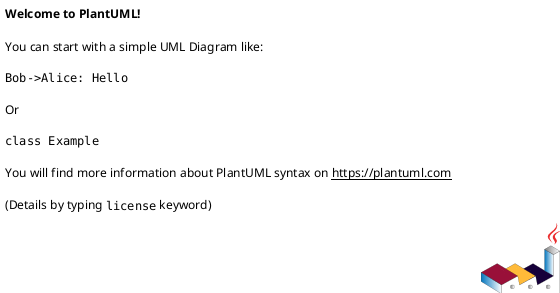
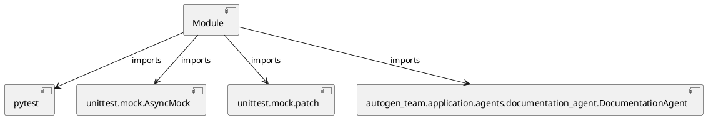

# Module Specification: test_documentation_agent

* **Source Reference:** `tests/application/agents/test_documentation_agent.py`

## 1. Architectural Role & Responsibilities
**Purpose:**
Provides functionality related to test documentation agent.

**Architecture Layer:**
- Infrastructure/Other

**Responsibilities:**
- Not explicitly defined.

**Main Workflow:**
- Not explicitly defined.

## 2. Dependencies
**Imports:**
- `pytest`
- `unittest.mock.AsyncMock`
- `unittest.mock.patch`
- `autogen_team.application.agents.documentation_agent.DocumentationAgent`

**Exported Classes:**
- None

**Exported Functions:**
- `test_documentation_agent_generate_docs_success`
- `test_documentation_agent_generate_docs_failure`

## 3. Architecture & Execution
### Internal Architecture
Not explicitly defined.

### Execution Flow
Not explicitly defined.

### Sequence Explanation
Not explicitly defined.

## 4. UML 2.0 Diagrams
### Class Diagram

### Dependency Graph

## 5. Class & Method Specifications
## 6. Module Functions
### `test_documentation_agent_generate_docs_success()`
Test DocumentationAgent.generate_docs success path.

**Inputs:**
- None

**Output:**
- Return Type: `None`

### `test_documentation_agent_generate_docs_failure()`
Test DocumentationAgent.generate_docs exception handling.

**Inputs:**
- None

**Output:**
- Return Type: `None`
