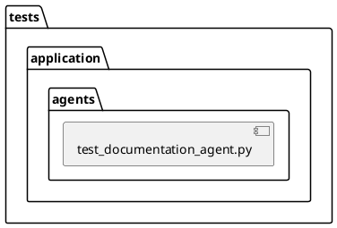
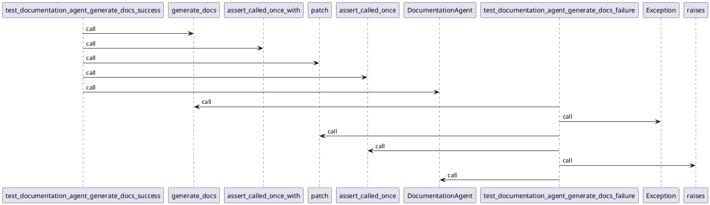
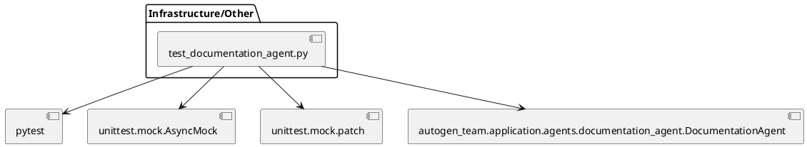
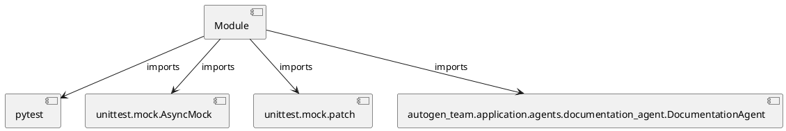
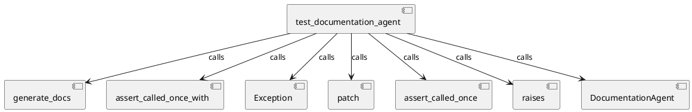

# Module Specification: test_documentation_agent

* **Source Reference:** `tests/application/agents/test_documentation_agent.py`

## 1. Architectural Role & Responsibilities
**Purpose:**
Provides functionality related to test documentation agent.

**Architecture Layer:**
- Infrastructure/Other

**Responsibilities:**
- Not explicitly defined.

**Main Workflow:**
- Not explicitly defined.

## 2. Dependencies
**Imports:**
- `pytest`
- `unittest.mock.AsyncMock`
- `unittest.mock.patch`
- `autogen_team.application.agents.documentation_agent.DocumentationAgent`

**Exported Classes:**
- None

**Exported Functions:**
- `test_documentation_agent_generate_docs_success`
- `test_documentation_agent_generate_docs_failure`

**Exported Interfaces:**
- Not explicitly defined.

**Public API:**
- Not explicitly defined.

## 3. Architecture & Execution
### Internal Architecture
Not explicitly defined.

### Execution Flow
Not explicitly defined.

### Sequence Explanation
Not explicitly defined.

### Examples
Not explicitly defined.

## 4. UML 2.0 Diagrams
### Class Diagram

```plantuml
@startuml
    ' No classes found in module
@enduml
```

### Package Diagram

```plantuml
@startuml
    package "tests" {
        package "application" {
            package "agents" {
                [test_documentation_agent.py]
            }
        }
    }
@enduml
```

### Sequence Diagram

```plantuml
@startuml
    test_documentation_agent_generate_docs_success -> generate_docs : call
    test_documentation_agent_generate_docs_success -> assert_called_once_with : call
    test_documentation_agent_generate_docs_success -> patch : call
    test_documentation_agent_generate_docs_success -> assert_called_once : call
    test_documentation_agent_generate_docs_success -> DocumentationAgent : call
    test_documentation_agent_generate_docs_failure -> generate_docs : call
    test_documentation_agent_generate_docs_failure -> Exception : call
    test_documentation_agent_generate_docs_failure -> patch : call
    test_documentation_agent_generate_docs_failure -> assert_called_once : call
    test_documentation_agent_generate_docs_failure -> raises : call
    test_documentation_agent_generate_docs_failure -> DocumentationAgent : call
@enduml
```

### Component Diagram

```plantuml
@startuml
    package "Infrastructure/Other" {
        [test_documentation_agent.py]
    }
    [test_documentation_agent.py] --> [pytest]
    [test_documentation_agent.py] --> [unittest.mock.AsyncMock]
    [test_documentation_agent.py] --> [unittest.mock.patch]
    [test_documentation_agent.py] --> [autogen_team.application.agents.documentation_agent.DocumentationAgent]
@enduml
```

### Dependency Graph

```plantuml
@startuml
    [Module] --> [pytest] : imports
    [Module] --> [unittest.mock.AsyncMock] : imports
    [Module] --> [unittest.mock.patch] : imports
    [Module] --> [autogen_team.application.agents.documentation_agent.DocumentationAgent] : imports
@enduml
```

## 5. Class & Method Specifications
## 6. Module Functions
### `test_documentation_agent_generate_docs_success() -> None` (Public)
**Description:** Test DocumentationAgent.generate_docs success path.

**Inputs:**
- None

**Output:**
- return type: `None`
- semantic meaning: Not explicitly defined.
- possible null values: Not explicitly defined.
- exceptions: Not explicitly defined.

**Side Effects:**
- Database updates: Not explicitly defined.
- File operations: Not explicitly defined.
- Network calls: Not explicitly defined.
- Cache: Not explicitly defined.
- State changes: Not explicitly defined.

**Complexity:**
- Time Complexity: Not explicitly defined.
- Space Complexity: Not explicitly defined.

**Example:**
```python
result = test_documentation_agent_generate_docs_success()
```

### `test_documentation_agent_generate_docs_failure() -> None` (Public)
**Description:** Test DocumentationAgent.generate_docs exception handling.

**Inputs:**
- None

**Output:**
- return type: `None`
- semantic meaning: Not explicitly defined.
- possible null values: Not explicitly defined.
- exceptions: Not explicitly defined.

**Side Effects:**
- Database updates: Not explicitly defined.
- File operations: Not explicitly defined.
- Network calls: Not explicitly defined.
- Cache: Not explicitly defined.
- State changes: Not explicitly defined.

**Complexity:**
- Time Complexity: Not explicitly defined.
- Space Complexity: Not explicitly defined.

**Example:**
```python
result = test_documentation_agent_generate_docs_failure()
```

## 7. Call Graph

```plantuml
@startuml
[test_documentation_agent] --> [generate_docs] : calls
[test_documentation_agent] --> [assert_called_once_with] : calls
[test_documentation_agent] --> [Exception] : calls
[test_documentation_agent] --> [patch] : calls
[test_documentation_agent] --> [assert_called_once] : calls
[test_documentation_agent] --> [raises] : calls
[test_documentation_agent] --> [DocumentationAgent] : calls
@enduml
```

## 8. Cross References
- **Dependencies:** [Dependencies](../../../../dependencies/index.md)
- **Used by:** None
- **Calls:** generate_docs, assert_called_once_with, Exception, patch, assert_called_once, raises, DocumentationAgent
- **Called from:** None
- **Related classes:** [Classes](../../../../classes/index.md)
- **Related diagrams:** [Diagrams](../../../../diagrams/index.md)
