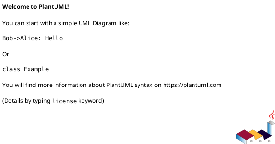
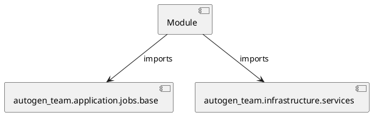

# Module Specification: test_base

* **Source Reference:** `tests/application/jobs/test_base.py`

## 1. Architectural Role & Responsibilities
**Purpose:**
Provides functionality related to test base.

**Architecture Layer:**
- Infrastructure/Other

**Responsibilities:**
- Manage and execute operations for test_base.

**Main Workflow:**
- Initialize components and process requests for test_base.

## 2. Dependencies
**Imports:**
- `autogen_team.application.jobs.base`
- `autogen_team.infrastructure.services`

**Exported Classes:**
- None

**Exported Functions:**
- `test_job`

## 3. Architecture & Execution
### Internal Architecture
Follows standard modular design, encapsulating state and behavior within defined classes and functions.

### Execution Flow
Sequential execution of defined functions and class methods.

### Sequence Explanation
Clients instantiate classes or call functions, which execute business logic and return results.

## 4. UML 2.0 Diagrams
### Class Diagram

### Dependency Graph

## 5. Class & Method Specifications
## 6. Module Functions
### `test_job(logger_service: Any, alerts_service: Any, mlflow_service: Any)`
Executes the test_job operation.

**Inputs:**
- `logger_service`: Any
- `alerts_service`: Any
- `mlflow_service`: Any

**Output:**
- Return Type: `None`
