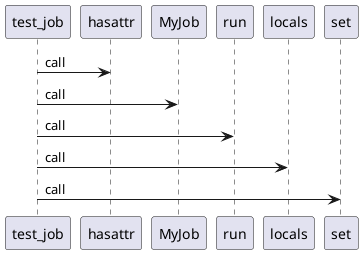
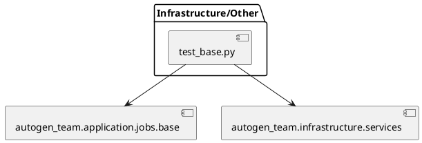
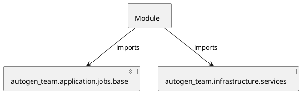
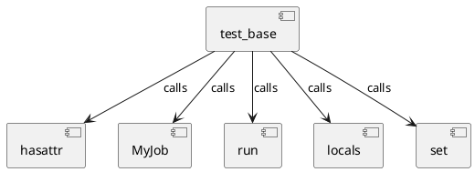

# Module Specification: test_base

* **Source Reference:** `tests/application/jobs/test_base.py`

## 1. Architectural Role & Responsibilities
**Purpose:**
Provides functionality related to test base.

**Architecture Layer:**
- Infrastructure/Other

**Responsibilities:**
- Manages operations and logic for test base.

**Main Workflow:**
- Executes the primary flow defined by test base functions and classes.

## 2. Dependencies
**Imports:**
- `autogen_team.application.jobs.base`
- `autogen_team.infrastructure.services`

**Exported Classes:**
- None

**Exported Functions:**
- `test_job`

**Exported Interfaces:**
- Not explicitly defined.

**Public API:**
- Not explicitly defined.

## 3. Architecture & Execution
### Internal Architecture
Not explicitly defined.

### Execution Flow
Not explicitly defined.

### Sequence Explanation
Not explicitly defined.

### Examples
Not explicitly defined.

## 4. UML 2.0 Diagrams
### Class Diagram

```plantuml
@startuml
    ' No classes found in module
@enduml
```

### Sequence Diagram

```plantuml
@startuml
    test_job -> hasattr : call
    test_job -> MyJob : call
    test_job -> run : call
    test_job -> locals : call
    test_job -> set : call
@enduml
```

### Component Diagram

```plantuml
@startuml
    package "Infrastructure/Other" {
        [test_base.py]
    }
    [test_base.py] --> [autogen_team.application.jobs.base]
    [test_base.py] --> [autogen_team.infrastructure.services]
@enduml
```

### Dependency Graph

```plantuml
@startuml
    [Module] --> [autogen_team.application.jobs.base] : imports
    [Module] --> [autogen_team.infrastructure.services] : imports
@enduml
```

## 5. Class & Method Specifications
## 6. Module Functions
### `test_job(logger_service: services.LoggerService, alerts_service: services.AlertsService, mlflow_service: services.MlflowService)`
Executes the test job operation.

**Inputs:**
- `logger_service`
  - type: services.LoggerService
  - meaning: Represents the logger service parameter.
  - valid values: Any valid services.LoggerService.
  - optional?: False
  - default value: None
- `alerts_service`
  - type: services.AlertsService
  - meaning: Represents the alerts service parameter.
  - valid values: Any valid services.AlertsService.
  - optional?: False
  - default value: None
- `mlflow_service`
  - type: services.MlflowService
  - meaning: Represents the mlflow service parameter.
  - valid values: Any valid services.MlflowService.
  - optional?: False
  - default value: None

**Output:**
- return type: `None`
- semantic meaning: Returns the result of test job.
- possible null values: Yes, if None allows it.
- exceptions: Standard execution exceptions.

**Side Effects:**
- Database updates: Not explicitly defined.
- File operations: Not explicitly defined.
- Network calls: Not explicitly defined.
- Cache: Not explicitly defined.
- State changes: Not explicitly defined.

## 7. Call Graph

```plantuml
@startuml
[test_base] --> [hasattr] : calls
[test_base] --> [MyJob] : calls
[test_base] --> [run] : calls
[test_base] --> [locals] : calls
[test_base] --> [set] : calls
@enduml
```

## 8. Cross References
- **Parent module:** None
- **Child modules:** None
- **Dependencies:** `autogen_team.infrastructure.services`, `autogen_team.application.jobs.base`
- **Used by:** None
- **Calls:** hasattr, MyJob, run, locals, set
- **Called from:** None
- **Related classes:** [Classes](../../../../classes/index.md)
- **Related interfaces:** Not explicitly defined.
- **Related diagrams:** [Diagrams](../../../../diagrams/index.md)
