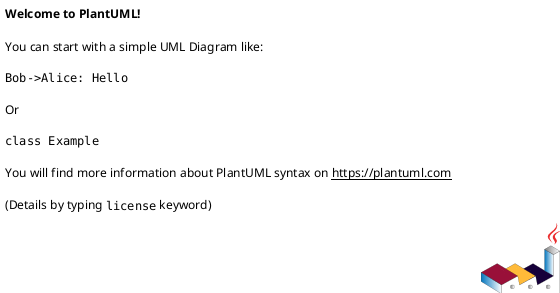
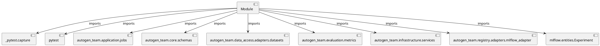

# Module Specification: test_evaluations

* **Source Reference:** `tests/application/jobs/test_evaluations.py`

## 1. Architectural Role & Responsibilities
**Purpose:**
Provides functionality related to test evaluations.

**Architecture Layer:**
- Infrastructure/Other

**Responsibilities:**
- Not explicitly defined.

**Main Workflow:**
- Not explicitly defined.

## 2. Dependencies
**Imports:**
- `_pytest.capture`
- `pytest`
- `autogen_team.application.jobs`
- `autogen_team.core.schemas`
- `autogen_team.data_access.adapters.datasets`
- `autogen_team.evaluation.metrics`
- `autogen_team.infrastructure.services`
- `autogen_team.registry.adapters.mlflow_adapter`
- `mlflow.entities.Experiment`

**Exported Classes:**
- None

**Exported Functions:**
- `test_evaluations_job`

## 3. Architecture & Execution
### Internal Architecture
Not explicitly defined.

### Execution Flow
Not explicitly defined.

### Sequence Explanation
Not explicitly defined.

## 4. UML 2.0 Diagrams
### Class Diagram

### Dependency Graph

## 5. Class & Method Specifications
## 6. Module Functions
### `test_evaluations_job(alias_or_version: str | int, thresholds: dict[str, metrics.Threshold], mlflow_service: services.MlflowService, alerts_service: services.AlertsService, logger_service: services.LoggerService, inputs_reader: datasets.ParquetReader, targets_reader: datasets.ParquetReader, model_alias: registries.Version, metric: metrics.AutogenMetric, capsys: pc.CaptureFixture[str])`
No description provided.

**Inputs:**
- `alias_or_version`: str | int
- `thresholds`: dict[str, metrics.Threshold]
- `mlflow_service`: services.MlflowService
- `alerts_service`: services.AlertsService
- `logger_service`: services.LoggerService
- `inputs_reader`: datasets.ParquetReader
- `targets_reader`: datasets.ParquetReader
- `model_alias`: registries.Version
- `metric`: metrics.AutogenMetric
- `capsys`: pc.CaptureFixture[str]

**Output:**
- Return Type: `None`
