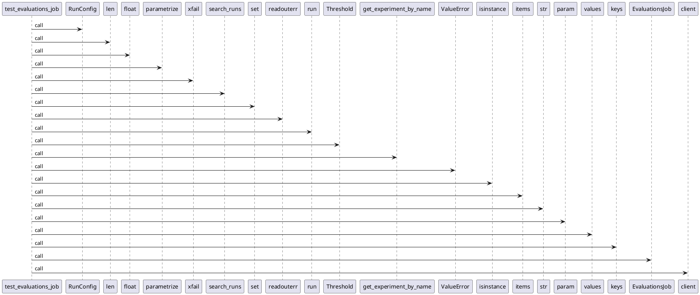
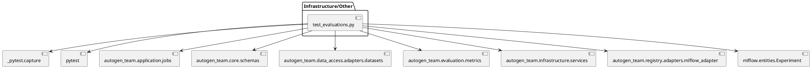
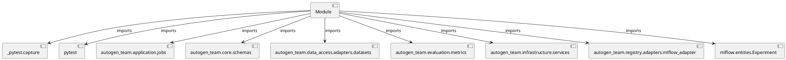

# Module Specification: test_evaluations

* **Source Reference:** `tests/application/jobs/test_evaluations.py`

## 1. Architectural Role & Responsibilities
**Purpose:**
Provides functionality related to test evaluations.

**Architecture Layer:**
- Infrastructure/Other

**Responsibilities:**
- Manages operations and logic for test evaluations.

**Main Workflow:**
- Executes the primary flow defined by test evaluations functions and classes.

## 2. Dependencies
**Imports:**
- `_pytest.capture`
- `pytest`
- `autogen_team.application.jobs`
- `autogen_team.core.schemas`
- `autogen_team.data_access.adapters.datasets`
- `autogen_team.evaluation.metrics`
- `autogen_team.infrastructure.services`
- `autogen_team.registry.adapters.mlflow_adapter`
- `mlflow.entities.Experiment`

**Exported Classes:**
- None

**Exported Functions:**
- `test_evaluations_job`

**Exported Interfaces:**
- Not explicitly defined.

**Public API:**
- Not explicitly defined.

## 3. Architecture & Execution
### Internal Architecture
Not explicitly defined.

### Execution Flow
Not explicitly defined.

### Sequence Explanation
Not explicitly defined.

### Examples
Not explicitly defined.

## 4. UML 2.0 Diagrams
### Class Diagram

```plantuml
@startuml
    ' No classes found in module
@enduml
```

### Sequence Diagram

```plantuml
@startuml
    test_evaluations_job -> RunConfig : call
    test_evaluations_job -> len : call
    test_evaluations_job -> float : call
    test_evaluations_job -> parametrize : call
    test_evaluations_job -> xfail : call
    test_evaluations_job -> search_runs : call
    test_evaluations_job -> set : call
    test_evaluations_job -> readouterr : call
    test_evaluations_job -> run : call
    test_evaluations_job -> Threshold : call
    test_evaluations_job -> get_experiment_by_name : call
    test_evaluations_job -> ValueError : call
    test_evaluations_job -> isinstance : call
    test_evaluations_job -> items : call
    test_evaluations_job -> str : call
    test_evaluations_job -> param : call
    test_evaluations_job -> values : call
    test_evaluations_job -> keys : call
    test_evaluations_job -> EvaluationsJob : call
    test_evaluations_job -> client : call
@enduml
```

### Component Diagram

```plantuml
@startuml
    package "Infrastructure/Other" {
        [test_evaluations.py]
    }
    [test_evaluations.py] --> [_pytest.capture]
    [test_evaluations.py] --> [pytest]
    [test_evaluations.py] --> [autogen_team.application.jobs]
    [test_evaluations.py] --> [autogen_team.core.schemas]
    [test_evaluations.py] --> [autogen_team.data_access.adapters.datasets]
    [test_evaluations.py] --> [autogen_team.evaluation.metrics]
    [test_evaluations.py] --> [autogen_team.infrastructure.services]
    [test_evaluations.py] --> [autogen_team.registry.adapters.mlflow_adapter]
    [test_evaluations.py] --> [mlflow.entities.Experiment]
@enduml
```

### Dependency Graph

```plantuml
@startuml
    [Module] --> [_pytest.capture] : imports
    [Module] --> [pytest] : imports
    [Module] --> [autogen_team.application.jobs] : imports
    [Module] --> [autogen_team.core.schemas] : imports
    [Module] --> [autogen_team.data_access.adapters.datasets] : imports
    [Module] --> [autogen_team.evaluation.metrics] : imports
    [Module] --> [autogen_team.infrastructure.services] : imports
    [Module] --> [autogen_team.registry.adapters.mlflow_adapter] : imports
    [Module] --> [mlflow.entities.Experiment] : imports
@enduml
```

## 5. Class & Method Specifications
## 6. Module Functions
### `test_evaluations_job(alias_or_version: str | int, thresholds: dict[str, metrics.Threshold], mlflow_service: services.MlflowService, alerts_service: services.AlertsService, logger_service: services.LoggerService, inputs_reader: datasets.ParquetReader, targets_reader: datasets.ParquetReader, model_alias: registries.Version, metric: metrics.AutogenMetric, capsys: pc.CaptureFixture[str])`
Executes the test evaluations job operation.

**Inputs:**
- `alias_or_version`
  - type: str | int
  - meaning: Represents the alias or version parameter.
  - valid values: Any valid str | int.
  - optional?: False
  - default value: None
- `thresholds`
  - type: dict[str, metrics.Threshold]
  - meaning: Represents the thresholds parameter.
  - valid values: Any valid dict[str, metrics.Threshold].
  - optional?: False
  - default value: None
- `mlflow_service`
  - type: services.MlflowService
  - meaning: Represents the mlflow service parameter.
  - valid values: Any valid services.MlflowService.
  - optional?: False
  - default value: None
- `alerts_service`
  - type: services.AlertsService
  - meaning: Represents the alerts service parameter.
  - valid values: Any valid services.AlertsService.
  - optional?: False
  - default value: None
- `logger_service`
  - type: services.LoggerService
  - meaning: Represents the logger service parameter.
  - valid values: Any valid services.LoggerService.
  - optional?: False
  - default value: None
- `inputs_reader`
  - type: datasets.ParquetReader
  - meaning: Represents the inputs reader parameter.
  - valid values: Any valid datasets.ParquetReader.
  - optional?: False
  - default value: None
- `targets_reader`
  - type: datasets.ParquetReader
  - meaning: Represents the targets reader parameter.
  - valid values: Any valid datasets.ParquetReader.
  - optional?: False
  - default value: None
- `model_alias`
  - type: registries.Version
  - meaning: Represents the model alias parameter.
  - valid values: Any valid registries.Version.
  - optional?: False
  - default value: None
- `metric`
  - type: metrics.AutogenMetric
  - meaning: Represents the metric parameter.
  - valid values: Any valid metrics.AutogenMetric.
  - optional?: False
  - default value: None
- `capsys`
  - type: pc.CaptureFixture[str]
  - meaning: Represents the capsys parameter.
  - valid values: Any valid pc.CaptureFixture[str].
  - optional?: False
  - default value: None

**Output:**
- return type: `None`
- semantic meaning: Returns the result of test evaluations job.
- possible null values: Yes, if None allows it.
- exceptions: Standard execution exceptions.

**Side Effects:**
- Database updates: Not explicitly defined.
- File operations: Not explicitly defined.
- Network calls: Not explicitly defined.
- Cache: Not explicitly defined.
- State changes: Not explicitly defined.

## 7. Call Graph

```plantuml
@startuml
[test_evaluations] --> [RunConfig] : calls
[test_evaluations] --> [len] : calls
[test_evaluations] --> [float] : calls
[test_evaluations] --> [parametrize] : calls
[test_evaluations] --> [xfail] : calls
[test_evaluations] --> [search_runs] : calls
[test_evaluations] --> [set] : calls
[test_evaluations] --> [readouterr] : calls
[test_evaluations] --> [run] : calls
[test_evaluations] --> [Threshold] : calls
[test_evaluations] --> [get_experiment_by_name] : calls
[test_evaluations] --> [ValueError] : calls
[test_evaluations] --> [isinstance] : calls
[test_evaluations] --> [items] : calls
[test_evaluations] --> [str] : calls
[test_evaluations] --> [param] : calls
[test_evaluations] --> [values] : calls
[test_evaluations] --> [keys] : calls
[test_evaluations] --> [EvaluationsJob] : calls
[test_evaluations] --> [client] : calls
@enduml
```

## 8. Cross References
- **Parent module:** None
- **Child modules:** None
- **Dependencies:** `_pytest.capture`, `autogen_team.application.jobs`, `pytest`, `mlflow.entities.Experiment`, `autogen_team.core.schemas`, `autogen_team.data_access.adapters.datasets`, `autogen_team.infrastructure.services`, `autogen_team.evaluation.metrics`, `autogen_team.registry.adapters.mlflow_adapter`
- **Used by:** None
- **Calls:** RunConfig, len, float, parametrize, xfail, search_runs, set, readouterr, run, Threshold, get_experiment_by_name, ValueError, isinstance, items, str, param, values, keys, EvaluationsJob, client
- **Called from:** None
- **Related classes:** [Classes](../../../../classes/index.md)
- **Related interfaces:** Not explicitly defined.
- **Related diagrams:** [Diagrams](../../../../diagrams/index.md)
