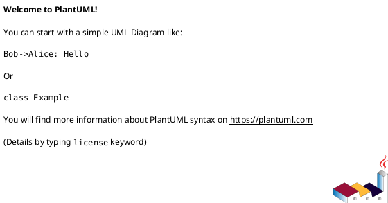
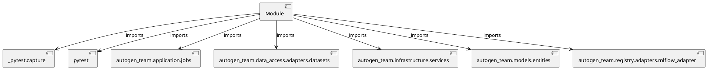

# Module Specification: test_explanations

* **Source Reference:** `tests/application/jobs/test_explanations.py`

## 1. Architectural Role & Responsibilities
**Purpose:**
Provides functionality related to test explanations.

**Architecture Layer:**
- Infrastructure/Other

**Responsibilities:**
- Manage and execute operations for test_explanations.

**Main Workflow:**
- Initialize components and process requests for test_explanations.

## 2. Dependencies
**Imports:**
- `_pytest.capture`
- `pytest`
- `autogen_team.application.jobs`
- `autogen_team.data_access.adapters.datasets`
- `autogen_team.infrastructure.services`
- `autogen_team.models.entities`
- `autogen_team.registry.adapters.mlflow_adapter`

**Exported Classes:**
- None

**Exported Functions:**
- `test_explanations_job`

## 3. Architecture & Execution
### Internal Architecture
Follows standard modular design, encapsulating state and behavior within defined classes and functions.

### Execution Flow
Sequential execution of defined functions and class methods.

### Sequence Explanation
Clients instantiate classes or call functions, which execute business logic and return results.

## 4. UML 2.0 Diagrams
### Class Diagram

### Dependency Graph

## 5. Class & Method Specifications
## 6. Module Functions
### `test_explanations_job(alias_or_version: Any, mlflow_service: Any, alerts_service: Any, logger_service: Any, inputs_samples_reader: Any, tmp_models_explanations_writer: Any, tmp_samples_explanations_writer: Any, model_alias: Any, loader: Any, capsys: Any)`
Executes the test_explanations_job operation.

**Inputs:**
- `alias_or_version`: Any
- `mlflow_service`: Any
- `alerts_service`: Any
- `logger_service`: Any
- `inputs_samples_reader`: Any
- `tmp_models_explanations_writer`: Any
- `tmp_samples_explanations_writer`: Any
- `model_alias`: Any
- `loader`: Any
- `capsys`: Any

**Output:**
- Return Type: `None`
