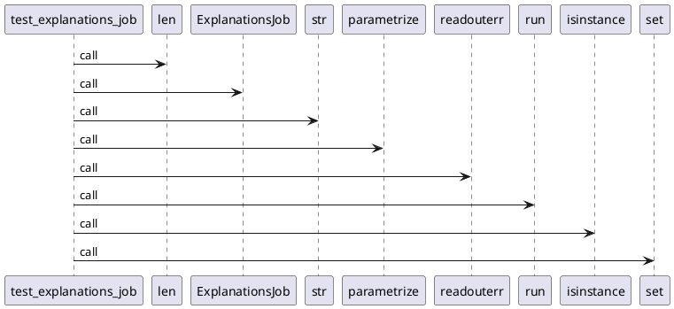
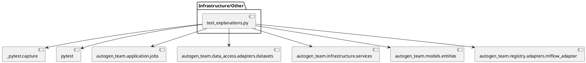
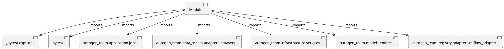
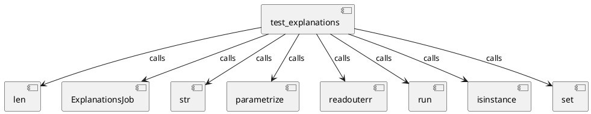

# Module Specification: test_explanations

* **Source Reference:** `tests/application/jobs/test_explanations.py`

## 1. Architectural Role & Responsibilities
**Purpose:**
Provides functionality related to test explanations.

**Architecture Layer:**
- Infrastructure/Other

**Responsibilities:**
- Manages operations and logic for test explanations.

**Main Workflow:**
- Executes the primary flow defined by test explanations functions and classes.

## 2. Dependencies
**Imports:**
- `_pytest.capture`
- `pytest`
- `autogen_team.application.jobs`
- `autogen_team.data_access.adapters.datasets`
- `autogen_team.infrastructure.services`
- `autogen_team.models.entities`
- `autogen_team.registry.adapters.mlflow_adapter`

**Exported Classes:**
- None

**Exported Functions:**
- `test_explanations_job`

**Exported Interfaces:**
- Not explicitly defined.

**Public API:**
- Not explicitly defined.

## 3. Architecture & Execution
### Internal Architecture
Not explicitly defined.

### Execution Flow
Not explicitly defined.

### Sequence Explanation
Not explicitly defined.

### Examples
Not explicitly defined.

## 4. UML 2.0 Diagrams
### Class Diagram

```plantuml
@startuml
    ' No classes found in module
@enduml
```

### Sequence Diagram

```plantuml
@startuml
    test_explanations_job -> len : call
    test_explanations_job -> ExplanationsJob : call
    test_explanations_job -> str : call
    test_explanations_job -> parametrize : call
    test_explanations_job -> readouterr : call
    test_explanations_job -> run : call
    test_explanations_job -> isinstance : call
    test_explanations_job -> set : call
@enduml
```

### Component Diagram

```plantuml
@startuml
    package "Infrastructure/Other" {
        [test_explanations.py]
    }
    [test_explanations.py] --> [_pytest.capture]
    [test_explanations.py] --> [pytest]
    [test_explanations.py] --> [autogen_team.application.jobs]
    [test_explanations.py] --> [autogen_team.data_access.adapters.datasets]
    [test_explanations.py] --> [autogen_team.infrastructure.services]
    [test_explanations.py] --> [autogen_team.models.entities]
    [test_explanations.py] --> [autogen_team.registry.adapters.mlflow_adapter]
@enduml
```

### Dependency Graph

```plantuml
@startuml
    [Module] --> [_pytest.capture] : imports
    [Module] --> [pytest] : imports
    [Module] --> [autogen_team.application.jobs] : imports
    [Module] --> [autogen_team.data_access.adapters.datasets] : imports
    [Module] --> [autogen_team.infrastructure.services] : imports
    [Module] --> [autogen_team.models.entities] : imports
    [Module] --> [autogen_team.registry.adapters.mlflow_adapter] : imports
@enduml
```

## 5. Class & Method Specifications
## 6. Module Functions
### `test_explanations_job(alias_or_version: str | int, mlflow_service: services.MlflowService, alerts_service: services.AlertsService, logger_service: services.LoggerService, inputs_samples_reader: datasets.ParquetReader, tmp_models_explanations_writer: datasets.ParquetWriter, tmp_samples_explanations_writer: datasets.ParquetWriter, model_alias: registries.Version, loader: registries.CustomLoader, capsys: pc.CaptureFixture[str])`
Executes the test explanations job operation.

**Inputs:**
- `alias_or_version`
  - type: str | int
  - meaning: Represents the alias or version parameter.
  - valid values: Any valid str | int.
  - optional?: False
  - default value: None
- `mlflow_service`
  - type: services.MlflowService
  - meaning: Represents the mlflow service parameter.
  - valid values: Any valid services.MlflowService.
  - optional?: False
  - default value: None
- `alerts_service`
  - type: services.AlertsService
  - meaning: Represents the alerts service parameter.
  - valid values: Any valid services.AlertsService.
  - optional?: False
  - default value: None
- `logger_service`
  - type: services.LoggerService
  - meaning: Represents the logger service parameter.
  - valid values: Any valid services.LoggerService.
  - optional?: False
  - default value: None
- `inputs_samples_reader`
  - type: datasets.ParquetReader
  - meaning: Represents the inputs samples reader parameter.
  - valid values: Any valid datasets.ParquetReader.
  - optional?: False
  - default value: None
- `tmp_models_explanations_writer`
  - type: datasets.ParquetWriter
  - meaning: Represents the tmp models explanations writer parameter.
  - valid values: Any valid datasets.ParquetWriter.
  - optional?: False
  - default value: None
- `tmp_samples_explanations_writer`
  - type: datasets.ParquetWriter
  - meaning: Represents the tmp samples explanations writer parameter.
  - valid values: Any valid datasets.ParquetWriter.
  - optional?: False
  - default value: None
- `model_alias`
  - type: registries.Version
  - meaning: Represents the model alias parameter.
  - valid values: Any valid registries.Version.
  - optional?: False
  - default value: None
- `loader`
  - type: registries.CustomLoader
  - meaning: Represents the loader parameter.
  - valid values: Any valid registries.CustomLoader.
  - optional?: False
  - default value: None
- `capsys`
  - type: pc.CaptureFixture[str]
  - meaning: Represents the capsys parameter.
  - valid values: Any valid pc.CaptureFixture[str].
  - optional?: False
  - default value: None

**Output:**
- return type: `None`
- semantic meaning: Returns the result of test explanations job.
- possible null values: Yes, if None allows it.
- exceptions: Standard execution exceptions.

**Side Effects:**
- Database updates: Not explicitly defined.
- File operations: Not explicitly defined.
- Network calls: Not explicitly defined.
- Cache: Not explicitly defined.
- State changes: Not explicitly defined.

## 7. Call Graph

```plantuml
@startuml
[test_explanations] --> [len] : calls
[test_explanations] --> [ExplanationsJob] : calls
[test_explanations] --> [str] : calls
[test_explanations] --> [parametrize] : calls
[test_explanations] --> [readouterr] : calls
[test_explanations] --> [run] : calls
[test_explanations] --> [isinstance] : calls
[test_explanations] --> [set] : calls
@enduml
```

## 8. Cross References
- **Parent module:** None
- **Child modules:** None
- **Dependencies:** `_pytest.capture`, `autogen_team.application.jobs`, `pytest`, `autogen_team.models.entities`, `autogen_team.infrastructure.services`, `autogen_team.data_access.adapters.datasets`, `autogen_team.registry.adapters.mlflow_adapter`
- **Used by:** None
- **Calls:** len, ExplanationsJob, str, parametrize, readouterr, run, isinstance, set
- **Called from:** None
- **Related classes:** [Classes](../../../../classes/index.md)
- **Related interfaces:** Not explicitly defined.
- **Related diagrams:** [Diagrams](../../../../diagrams/index.md)
