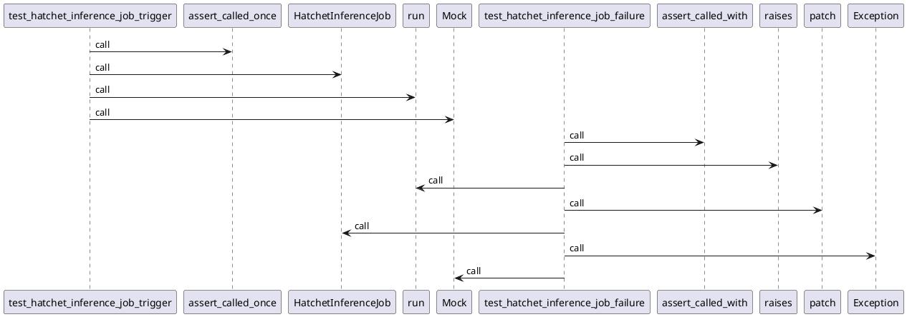
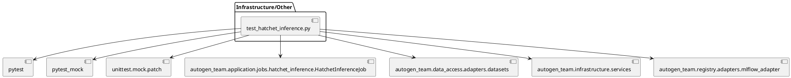
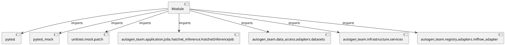
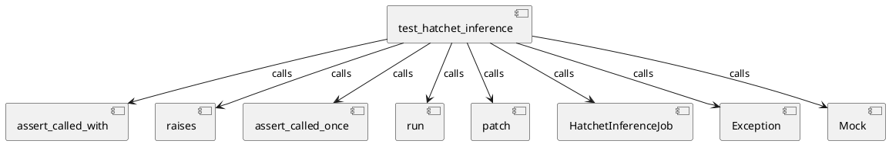

# Module Specification: test_hatchet_inference

* **Source Reference:** `tests/application/jobs/test_hatchet_inference.py`

## 1. Architectural Role & Responsibilities
**Purpose:**
Provides functionality related to test hatchet inference.

**Architecture Layer:**
- Infrastructure/Other

**Responsibilities:**
- Manages operations and logic for test hatchet inference.

**Main Workflow:**
- Executes the primary flow defined by test hatchet inference functions and classes.

## 2. Dependencies
**Imports:**
- `pytest`
- `pytest_mock`
- `unittest.mock.patch`
- `autogen_team.application.jobs.hatchet_inference.HatchetInferenceJob`
- `autogen_team.data_access.adapters.datasets`
- `autogen_team.infrastructure.services`
- `autogen_team.registry.adapters.mlflow_adapter`

**Exported Classes:**
- None

**Exported Functions:**
- `test_hatchet_inference_job_trigger`
- `test_hatchet_inference_job_failure`

**Exported Interfaces:**
- Not explicitly defined.

**Public API:**
- Not explicitly defined.

## 3. Architecture & Execution
### Internal Architecture
Not explicitly defined.

### Execution Flow
Not explicitly defined.

### Sequence Explanation
Not explicitly defined.

### Examples
Not explicitly defined.

## 4. UML 2.0 Diagrams
### Class Diagram

```plantuml
@startuml
    ' No classes found in module
@enduml
```

### Sequence Diagram

```plantuml
@startuml
    test_hatchet_inference_job_trigger -> assert_called_once : call
    test_hatchet_inference_job_trigger -> HatchetInferenceJob : call
    test_hatchet_inference_job_trigger -> run : call
    test_hatchet_inference_job_trigger -> Mock : call
    test_hatchet_inference_job_failure -> assert_called_with : call
    test_hatchet_inference_job_failure -> raises : call
    test_hatchet_inference_job_failure -> run : call
    test_hatchet_inference_job_failure -> patch : call
    test_hatchet_inference_job_failure -> HatchetInferenceJob : call
    test_hatchet_inference_job_failure -> Exception : call
    test_hatchet_inference_job_failure -> Mock : call
@enduml
```

### Component Diagram

```plantuml
@startuml
    package "Infrastructure/Other" {
        [test_hatchet_inference.py]
    }
    [test_hatchet_inference.py] --> [pytest]
    [test_hatchet_inference.py] --> [pytest_mock]
    [test_hatchet_inference.py] --> [unittest.mock.patch]
    [test_hatchet_inference.py] --> [autogen_team.application.jobs.hatchet_inference.HatchetInferenceJob]
    [test_hatchet_inference.py] --> [autogen_team.data_access.adapters.datasets]
    [test_hatchet_inference.py] --> [autogen_team.infrastructure.services]
    [test_hatchet_inference.py] --> [autogen_team.registry.adapters.mlflow_adapter]
@enduml
```

### Dependency Graph

```plantuml
@startuml
    [Module] --> [pytest] : imports
    [Module] --> [pytest_mock] : imports
    [Module] --> [unittest.mock.patch] : imports
    [Module] --> [autogen_team.application.jobs.hatchet_inference.HatchetInferenceJob] : imports
    [Module] --> [autogen_team.data_access.adapters.datasets] : imports
    [Module] --> [autogen_team.infrastructure.services] : imports
    [Module] --> [autogen_team.registry.adapters.mlflow_adapter] : imports
@enduml
```

## 5. Class & Method Specifications
## 6. Module Functions
### `test_hatchet_inference_job_trigger(mocker: pm.MockerFixture, mlflow_service: services.MlflowService, alerts_service: services.AlertsService, logger_service: services.LoggerService, inputs_reader: datasets.ParquetReader, tmp_outputs_writer: datasets.ParquetWriter, loader: registries.CustomLoader)`
Executes the test hatchet inference job trigger operation.

**Inputs:**
- `mocker`
  - type: pm.MockerFixture
  - meaning: Represents the mocker parameter.
  - valid values: Any valid pm.MockerFixture.
  - optional?: False
  - default value: None
- `mlflow_service`
  - type: services.MlflowService
  - meaning: Represents the mlflow service parameter.
  - valid values: Any valid services.MlflowService.
  - optional?: False
  - default value: None
- `alerts_service`
  - type: services.AlertsService
  - meaning: Represents the alerts service parameter.
  - valid values: Any valid services.AlertsService.
  - optional?: False
  - default value: None
- `logger_service`
  - type: services.LoggerService
  - meaning: Represents the logger service parameter.
  - valid values: Any valid services.LoggerService.
  - optional?: False
  - default value: None
- `inputs_reader`
  - type: datasets.ParquetReader
  - meaning: Represents the inputs reader parameter.
  - valid values: Any valid datasets.ParquetReader.
  - optional?: False
  - default value: None
- `tmp_outputs_writer`
  - type: datasets.ParquetWriter
  - meaning: Represents the tmp outputs writer parameter.
  - valid values: Any valid datasets.ParquetWriter.
  - optional?: False
  - default value: None
- `loader`
  - type: registries.CustomLoader
  - meaning: Represents the loader parameter.
  - valid values: Any valid registries.CustomLoader.
  - optional?: False
  - default value: None

**Output:**
- return type: `None`
- semantic meaning: Returns the result of test hatchet inference job trigger.
- possible null values: Yes, if None allows it.
- exceptions: Standard execution exceptions.

**Side Effects:**
- Database updates: Not explicitly defined.
- File operations: Not explicitly defined.
- Network calls: Not explicitly defined.
- Cache: Not explicitly defined.
- State changes: Not explicitly defined.

### `test_hatchet_inference_job_failure(mocker: pm.MockerFixture, mlflow_service: services.MlflowService, alerts_service: services.AlertsService, logger_service: services.LoggerService, inputs_reader: datasets.ParquetReader, tmp_outputs_writer: datasets.ParquetWriter, loader: registries.CustomLoader)`
Executes the test hatchet inference job failure operation.

**Inputs:**
- `mocker`
  - type: pm.MockerFixture
  - meaning: Represents the mocker parameter.
  - valid values: Any valid pm.MockerFixture.
  - optional?: False
  - default value: None
- `mlflow_service`
  - type: services.MlflowService
  - meaning: Represents the mlflow service parameter.
  - valid values: Any valid services.MlflowService.
  - optional?: False
  - default value: None
- `alerts_service`
  - type: services.AlertsService
  - meaning: Represents the alerts service parameter.
  - valid values: Any valid services.AlertsService.
  - optional?: False
  - default value: None
- `logger_service`
  - type: services.LoggerService
  - meaning: Represents the logger service parameter.
  - valid values: Any valid services.LoggerService.
  - optional?: False
  - default value: None
- `inputs_reader`
  - type: datasets.ParquetReader
  - meaning: Represents the inputs reader parameter.
  - valid values: Any valid datasets.ParquetReader.
  - optional?: False
  - default value: None
- `tmp_outputs_writer`
  - type: datasets.ParquetWriter
  - meaning: Represents the tmp outputs writer parameter.
  - valid values: Any valid datasets.ParquetWriter.
  - optional?: False
  - default value: None
- `loader`
  - type: registries.CustomLoader
  - meaning: Represents the loader parameter.
  - valid values: Any valid registries.CustomLoader.
  - optional?: False
  - default value: None

**Output:**
- return type: `None`
- semantic meaning: Returns the result of test hatchet inference job failure.
- possible null values: Yes, if None allows it.
- exceptions: Standard execution exceptions.

**Side Effects:**
- Database updates: Not explicitly defined.
- File operations: Not explicitly defined.
- Network calls: Not explicitly defined.
- Cache: Not explicitly defined.
- State changes: Not explicitly defined.

## 7. Call Graph

```plantuml
@startuml
[test_hatchet_inference] --> [assert_called_with] : calls
[test_hatchet_inference] --> [raises] : calls
[test_hatchet_inference] --> [assert_called_once] : calls
[test_hatchet_inference] --> [run] : calls
[test_hatchet_inference] --> [patch] : calls
[test_hatchet_inference] --> [HatchetInferenceJob] : calls
[test_hatchet_inference] --> [Exception] : calls
[test_hatchet_inference] --> [Mock] : calls
@enduml
```

## 8. Cross References
- **Parent module:** None
- **Child modules:** None
- **Dependencies:** `pytest`, `unittest.mock.patch`, `autogen_team.data_access.adapters.datasets`, `autogen_team.infrastructure.services`, `pytest_mock`, `autogen_team.application.jobs.hatchet_inference.HatchetInferenceJob`, `autogen_team.registry.adapters.mlflow_adapter`
- **Used by:** None
- **Calls:** assert_called_with, raises, assert_called_once, run, patch, HatchetInferenceJob, Exception, Mock
- **Called from:** None
- **Related classes:** [Classes](../../../../classes/index.md)
- **Related interfaces:** Not explicitly defined.
- **Related diagrams:** [Diagrams](../../../../diagrams/index.md)
