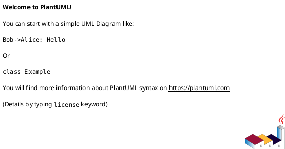
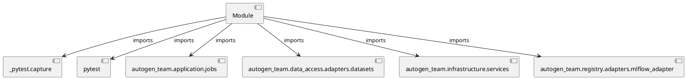

# Module Specification: test_inference

* **Source Reference:** `tests/application/jobs/test_inference.py`

## 1. Architectural Role & Responsibilities
**Purpose:**
Provides functionality related to test inference.

**Architecture Layer:**
- Infrastructure/Other

**Responsibilities:**
- Not explicitly defined.

**Main Workflow:**
- Not explicitly defined.

## 2. Dependencies
**Imports:**
- `_pytest.capture`
- `pytest`
- `autogen_team.application.jobs`
- `autogen_team.data_access.adapters.datasets`
- `autogen_team.infrastructure.services`
- `autogen_team.registry.adapters.mlflow_adapter`

**Exported Classes:**
- None

**Exported Functions:**
- `test_inference_job`

## 3. Architecture & Execution
### Internal Architecture
Not explicitly defined.

### Execution Flow
Not explicitly defined.

### Sequence Explanation
Not explicitly defined.

## 4. UML 2.0 Diagrams
### Class Diagram

### Dependency Graph

## 5. Class & Method Specifications
## 6. Module Functions
### `test_inference_job(alias_or_version: str | int, mlflow_service: services.MlflowService, alerts_service: services.AlertsService, logger_service: services.LoggerService, inputs_reader: datasets.ParquetReader, tmp_outputs_writer: datasets.ParquetWriter, model_alias: registries.Version, loader: registries.CustomLoader, capsys: pc.CaptureFixture[str])`
No description provided.

**Inputs:**
- `alias_or_version`: str | int
- `mlflow_service`: services.MlflowService
- `alerts_service`: services.AlertsService
- `logger_service`: services.LoggerService
- `inputs_reader`: datasets.ParquetReader
- `tmp_outputs_writer`: datasets.ParquetWriter
- `model_alias`: registries.Version
- `loader`: registries.CustomLoader
- `capsys`: pc.CaptureFixture[str]

**Output:**
- Return Type: `None`
