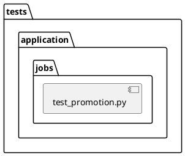
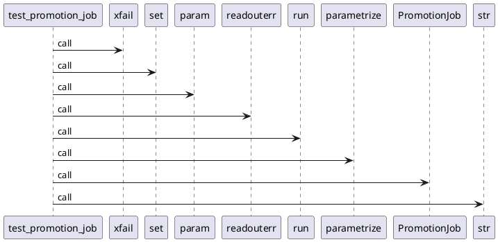
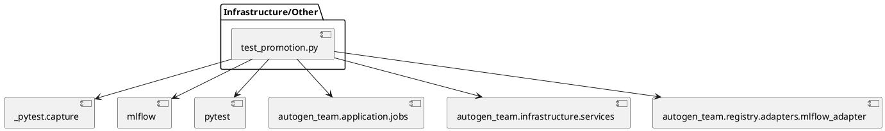
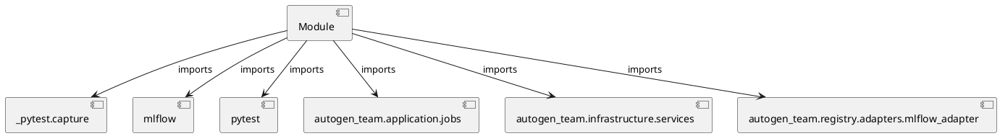
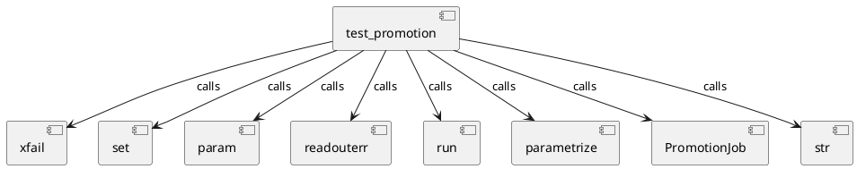

# Module Specification: test_promotion

* **Source Reference:** `tests/application/jobs/test_promotion.py`

## 1. Architectural Role & Responsibilities
**Purpose:**
Provides functionality related to test promotion.

**Architecture Layer:**
- Infrastructure/Other

**Responsibilities:**
- Not explicitly defined.

**Main Workflow:**
- Not explicitly defined.

## 2. Dependencies
**Imports:**
- `_pytest.capture`
- `mlflow`
- `pytest`
- `autogen_team.application.jobs`
- `autogen_team.infrastructure.services`
- `autogen_team.registry.adapters.mlflow_adapter`

**Exported Classes:**
- None

**Exported Functions:**
- `test_promotion_job`

**Exported Interfaces:**
- Not explicitly defined.

**Public API:**
- Not explicitly defined.

## 3. Architecture & Execution
### Internal Architecture
Not explicitly defined.

### Execution Flow
Not explicitly defined.

### Sequence Explanation
Not explicitly defined.

### Examples
Not explicitly defined.

## 4. UML 2.0 Diagrams
### Class Diagram

```plantuml
@startuml
    ' No classes found in module
@enduml
```

### Package Diagram

```plantuml
@startuml
    package "tests" {
        package "application" {
            package "jobs" {
                [test_promotion.py]
            }
        }
    }
@enduml
```

### Sequence Diagram

```plantuml
@startuml
    test_promotion_job -> xfail : call
    test_promotion_job -> set : call
    test_promotion_job -> param : call
    test_promotion_job -> readouterr : call
    test_promotion_job -> run : call
    test_promotion_job -> parametrize : call
    test_promotion_job -> PromotionJob : call
    test_promotion_job -> str : call
@enduml
```

### Component Diagram

```plantuml
@startuml
    package "Infrastructure/Other" {
        [test_promotion.py]
    }
    [test_promotion.py] --> [_pytest.capture]
    [test_promotion.py] --> [mlflow]
    [test_promotion.py] --> [pytest]
    [test_promotion.py] --> [autogen_team.application.jobs]
    [test_promotion.py] --> [autogen_team.infrastructure.services]
    [test_promotion.py] --> [autogen_team.registry.adapters.mlflow_adapter]
@enduml
```

### Dependency Graph

```plantuml
@startuml
    [Module] --> [_pytest.capture] : imports
    [Module] --> [mlflow] : imports
    [Module] --> [pytest] : imports
    [Module] --> [autogen_team.application.jobs] : imports
    [Module] --> [autogen_team.infrastructure.services] : imports
    [Module] --> [autogen_team.registry.adapters.mlflow_adapter] : imports
@enduml
```

## 5. Class & Method Specifications
## 6. Module Functions
### `test_promotion_job(version: int | None, mlflow_service: services.MlflowService, alerts_service: services.AlertsService, logger_service: services.LoggerService, model_version: registries.Version, capsys: pc.CaptureFixture[str]) -> None` (Public)
**Description:** No description provided.

**Inputs:**
- `version`
  - type: int | None
  - meaning: Not explicitly defined.
  - valid values: Not explicitly defined.
  - optional?: False
  - default value: None
- `mlflow_service`
  - type: services.MlflowService
  - meaning: Not explicitly defined.
  - valid values: Not explicitly defined.
  - optional?: False
  - default value: None
- `alerts_service`
  - type: services.AlertsService
  - meaning: Not explicitly defined.
  - valid values: Not explicitly defined.
  - optional?: False
  - default value: None
- `logger_service`
  - type: services.LoggerService
  - meaning: Not explicitly defined.
  - valid values: Not explicitly defined.
  - optional?: False
  - default value: None
- `model_version`
  - type: registries.Version
  - meaning: Not explicitly defined.
  - valid values: Not explicitly defined.
  - optional?: False
  - default value: None
- `capsys`
  - type: pc.CaptureFixture[str]
  - meaning: Not explicitly defined.
  - valid values: Not explicitly defined.
  - optional?: False
  - default value: None

**Output:**
- return type: `None`
- semantic meaning: Not explicitly defined.
- possible null values: Not explicitly defined.
- exceptions: Not explicitly defined.

**Side Effects:**
- Database updates: Not explicitly defined.
- File operations: Not explicitly defined.
- Network calls: Not explicitly defined.
- Cache: Not explicitly defined.
- State changes: Not explicitly defined.

**Complexity:**
- Time Complexity: Not explicitly defined.
- Space Complexity: Not explicitly defined.

**Example:**
```python
result = test_promotion_job(..., ..., ..., ..., ..., ...)
```

## 7. Call Graph

```plantuml
@startuml
[test_promotion] --> [xfail] : calls
[test_promotion] --> [set] : calls
[test_promotion] --> [param] : calls
[test_promotion] --> [readouterr] : calls
[test_promotion] --> [run] : calls
[test_promotion] --> [parametrize] : calls
[test_promotion] --> [PromotionJob] : calls
[test_promotion] --> [str] : calls
@enduml
```

## 8. Cross References
- **Dependencies:** [Dependencies](../../../../dependencies/index.md)
- **Used by:** None
- **Calls:** xfail, set, param, readouterr, run, parametrize, PromotionJob, str
- **Called from:** None
- **Related classes:** [Classes](../../../../classes/index.md)
- **Related diagrams:** [Diagrams](../../../../diagrams/index.md)
