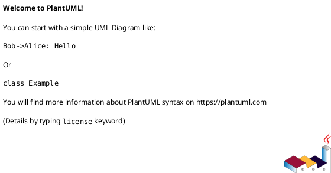

# Module Specification: test_training

* **Source Reference:** `tests/application/jobs/test_training.py`

## 1. Architectural Role & Responsibilities
**Purpose:**
Provides functionality related to test training.

**Architecture Layer:**
- Infrastructure/Other

**Responsibilities:**
- Manage and execute operations for test_training.

**Main Workflow:**
- Initialize components and process requests for test_training.

## 2. Dependencies
**Imports:**
- `_pytest.capture`
- `autogen_team.application.jobs`
- `autogen_team.core.schemas`
- `autogen_team.data_access.adapters.datasets`
- `autogen_team.evaluation.metrics`
- `autogen_team.infrastructure.services`
- `autogen_team.infrastructure.utils.signers`
- `autogen_team.infrastructure.utils.splitters`
- `autogen_team.models.entities`
- `autogen_team.registry.adapters.mlflow_adapter`
- `mlflow.entities.Experiment`

**Exported Classes:**
- None

**Exported Functions:**
- `test_training_job`

## 3. Architecture & Execution
### Internal Architecture
Follows standard modular design, encapsulating state and behavior within defined classes and functions.

### Execution Flow
Sequential execution of defined functions and class methods.

### Sequence Explanation
Clients instantiate classes or call functions, which execute business logic and return results.

## 4. UML 2.0 Diagrams
### Class Diagram

### Dependency Graph

```plantuml
@startuml
    [Module] --> [_pytest.capture] : imports
    [Module] --> [autogen_team.application.jobs] : imports
    [Module] --> [autogen_team.core.schemas] : imports
    [Module] --> [autogen_team.data_access.adapters.datasets] : imports
    [Module] --> [autogen_team.evaluation.metrics] : imports
    [Module] --> [autogen_team.infrastructure.services] : imports
    [Module] --> [autogen_team.infrastructure.utils.signers] : imports
    [Module] --> [autogen_team.infrastructure.utils.splitters] : imports
    [Module] --> [autogen_team.models.entities] : imports
    [Module] --> [autogen_team.registry.adapters.mlflow_adapter] : imports
    [Module] --> [mlflow.entities.Experiment] : imports
@enduml
```

## 5. Class & Method Specifications
## 6. Module Functions
### `test_training_job(mlflow_service: Any, alerts_service: Any, logger_service: Any, inputs_reader: Any, targets_reader: Any, model: Any, metric: Any, train_test_splitter: Any, saver: Any, signer: Any, register: Any, capsys: Any)`
Executes the test_training_job operation.

**Inputs:**
- `mlflow_service`: Any
- `alerts_service`: Any
- `logger_service`: Any
- `inputs_reader`: Any
- `targets_reader`: Any
- `model`: Any
- `metric`: Any
- `train_test_splitter`: Any
- `saver`: Any
- `signer`: Any
- `register`: Any
- `capsys`: Any

**Output:**
- Return Type: `None`
