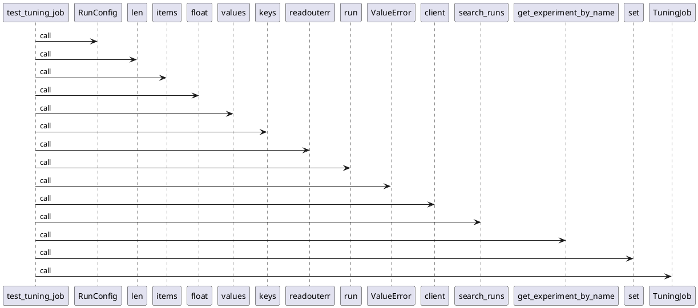
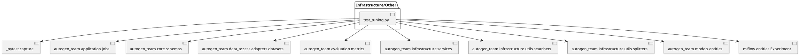
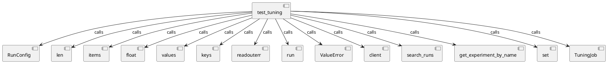

# Module Specification: test_tuning

* **Source Reference:** `tests/application/jobs/test_tuning.py`

## 1. Architectural Role & Responsibilities
**Purpose:**
Provides functionality related to test tuning.

**Architecture Layer:**
- Infrastructure/Other

**Responsibilities:**
- Manages operations and logic for test tuning.

**Main Workflow:**
- Executes the primary flow defined by test tuning functions and classes.

## 2. Dependencies
**Imports:**
- `_pytest.capture`
- `autogen_team.application.jobs`
- `autogen_team.core.schemas`
- `autogen_team.data_access.adapters.datasets`
- `autogen_team.evaluation.metrics`
- `autogen_team.infrastructure.services`
- `autogen_team.infrastructure.utils.searchers`
- `autogen_team.infrastructure.utils.splitters`
- `autogen_team.models.entities`
- `mlflow.entities.Experiment`

**Exported Classes:**
- None

**Exported Functions:**
- `test_tuning_job`

**Exported Interfaces:**
- Not explicitly defined.

**Public API:**
- Not explicitly defined.

## 3. Architecture & Execution
### Internal Architecture
Not explicitly defined.

### Execution Flow
Not explicitly defined.

### Sequence Explanation
Not explicitly defined.

### Examples
Not explicitly defined.

## 4. UML 2.0 Diagrams
### Class Diagram

```plantuml
@startuml
    ' No classes found in module
@enduml
```

### Sequence Diagram

```plantuml
@startuml
    test_tuning_job -> RunConfig : call
    test_tuning_job -> len : call
    test_tuning_job -> items : call
    test_tuning_job -> float : call
    test_tuning_job -> values : call
    test_tuning_job -> keys : call
    test_tuning_job -> readouterr : call
    test_tuning_job -> run : call
    test_tuning_job -> ValueError : call
    test_tuning_job -> client : call
    test_tuning_job -> search_runs : call
    test_tuning_job -> get_experiment_by_name : call
    test_tuning_job -> set : call
    test_tuning_job -> TuningJob : call
@enduml
```

### Component Diagram

```plantuml
@startuml
    package "Infrastructure/Other" {
        [test_tuning.py]
    }
    [test_tuning.py] --> [_pytest.capture]
    [test_tuning.py] --> [autogen_team.application.jobs]
    [test_tuning.py] --> [autogen_team.core.schemas]
    [test_tuning.py] --> [autogen_team.data_access.adapters.datasets]
    [test_tuning.py] --> [autogen_team.evaluation.metrics]
    [test_tuning.py] --> [autogen_team.infrastructure.services]
    [test_tuning.py] --> [autogen_team.infrastructure.utils.searchers]
    [test_tuning.py] --> [autogen_team.infrastructure.utils.splitters]
    [test_tuning.py] --> [autogen_team.models.entities]
    [test_tuning.py] --> [mlflow.entities.Experiment]
@enduml
```

### Dependency Graph

```plantuml
@startuml
    [Module] --> [_pytest.capture] : imports
    [Module] --> [autogen_team.application.jobs] : imports
    [Module] --> [autogen_team.core.schemas] : imports
    [Module] --> [autogen_team.data_access.adapters.datasets] : imports
    [Module] --> [autogen_team.evaluation.metrics] : imports
    [Module] --> [autogen_team.infrastructure.services] : imports
    [Module] --> [autogen_team.infrastructure.utils.searchers] : imports
    [Module] --> [autogen_team.infrastructure.utils.splitters] : imports
    [Module] --> [autogen_team.models.entities] : imports
    [Module] --> [mlflow.entities.Experiment] : imports
@enduml
```

## 5. Class & Method Specifications
## 6. Module Functions
### `test_tuning_job(mlflow_service: services.MlflowService, alerts_service: services.AlertsService, logger_service: services.LoggerService, inputs_reader: datasets.ParquetReader, targets_reader: datasets.ParquetReader, model: models.BaselineAutogenModel, metric: metrics.AutogenMetric, time_series_splitter: splitters.TrainTestSplitter, searcher: searchers.GridCVSearcher, capsys: pc.CaptureFixture[str])`
Executes the test tuning job operation.

**Inputs:**
- `mlflow_service`
  - type: services.MlflowService
  - meaning: Represents the mlflow service parameter.
  - valid values: Any valid services.MlflowService.
  - optional?: False
  - default value: None
- `alerts_service`
  - type: services.AlertsService
  - meaning: Represents the alerts service parameter.
  - valid values: Any valid services.AlertsService.
  - optional?: False
  - default value: None
- `logger_service`
  - type: services.LoggerService
  - meaning: Represents the logger service parameter.
  - valid values: Any valid services.LoggerService.
  - optional?: False
  - default value: None
- `inputs_reader`
  - type: datasets.ParquetReader
  - meaning: Represents the inputs reader parameter.
  - valid values: Any valid datasets.ParquetReader.
  - optional?: False
  - default value: None
- `targets_reader`
  - type: datasets.ParquetReader
  - meaning: Represents the targets reader parameter.
  - valid values: Any valid datasets.ParquetReader.
  - optional?: False
  - default value: None
- `model`
  - type: models.BaselineAutogenModel
  - meaning: Represents the model parameter.
  - valid values: Any valid models.BaselineAutogenModel.
  - optional?: False
  - default value: None
- `metric`
  - type: metrics.AutogenMetric
  - meaning: Represents the metric parameter.
  - valid values: Any valid metrics.AutogenMetric.
  - optional?: False
  - default value: None
- `time_series_splitter`
  - type: splitters.TrainTestSplitter
  - meaning: Represents the time series splitter parameter.
  - valid values: Any valid splitters.TrainTestSplitter.
  - optional?: False
  - default value: None
- `searcher`
  - type: searchers.GridCVSearcher
  - meaning: Represents the searcher parameter.
  - valid values: Any valid searchers.GridCVSearcher.
  - optional?: False
  - default value: None
- `capsys`
  - type: pc.CaptureFixture[str]
  - meaning: Represents the capsys parameter.
  - valid values: Any valid pc.CaptureFixture[str].
  - optional?: False
  - default value: None

**Output:**
- return type: `None`
- semantic meaning: Returns the result of test tuning job.
- possible null values: Yes, if None allows it.
- exceptions: Standard execution exceptions.

**Side Effects:**
- Database updates: Not explicitly defined.
- File operations: Not explicitly defined.
- Network calls: Not explicitly defined.
- Cache: Not explicitly defined.
- State changes: Not explicitly defined.

## 7. Call Graph

```plantuml
@startuml
[test_tuning] --> [RunConfig] : calls
[test_tuning] --> [len] : calls
[test_tuning] --> [items] : calls
[test_tuning] --> [float] : calls
[test_tuning] --> [values] : calls
[test_tuning] --> [keys] : calls
[test_tuning] --> [readouterr] : calls
[test_tuning] --> [run] : calls
[test_tuning] --> [ValueError] : calls
[test_tuning] --> [client] : calls
[test_tuning] --> [search_runs] : calls
[test_tuning] --> [get_experiment_by_name] : calls
[test_tuning] --> [set] : calls
[test_tuning] --> [TuningJob] : calls
@enduml
```

## 8. Cross References
- **Parent module:** None
- **Child modules:** None
- **Dependencies:** `_pytest.capture`, `autogen_team.application.jobs`, `mlflow.entities.Experiment`, `autogen_team.models.entities`, `autogen_team.core.schemas`, `autogen_team.data_access.adapters.datasets`, `autogen_team.infrastructure.services`, `autogen_team.evaluation.metrics`, `autogen_team.infrastructure.utils.searchers`, `autogen_team.infrastructure.utils.splitters`
- **Used by:** None
- **Calls:** RunConfig, len, items, float, values, keys, readouterr, run, ValueError, client, search_runs, get_experiment_by_name, set, TuningJob
- **Called from:** None
- **Related classes:** [Classes](../../../../classes/index.md)
- **Related interfaces:** Not explicitly defined.
- **Related diagrams:** [Diagrams](../../../../diagrams/index.md)
